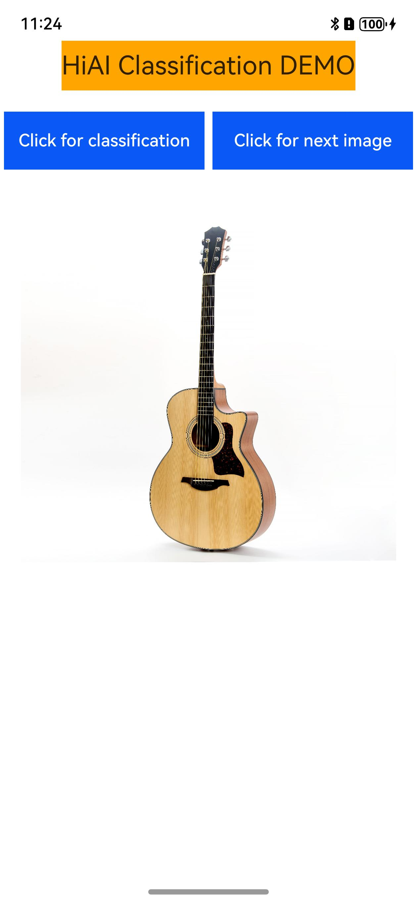
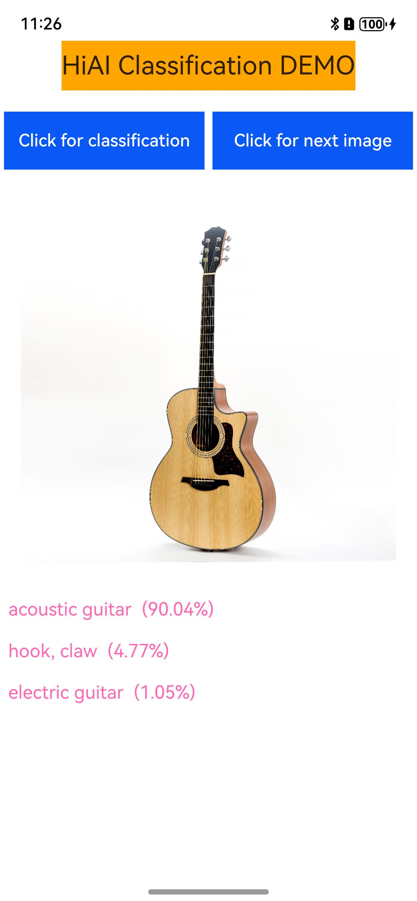

# HiAI Foundation -- 模型推理

## 介绍

本示例展示了使用HiAI Foundation API提供的模型推理能力。

本示例展示了对图片中的物体进行分类识别的能力展示。

需要编译依赖HiAI Foundation的动态库libhiai_foundation.so和AI 领域公共动态库libneural_network_core.so。

## 效果预览

|         **主界面**          |          **分类**          |          **下一张图片**          |
|:------------------------:|:------------------------:|--------------------------|
|  |  |  |

使用说明：

1. 在手机的主屏幕，点击”hiaiDemo“，启动应用，自动加载模型。
2. 点击“Click for classification”，进行模型推理对当前图片进行分类识别，推理完成后会把概率最大的三个分类结果展示在图片下方。
3. 点击“Click for next image”，展示下一张图片。 
4. 退出应用时，自动卸载模型。

## 工程目录
```
└── entry/src/main                      // 代码区
    ├── cpp
    │    ├── types/libentry
    │    │     └── index.d.ts           // native层接口注册文件
    │    ├── Classification.cpp         // native api层接口的具体实现函数
    │    ├── CMakeLists.txt             // native层编译配置
    │    ├── HIAIModelManager.cpp       // 模型管理类的实现
    │    ├── HIAIModelManager.h         // 模型管理类的定义
    ├── ets
    │    ├── entryability 
    │    │     └── EntryAbility.ets      // 程序入口类
    │    ├── pages 
    │    │     └── Index.ets            // 主界面展示类
    └── resources
    │    ├── base/media                 // 图片资源
    │    │   ├── cup.jpg
    │    │   └── guitar.jpg
    │    ├── rawfile 
    │    │    ├── hiai.om               // 模型文件
    │    │    └── labels_caffe.txt      // 模型输出标签文件
```

## 具体实现

本示例展示的功能使用了在HiAI Foundation和NNCore中定义的以下API：

* OH_NN_ReturnCode HMS_HiAIOptions_SetBandMode(OH_NNCompilation* compilation, HiAI_BandMode bandMode)
* HiAI_BandMode HMS_HiAIOptions_GetBandMode(const OH_NNCompilation* compilation)
* OH_NN_ReturnCode HMS_HiAIOptions_SetModelDeviceOrder(OH_NNCompilation* compilation, HiAI_ExecuteDevice* executeDevices, size_t deviceCount);
* HiAI_Compatibility HMS_HiAICompatibility_CheckFromBuffer(const void* data, size_t size);
* OH_NN_ReturnCode OH_NNDevice_GetAllDevicesID(const size_t **allDevicesID, uint32_t *deviceCount);
* OH_NN_ReturnCode OH_NNDevice_GetName(size_t deviceID, const char **name);
* void *OH_NNTensor_GetDataBuffer(const NN_Tensor *tensor);
* OH_NN_ReturnCode OH_NNTensor_GetSize(const NN_Tensor *tensor, size_t *size);
* OH_NN_ReturnCode OH_NNTensor_Destroy(NN_Tensor **tensor);
* OH_NNCompilation *OH_NNCompilation_ConstructWithOfflineModelBuffer(const void *modelBuffer, size_t modelSize);
* void OH_NNCompilation_Destroy(OH_NNCompilation **compilation);
* OH_NN_ReturnCode OH_NNCompilation_SetDevice(OH_NNCompilation *compilation, size_t deviceID);
* void OH_NNCompilation_Destroy(OH_NNCompilation **compilation);
* OH_NN_ReturnCode OH_NNCompilation_Build(OH_NNCompilation *compilation);
* OH_NNExecutor *OH_NNExecutor_Construct(OH_NNCompilation *compilation);
* OH_NN_ReturnCode OH_NNExecutor_GetInputCount(const OH_NNExecutor *executor, size_t *inputCount);
* NN_TensorDesc *OH_NNExecutor_CreateInputTensorDesc(const OH_NNExecutor *executor, size_t index);
* NN_Tensor *OH_NNTensor_Create(size_t deviceID, NN_TensorDesc *tensorDesc);
* OH_NN_ReturnCode OH_NNTensorDesc_Destroy(NN_TensorDesc **tensorDesc);
* OH_NN_ReturnCode OH_NNExecutor_GetOutputCount(const OH_NNExecutor *executor, size_t *outputCount);
* NN_TensorDesc *OH_NNExecutor_CreateOutputTensorDesc(const OH_NNExecutor *executor, size_t index);
* OH_NN_ReturnCode OH_NNExecutor_RunSync(OH_NNExecutor *executor, NN_Tensor *inputTensor[], size_t inputCount, NN_Tensor *outputTensor[], size_t outputCount);
* void OH_NNExecutor_Destroy(OH_NNExecutor **executor);

调用OH_NNExecutor_RunSync等接口，传入想要分类的图片，得到识别结果，观察日志等。参考entry/src/main/ets/pages/Index.ets.

## 相关权限

不涉及。

## 依赖

不涉及。

## 约束与限制

1. 本示例仅支持标准系统上运行，支持设备：华为手机、平板和2in1。
2. HarmonyOS系统：HarmonyOS NEXT Developer Beta1及以上。
3. DevEco Studio版本：DevEco Studio NEXT Developer Beta1及以上。
4. HarmonyOS SDK版本：HarmonyOS NEXT Developer Beta1 SDK及以上。


