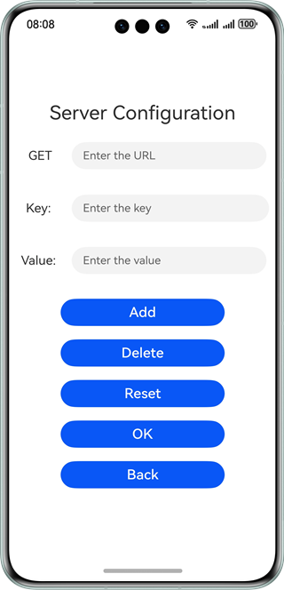
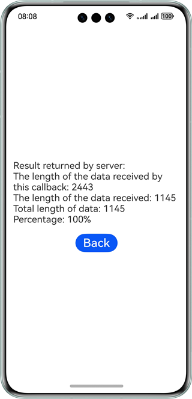

# HTTP

### Overview

This sample shows how to use the APIs provided by @ohos.net.http to initiate an HTTP request based on the URL and related configuration.

### Preview

| Home Page                            | Result Page                           |
|--------------------------------------|---------------------------------------|
|  |  |

### How to Use

1. When starting the sample application, configure the network request by specifying the destination URL, request mode, and request parameters.

2. Tap **OK**. The request result page is displayed.

3. Tap **Back** to return to the configuration page.

4. You can compile the http module into a **.tgz** package.

### Project Directory

```
├──entry/src/main/ets/
│  ├──Application
│  │  └──MyAbilityStage.ets
│  ├──MainAbility
│  │  └──MainAbility.ets          // Project entry，with permissions requested
│  ├──page
│  │  └──Index.ets                 // Home page
│  └──util                        
│     └──Logger.ets               // Logging utility.
├──entry/src/main/resources       // Static resources of the app
│
├──httprequest/src/main/ets/
│  └──components
│     ├──MainPage
│     │  └──MainPage.ets          // Content of the home page
│     └──model
│        └──http.ts               // APIs and parameters for initiating HTTP requests
└──http/src/main/resources        // Static resources of the app
```

### How to Implement

* The APIs for sending HTTP requests are encapsulated in the HTTP module. For details about the source code, see [http.ts](httprequest/src/main/ets/components/model/http.ts).
  * Initiate a request: Use the **TextInput** component in [MainPage.ets](httprequest/src/main/ets/components/MainPage/MainPage.ets) to obtain parameters. After **OK** is tapped, use **Http.request ()** to call **http.createHttp ().request ()** to send a request to the specified address.

### Required Permissions

ohos.permission.INTERNET

### Dependencies

N/A

### Constraints

1. The sample app is supported only on Huawei phones running the standard system.

2. The HarmonyOS version must be HarmonyOS 5.0.5 Release or later.

3. The DevEco Studio version must be DevEco Studio 5.0.5 Release or later.

4. The HarmonyOS SDK version must be HarmonyOS 5.0.5 Release or later.
