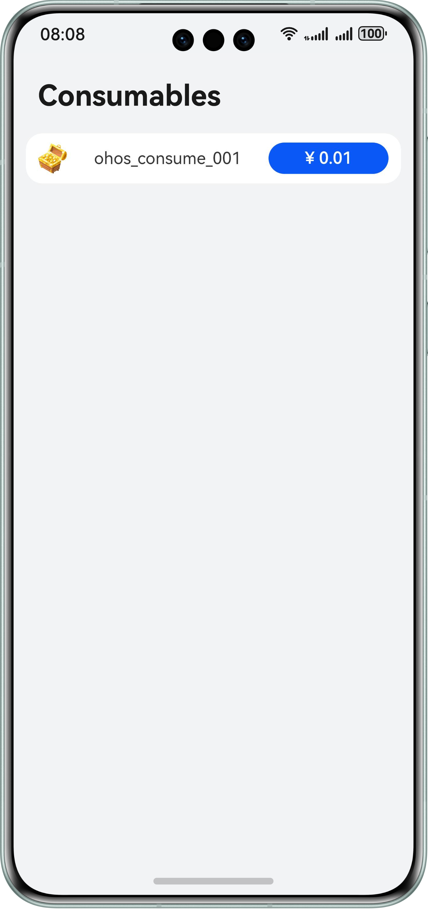

# 应用内支付

## 介绍
IAP Kit（应用内支付服务）为开发者提供便捷的应用内支付体验和简便的接入流程，让开发者聚焦应用本身的业务能力，助力开发者的商业变现。开发者应用可通过使用IAP Kit提供的系统级支付API快速启动IAP收银台，即可实现应用内支付。
通过IAP Kit，用户可以在应用内购买各种类型的数字商品（虚拟商品），包括消耗型商品、非消耗型商品、自动续期订阅商品和非续期订阅商品。
- 消耗型商品：使用一次后即消耗掉，随使用减少，需要再次购买的商品。例：游戏货币，游戏道具等。
- 非消耗型商品：一次性购买，永久拥有，无需消耗。例：游戏中额外的游戏关卡、应用中无时限的高级会员等。
- 自动续期订阅商品：用户购买后在一段时间内允许访问增值功能或内容，周期结束后自动续期购买下一期的服务。例：应用中有时限的自动续期高级会员，如视频连续包月会员。
- 非续期订阅商品：用户购买后在一段时间内允许访问增值功能或内容，周期结束后禁止访问，除非再次购买自动续期订阅或非续期订阅商品。例：应用中有时限的高级会员，如：视频一个月会员。

本示例展示了使用应用内支付服务提供的接入支付的能力，需要使用应用内支付服务接口 @kit.IAPKit。

## 效果预览





## 工程的配置与使用
### 工程配置说明
1. 完成应用开发准备。其中配置签名信息时，请使用手动签名方式。详情请参见：[应用开发准备](https://developer.huawei.com/consumer/cn/doc/harmonyos-guides/application-dev-overview)。
   - 如果开发者应用的compatibleSdkVersion>=14，则接入IAP Kit不要求开发者[添加公钥指纹](https://developer.huawei.com/consumer/cn/doc/harmonyos-guides/application-dev-overview#section1726913517284)以及[配置应用身份信息](https://developer.huawei.com/consumer/cn/doc/harmonyos-guides/iap-config-app-identity-info#section96781336145618)。
2. 开通商户服务。详情请参见：[开通商户服务](https://developer.huawei.com/consumer/cn/doc/harmonyos-guides/iap-enable-merchant-service)。
3. 开启和激活应用内购买服务。详情请参见：[开启和激活应用内购买服务](https://developer.huawei.com/consumer/cn/doc/harmonyos-guides/iap-enable-in-app-purchases)。
4. 在AppGallery Connect中添加商品信息。详情请参见：[配置商品信息](https://developer.huawei.com/consumer/cn/doc/harmonyos-guides/iap-config-product)。
5. 配置示例代码：
   - "AppScope/app.json5"文件中的bundleName修改为您自己应用的包名。
   - 替换"entry/src/main/module.json5"文件中的client_id，详情请参见：[配置应用身份信息](https://developer.huawei.com/consumer/cn/doc/harmonyos-guides/iap-config-app-identity-info)。
   - 将本demo中的商品替换为您的商品（替换iap.queryProducts接口参数中productIds字段的商品ID，注意商品ID和商品的类型要匹配）。
6. 在真机上运行该示例代码。

### 工程应用使用说明

1. 在手机的主屏幕，点击“设置” - “华为账号”，确保华为账号是登录状态。
2. 在手机的主屏幕，点击”IAP Demo“，启动应用。
3. 在主界面可见四个按钮：
   Consumables：消耗型商品购买。
   NonConsumables：非消耗型商品购买。
   Subscriptions：自动续期订阅商品购买。
   NonRenewables：非续期订阅商品购买。
4. 点击相应按钮后，在主界面可见演示商品信息以及金额按钮。
5. 点击金额按钮，拉起收银台，完成支付后，返回到商品页，弹出支付成功提示。

## 相关权限

无

## 依赖

需要登录华为账号。

## 约束与限制
设备类型：华为手机、华为平板、2in1。
HarmonyOS系统：HarmonyOS 5.0.2 Release及以上。
DevEco Studio版本：DevEco Studio 5.0.2 Release及以上。
HarmonyOS SDK版本：HarmonyOS 5.0.2 Release SDK及以上。

## 代码结构解读
```
└── entry/src/main/ets
    └── common // 公共组件
    │   └── IapDataModel.ets // 数据模型
    │   └── JWSUtil.ets // JWS工具组件，用于解析购买数据
    │   └── Logger.ets // 日志打印组件
    │
    └── entryability // 所有的ability
    │   └── EntryAbility.ets // 应用首页ability
    │
    └── pages // 所有的页面
        └── ConsumablesPage.ets // 消耗型商品对应的页面组件，用于展示商品、支付按钮等
        └── EntryPage.ets // 应用首页对应的页面组件，用于展示消耗型商品购买、非消耗型商品购买、自动续期订阅商品购买按钮
        └── NonConsumablesPage.ets // 非消耗型商品对应的页面组件，用于展示商品、支付按钮等
        └── NonRenewablesPage.ets // 非续期订阅商品对应的页面组件，用于展示商品、支付按钮等
        └── SubscriptionsPage.ets // 自动续期订阅商品对应的页面组件，用于展示商品、支付按钮、跳转订阅/订阅详情页等
```