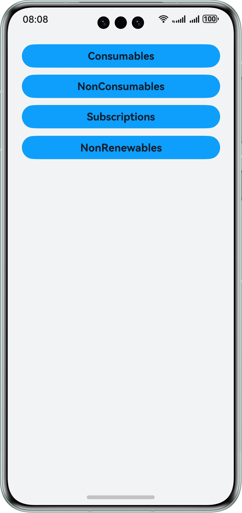
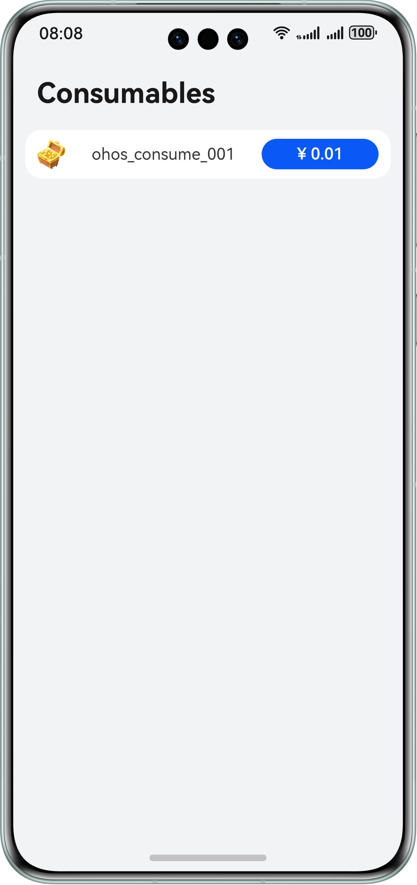
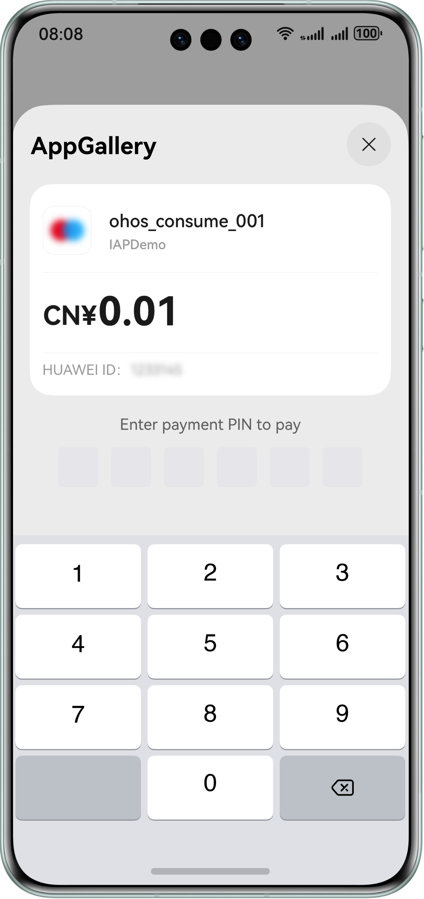

# IAP Kit

## Overview
IAP Kit can be easily integrated into your app to deliver a streamlined in-app payment experience, allowing you to focus on your app's core business and boosting monetization. With the help of IAP Kit's system-level payment APIs, your app can quickly show the IAP checkout screen for users to pay for various virtual goods sold within it.
These goods fall into the following categories: consumables, non-consumables, auto-renewable subscriptions, and non-renewable subscriptions.
- Consumables: Such products are depleted as they are used and can be purchased again. For example, in-game currencies and items.
- Non-consumables: They are purchased once and can be used indefinitely. They are not depleted with use. For example, extra game levels in games or unlimited premium memberships in apps.
- Auto-renewable subscriptions: A purchase that grants users access to enhanced features or content for a limited time. After the initial term, the subscription is automatically renewed, charging the user for the next period. For example, a month-to-month auto-renewable premium membership within an app, such as a video streaming service.
- Non-renewable subscription: A non-renewable subscription provides users with temporary access to enhanced features or content. After the specified duration, these privileges are terminated. To continue enjoying these benefits, users must make another purchase (auto-renewable subscription or non-renewable subscription) to extend their access. A common example would be a one-month premium membership for a video streaming service.

This sample code illustrates how to use the in-app payment service of IAP Kit. The APIs that you need to use are packaged into @kit.IAPKit.

## Preview






## How to Configure and Use
### Configuring the Project
1. Make necessary preparations. When configuring the signing information, use the manual signing method. For details, please refer to [Application Development Overview](https://developer.huawei.com/consumer/en/doc/harmonyos-guides/application-dev-overview).
   - If compatibleSdkVersion of your app is 14 or later, the tasks of [adding a public key fingerprint](https://developer.huawei.com/consumer/en/doc/harmonyos-guides/application-dev-overview#section1726913517284) and [configuring app identity information](https://developer.huawei.com/consumer/en/doc/harmonyos-guides/iap-config-app-identity-info#section96781336145618) are not required for IAP Kit integration.
2. Enabling Merchant Service. For details, please refer to [Enabling Merchant Service](https://developer.huawei.com/consumer/en/doc/harmonyos-guides/iap-enable-merchant-service).
3. Enabling and Activating IAP Kit. For details, please refer to [Enabling and Activating IAP Kit](https://developer.huawei.com/consumer/en/doc/harmonyos-guides/iap-enable-in-app-purchases).
4. Configure products in AppGallery Connect. For details, please refer to [Configuring Products](https://developer.huawei.com/consumer/en/doc/harmonyos-guides/iap-config-product).
5. Configure the sample code.
   - Set bundleName in the AppScope/app.json5 file to your app package name.
   - Set client_id in the entry/src/main/module.json5 file to the actual values. For details, please refer to [Configuring App Identity Information](https://developer.huawei.com/consumer/en/doc/harmonyos-guides/iap-config-app-identity-info).
   - Replace the products in this demo with your products. (Replace all product IDs in the productIds field of the iap.queryProducts API with the actual IDs of your products. Note that the product ID must match the product type.)
6. Run the sample code on the real device.

### Using the Sample App

1. On the home screen of your phone, go to Settings > HUAWEI ID. Make sure that you have signed your HUAWEI ID in.
2. On the home screen of your phone, tap IAP Demo to start the app.
3. Four buttons are available on the main UI of the demo:
   Consumables: button for purchasing consumables
   NonConsumables: button for purchasing non-consumables
   Subscriptions: button for purchasing auto-renewable subscriptions
   NonRenewables: button for purchasing non-renewable subscriptions
4. After you tap one of the buttons, you will see the product information and price button.
5. Tap the price button to display the checkout screen. After the payment is complete, you will go back to the product information UI.

## Required Permissions

None

## Dependencies

The HUAWEI ID must be signed in.

## Constraints
Device type: Huawei phone, tablet, and 2-in-1 device
HarmonyOS: HarmonyOS 5.0.2 Release or later
DevEco Studio: DevEco Studio 5.0.2 Release or later
HarmonyOS SDK: HarmonyOS 5.0.2 Release or later

## Code Structure
```
└── entry/src/main/ets
    └── common // Common component.
    │   └── IapDataModel.ets // Data model.
    │   └── JWSUtil.ets // JWS utility component, which is used to parse purchase data.
    │   └── Logger.ets // Logging component.
    │
    └── entryability // All abilities.
    │   └── EntryAbility.ets // Ability of the app's main UI.
    │
    └── pages // All pages.
        └── ConsumablesPage.ets // Page component of consumables. This component is used to display the product information, payment button, and others.
        └── EntryPage.ets // Page component of the app's main UI. This component is used to display the purchase buttons of consumables, non-consumables, and auto-renewable subscriptions.
        └── NonConsumablesPage.ets // Page component of non-consumables. This component is used to display the product information, payment button, and others.
        └── NonRenewablesPage.ets // Page component of non-renewable subscriptions. This component is used to display the product information, payment button, and others.
        └── SubscriptionsPage.ets // Page component of auto-renewable subscriptions. This component is used to display the product information and payment button, and also provides the functions of going to the subscription status screen and subscription details screen.
```