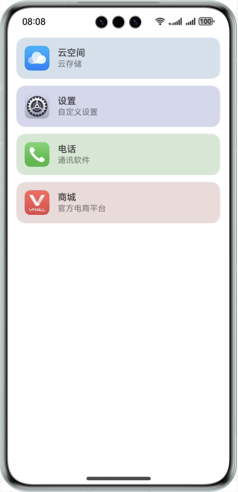

# 实现根据图标自适应背景色功能

### 介绍

本示例通过Image相关接口将Icon图标的解码为PixelMap对象，然后取出所有像素值，接着通过自定义算法遍历所有像素值，查找到出现次数最多的像素用于设置背景颜色。通过该案例开发者可以了解根据图片最多的像素点设置自适应背景色的具体方法。

### 效果图预览



**使用说明**

1. 转换图片为PixelMap，取出所有像素值。
2. 遍历所有像素值，查找到出现次数最多的像素，即为图片的主要颜色。
3. 适当修改图片的主要颜色，作为自适应的背景色。

### 实现思路

**实现步骤**

1. 解码图片，转换为PixelMap对象，便于提取像素值。
2. 提取所有像素值，转换为整数，放入数组中。
3. 遍历数组，将所有像素值放入一个Map中，key为像素值，value为个数。
4. 遍历Map，找出出现次数最多的像素值。
5. 将整数格式的像素值转换为RGB格式，再转换为HSV格式。
6. 将HSV格式转换为RGB格式，就得到了背景色。

### 高性能知识点

1. 解码图片时，分辨率设为40*40，既可以加快计算背景颜色的速度，又可以保证准确性。
2. 提取像素时，由于HarmonyOS中的颜色是用{red,green,blue,alpha}来表示，直接放入数组或者Map中会影响计算出现次数最多的像素的速度，所以需要使用rgbToNumber方法转换为整数。

### 工程结构&模块类型

   ```
├──entry/src/main/ets                         // ets 代码区
│  ├──constants
│  │  └──CommonConstants.ets                  // 常量定义文件  
│  ├──entryability
│  │  └──EntryAbility.ets       
│  ├──utils
│  │  ├──ImageUtils.ets                       // 图片处理工具类
│  │  └──ColorUtils.ets                       // 颜色处理工具类  
│  ├──pages
│  │  ├──IconItem.ets                         // Icon组件布局
│  │  └──Index.ets                            // 主页界面
│  └──viewmodel
│     ├──AppInfoModel.ets                     // App信息类
│     └──MockDataModel.ets                    // 列表信息类
└──entry/src/main/resources                   // 应用资源目录
   ```

### 模块依赖

**不涉及**

### 参考资料

**不涉及**

### 约束与限制

1. 本示例仅支持标准系统上运行，支持设备：华为手机。
2. HarmonyOS系统：HarmonyOS 5.0.5 Release及以上。
3. DevEco Studio版本：DevEco Studio 5.0.5 Release及以上。
4. HarmonyOS SDK版本：HarmonyOS 5.0.5 Release SDK及以上。