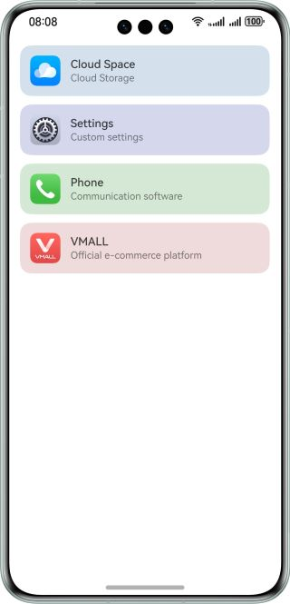

# Adaptive Background Color Based on the Icon

### Overview

This sample describes how to set an adaptive background color based on the icon main color.

### Preview



How to Use

1. Convert an image into a pixel map and obtains all pixel values.
2. Traverse all pixel values to find the pixel that appears most frequently, that is, the main color of the image.
3. Modify the main color of the image as the adaptive background color.

### How to Implement

How to Implement

1. Decode an image and convert it into a PixelMap object to extract pixel values.
2. Extract all pixel values, convert them into integers, and put them into an array.
3. Traverse the array and put all pixel values into a map. The key is the pixel value, and the value is the number of pixels.
4. Traverse the map to find the pixel value that appears most frequently.
5. Convert the pixel value in integer format to the RGB format and then to the HSV format.
6. Convert the HSV format to the RGB format to obtain the background color.

### High-Performance Knowledge

1. When decoding an image, set the resolution to 40 x 40 to accelerate the calculation of the background color and ensure the accuracy.
2. Colors in HarmonyOS are represented by {red,green,blue,alpha}. If the colors are directly put into an array or map, the speed of calculating the pixels that appear most frequently will be affected. Therefore, you need to use the rgbToNumber method to convert the colors to integers.

### Project Structure

   ```
├──entry/src/main/ets                        // ets code
│  ├──constants
│  │  └──CommonConstants.ets                 // Constant definition file 
│  ├──entryability
│  │  └──EntryAbility.ets       
│  ├──utils
│  │  ├──ImageUtils.ets                      // Image processing utils class
│  │  └──ColorUtils.ets                      // Color processing utils class  
│  ├──pages
│  │  ├──IconItem.ets                        // Icon component layout
│  |  └──Index.ets                           // Home page
│  └──viewmodel
│     ├──AppInfoModel.ets                    // App information class
│     └──MockDataModel.ets                   // List information class
└──entry/src/main/resources                  // App resource directory
   ```

### Dependencies

N/A

### Reference

N/A

### Constraints

1. The sample app is supported only on Huawei phones running the standard system.
2. The HarmonyOS version must be HarmonyOS 5.0.5 Release or later.
3. The DevEco Studio version must be DevEco Studio 5.0.5 Release or later.
4. The HarmonyOS SDK version must be HarmonyOS 5.0.5 Release SDK or later.
