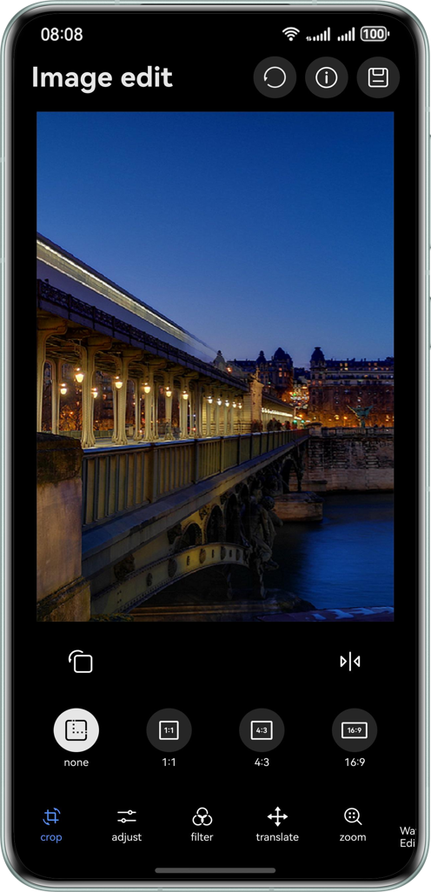
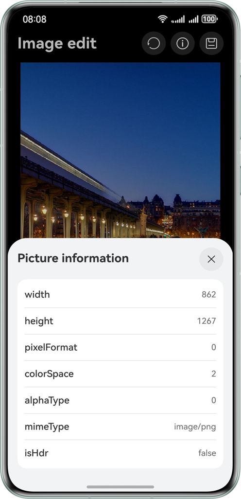
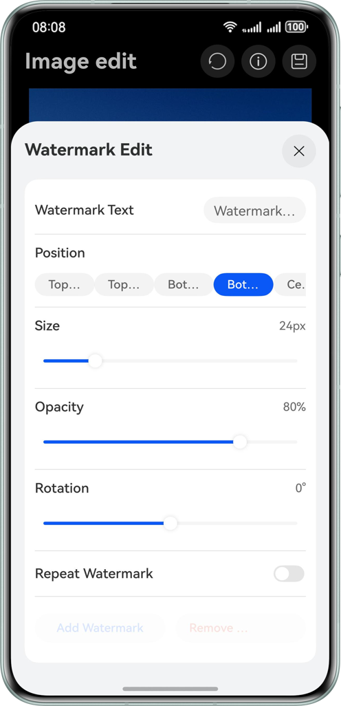
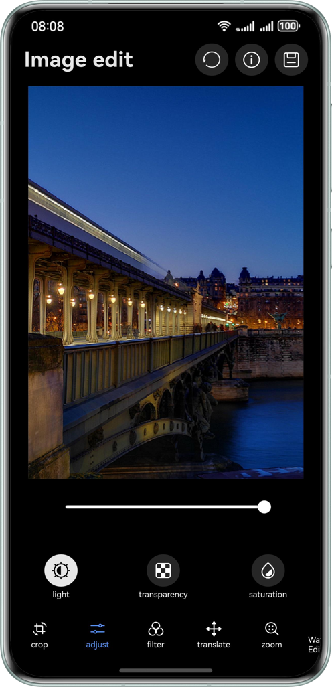
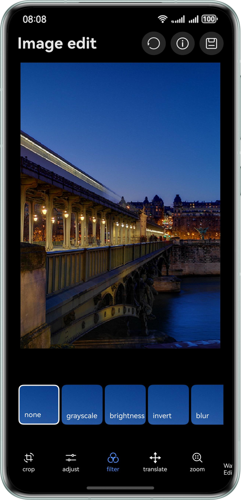
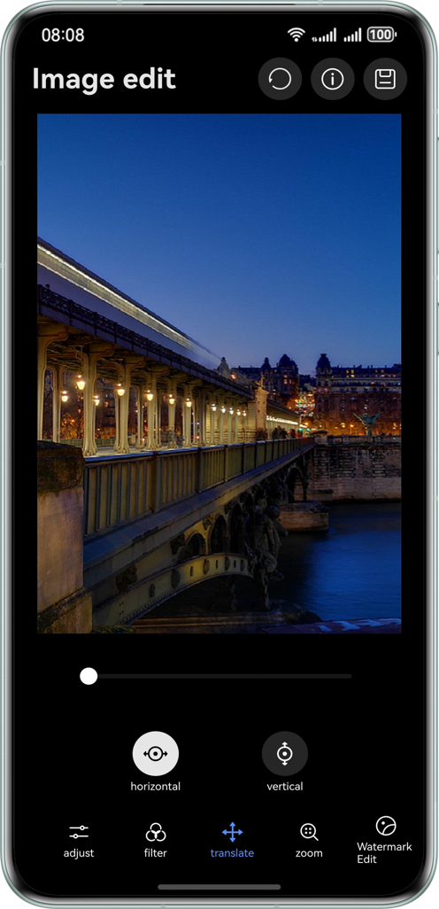
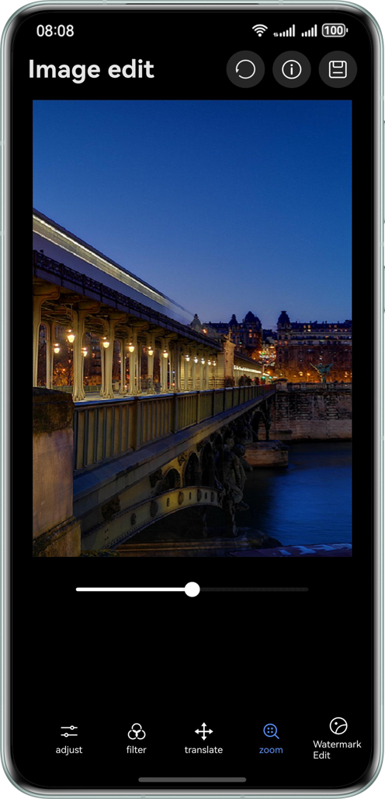

# Image Editing Using PixelMap and Canvas

## Overview

- This sample demonstrates how to implement efficient image processing using the PixelMap codec technology and Canvas.
  Users can perform basic editing operations such as cropping, rotation, zooming, and translation, as well as
  brightness, opacity, and saturation adjustment, and apply multiple filter effects and add watermarks.
- Real-time preview of edits is supported, and after completing adjustments, users can save the processed image. This
  meets the needs for daily image beautification and adjustment.

## Effect

|                         Cropping                         |                     Image Information                     |                         Watermark                         |                        Adjustment                         |
|:--------------------------------------------------------:|:---------------------------------------------------------:|:---------------------------------------------------------:|:---------------------------------------------------------:|
|  |   |  |  |
|                          Filter                          |                        Translation                        |                          Zooming                          |                                                           |
|   |  |   |                                                           |

## Features

- **Original image information**: displaying original image data after decoding
- **Basic editing**: cropping, rotation, and mirroring
- **Image adjustment**: adjusting brightness, opacity, and saturation
- **Image transformation**: translation and zooming
- **Filter effects**: black and white, blur, highlight, and other filters
- **Watermark**: adding text
- **Real-time preview**: previewing all editing operations in real time
- **Saving**: saving the edited image

## How to Use

Launch the app and select an image to edit.
Use the bottom tab bar to switch between different editing functions:

- **Crop**: Support for various aspect ratio cropping.
- **Adjust**: Adjust image brightness, transparency, and saturation.
- **Filter**: Apply various filter effects.
- **Translate**: Move the image horizontally and vertically.
- **Scale**: Zoom in or out of the image.
- **Watermark**: Add text.
  Preview editing effects in real-time.
  Tap the save button to save the edited image.

1. Start the application and select the image to be edited.
2. Use the bottom tabs to switch between different editing features.
   − **Cropping**: cropping in multiple proportions
   − **Adjustment**: adjusting brightness, opacity, and saturation
   − **Filter**: applying various filter effects
   − **Translation**: moving the image horizontally or vertically
   − **Zooming**: zooming in or out an image
   − **Watermark**: adding text
3. Preview the editing effect in real time.
4. Tap the save icon to save the edited image.

## Project Directory

```
├──entry/src/main/ets                   // code area
│  ├──common
│  │  └──constant
│  │     └──CommonConstants.ts          // Common Constants
│  ├──component
│  │  ├──TabComponent.ets               // Bottom tab bar component
│  │  └──TitleComponent.ets             // Top title bar components
│  ├──dialog
│  │  ├──MyCustomDialog.ets             // Custom dialog box 
│  │  └──SavePicker.ets                 // Dialog box for saving
│  ├──entryability
│  │  └──EntryAbility.ets
│  ├──entrybackupability
│  │  └──EntryBackupAbility.ets         // data backup and recovery
│  ├──pages
│  │  └──PictureEdit.ets                // Main editing page
│  ├──utils
│  │  ├──AdjustUtil.ets                 // Adjust utility 
│  │  ├──ContextStorageUtil.ets         // Context storage utility 
│  │  ├──CropUtil.ets                   // Crop utility 
│  │  ├──DecodeUtil.ets                 // Decode utility 
│  │  ├──EncodeUtil.ets                 // Encode utility 
│  │  ├──LoggerUtil.ets                 // Logger utility 
│  │  ├──OpacityUtil.ets                // Opacity utility 
│  │  ├──PixelMapManager.ets            // Image editing apps
│  │  └──WatermarkUtil.ets              // Watermark utility 
│  ├──view
│  │  ├──PixelDataManager.ets           // Instance 
│  │  ├──AdjustContentView.ets          // Adjustment component
│  │  ├──CropView.ets                   // Cropping component
│  │  ├──TranslateView.ets              // Translation component 
│  │  ├──ZoomView.ets                   // Zooming component 
│  │  ├──ApplyFilterView.ets            // Filter component 
│  │  └──WatermarkView.ets              // Watermark component
│  ├──viewModel           
│  │  ├──IconListViewModel.ets          // icon Model
│  │  ├──MessageItem.ets                // Multi-thread message transmission
│  │  ├──OptionViewModel.ets            // Operation enumeration 
│  │  ├──PictureEditModel.ets           // Image editing type
│  │  ├──PictureEditModelData.ets       // Image editing data
│  │  └──RegionItem.ets                 // Crop data type
│  └──workers
│     └──AdjustWork.ets                 // Thread          
└──entry/src/main/resources             // Application resources
```

## How to Implement

- Image decoding: the process of decoding an archived image in supported formats into a unified pixel map for image
  display or processing in applications or systems.
- PixelMap: provides APIs to read or write image pixel map data and obtain image pixel map information.
- Image encoding: the process of encoding a pixel map into an archived image in different formats for subsequent
  processing, such as saving and transmission.
- Canvas: a canvas component used for custom drawing and image rendering.
- OffscreenCanvas: an offscreen canvas component designed for background image processing and rendering.

## Required Permissions

- ohos.permission.WRITE_IMAGEVIDEO: allows an application to modify image and video files in the user directory.

## Constraints

1. This sample is only supported on Huawei phones running standard systems.
2. The HarmonyOS version must be HarmonyOS 5.1.1 Release or later.
3. The DevEco Studio version must be DevEco Studio 5.1.1 Release or later.
4. The HarmonyOS SDK version must be HarmonyOS 5.1.1 Release SDK or later.