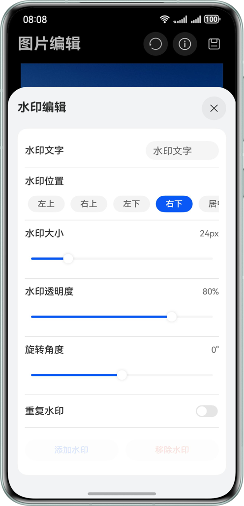

# 基于PixelMap与Canvas实现图片编辑

## 项目简介

- 基于PixelMap 编解码技术与 Canvas 画布实现高效图像处理。支持裁剪、旋转、缩放、平移等基础编辑，提供亮度、透明度、饱和度调节功能，内置多种滤镜效果及文字水印工具。
- 操作实时预览，编辑后可直接保存处理结果，满足日常图片美化与调整需求。

## 效果预览

|                           裁剪                            |                           图片信息                           |                            水印                            |                            调节                            |
|:-------------------------------------------------------:|:--------------------------------------------------------:|:--------------------------------------------------------:|:--------------------------------------------------------:|
|    |     |    |    |
|                           滤镜                            |                            平移                            |                            缩放                            |                                                          |
|     |    |     |                                                          |

## 功能特性
- **原图信息**：查看解码原图数据。
- **基础编辑**：裁剪、旋转、镜像。
- **图像调节**：亮度、透明度、饱和度调节。
- **图像变换**：平移、缩放。
- **滤镜效果**：黑白、模糊、高亮等多种滤镜。
- **水印功能**：支持添加文字。
- **实时预览**：所有编辑操作支持实时预览。
- **保存功能**：支持保存编辑后的图片。

## 使用说明
1. 启动应用后选择要编辑的图片。
2. 使用底部标签页切换不同的编辑功能：
   - **裁剪**：支持多种比例裁剪。
   - **调节**：调整图片亮度、透明度、饱和度。
   - **滤镜**：应用各种滤镜效果。
   - **平移**：水平和垂直移动图片。
   - **缩放**：放大或缩小图片。
   - **水印**：添加文字。
3. 实时预览编辑效果。
4. 点击保存按钮保存编辑后的图片。

## 工程目录

```
├──entry/src/main/ets                  // 代码区
│  ├──common
│  │  └──constant
│  │     └──CommonConstants.ets        // 常量
│  ├──component
│  │  ├──TabComponent.ets              // 底部Tab栏组件
│  │  └──TitleComponent.ets            // 顶部标题栏组件
│  ├──dialog
│  │  ├──MyCustomDialog.ets            // 自定义弹出框
│  │  └──SavePicker.ets                // 保存弹出框
│  ├──entryability
│  │  └──EntryAbility.ets              // 应用入口
│  ├──entrybackupability
│  │  └──EntryBackupAbility.ets        // 数据备份与恢复
│  ├──pages
│  │  └──PictureEdit.ets               // 主编辑页面
│  ├──utils
│  │  ├──AdjustUtil.ets                // 调节utils
│  │  ├──ContextStorageUtil.ets        // 上下文存储utils
│  │  ├──CropUtil.ets                  // 裁剪utils
│  │  ├──DecodeUtil.ets                // 解码utils
│  │  ├──EncodeUtil.ets                // 编码utils
│  │  ├──LoggerUtil.ets                // 日志utils
│  │  ├──OpacityUtil.ets               // 透明utils
│  │  ├──PixelMapManager.ets           // 图片编辑utils
│  │  └──WatermarkUtil.ets             // 水印utils
│  ├──view
│  │  ├──PixelDataManager.ets          // 实例
│  │  ├──AdjustContentView.ets         // 调节组件
│  │  ├──CropView.ets                  // 裁剪组件
│  │  ├──TranslateView.ets             // 平移组件
│  │  ├──ZoomView.ets                  // 缩放组件
│  │  ├──ApplyFilterView.ets           // 滤镜组件
│  │  └──WatermarkView.ets             // 水印功能组件
│  ├──viewModel           
│  │  ├──IconListViewModel.ets         // icon Model
│  │  ├──MessageItem.ets               // 多线程传输消息
│  │  ├──OptionViewModel.ets           // 操作枚举
│  │  ├──PictureEditModel.ets          // 图片编辑类型
│  │  ├──PictureEditModelData.ets      // 图片编辑数据
│  │  └──RegionItem.ets                // 裁剪数据类型
│  └──workers
│     └──AdjustWork.ets                // 线程         
└──entry/src/main/resources            // 应用资源目录
```

## 具体实现

- 图片解码：图片解码指将所支持格式的存档图片解码成统一的PixelMap，以便在应用或系统中进行图片显示或图片处理。
- PixelMap：图像像素类，用于读取或写入图像数据以及获取图像信息。
- 图片编码：图片编码指将PixelMap编码成不同格式的存档图片，用于后续处理，如保存、传输等。
- Canvas：画布组件，用于自定义绘制图形、图片等内容。
- OffscreenCanvas：离屏画布，用于在后台进行图像处理和渲染。


## 相关权限

- 允许修改用户公共目录的图片或视频文件：ohos.permission.WRITE_IMAGEVIDEO。

## 约束与限制

1. 本示例仅支持标准系统上运行，支持设备：华为手机。
2. HarmonyOS系统：HarmonyOS 5.1.1 Release及以上。
3. DevEco Studio版本：DevEco Studio 5.1.1 Release及以上。
4. HarmonyOS SDK版本：HarmonyOS 5.1.1 Release SDK及以上。
