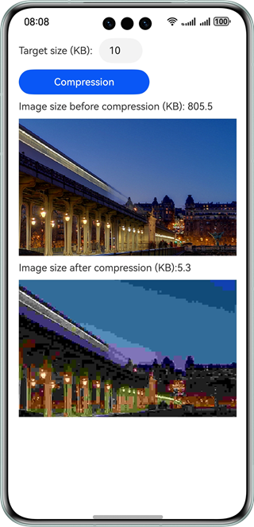

# Image Compression

### Overview
This sample uses the interfaces provided by @ohos.multimedia.image to compress images using the binary reduction method.

### Preview

|      **Image compression**       |
|:--------------------------------:|
|  |

### How to Use

1. Start the app. The home page is displayed properly.

2. Enter the target size of the image and touch **Compress**.

3. The compressed image is displayed, and the actual size of the image after compression is less than or equal to the input target size.

### Project Directory

```
├──entry/src/main/ets/
│  ├──common
│  │  └──Constants.ets                  // Common constants
│  ├──entryability
│  │  └──EntryAbility.ets               // Entry ability
│  └──pages                  
│     └──Index.ets                      // Home page
└──entry/src/main/resources             // Static resources
```

### Required Permissions

N/A

### Constraints

1. The sample app is supported only on Huawei phones running the standard system.

2. The HarmonyOS version must be HarmonyOS 5.0.5 Release or later.

3. The DevEco Studio version must be DevEco Studio 5.0.5 Release or later.

4. The HarmonyOS SDK version must be HarmonyOS 5.0.5 Release SDK or later.
