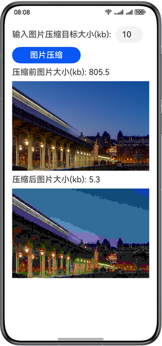

# 实现图片压缩

### 简介
本示例通过Image kit相关接口，实现了对图片进行压缩的功能，主要是通过二分法进行图片压缩，参考本示例可实现选择图片目标大小进行压缩的功能。

### 效果预览：

|           **图片压缩**            |
|:-----------------------------:|
|  |

使用说明：

1.启动应用后，首页正常显示界面。

2.输入图片压缩目标大小，点击图片压缩。

3.出现压缩后的图片，实际压缩大小小于等于输入的目标压缩大小。

### 工程目录

```
├──entry/src/main/ets/
│  ├──common
│  │  └──Constants.ets                  // 公共常量类
│  ├──entryability
│  │  └──EntryAbility.ets               // 程序入口类
│  └──pages                  
│     └──Index.ets                      // 首页
└──entry/src/main/resources             // 应用静态资源目录
```

### 相关权限

- 无权限涉及

### 约束与限制

1.本示例仅支持标准系统上运行，支持设备：华为手机。

2.HarmonyOS系统：HarmonyOS 5.0.5 Release及以上。

3.DevEco Studio版本：DevEco Studio 5.0.5 Release及以上。

4.HarmonyOS SDK版本：HarmonyOS 5.0.5 Release SDK及以上。