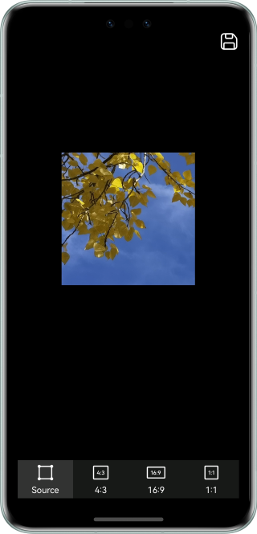

# PixelMap Deep Copy

### Overview

The deep copy of PixelMap is often involved in image development. In this sample, the readPixelsToBuffer method of PixelMap is used to implement the deep copy. When the source pixel map is created, the decoding parameter needs to be set to **RGBA_8888**. When the target pixel map is created in deep copy mode, the decoding parameter needs to be set to **RGBA_8888**.

### Preview

 

How to Use

1. Access the page, which shows the PixelMap object after the deep copy of the PixelMap of the image in the rawfile.
2. Tap the button at the bottom to perform deep copy on the original pixel map and then crop the pixel map based on the corresponding ratio.
3. Tap the save icon on the top to save the current image.

### How to Implement
1. Deep copy of the pixel map: Call readPixelsToBuffer to read the pixel map of the image resource to ArrayBuffer, and then call createPixelMap to obtain the target pixel map.
2. Create a target pixel map from the original pixel map by deep copy during initialization.
3. Call the crop method to crop the image.
4. Call the FileIO API to save the image to a specific path.

### High-Performance Knowledge

N/A

### Project Structure
```
├──entry/src/main/ets                         // ets code
│  ├──constants
│  │  └──CommonConstants.ets                  // Constant definition file 
│  ├──entryability
│  │  └──EntryAbility.ets       
│  ├──util
│  │  ├──CopyObj.ets                          // Service layer - image deep cop
│  │  └──FileUtil.ets                         // Service layer - image saving
│  ├──model
│  │  └──AdjustData.ets                       // Tailoring option resources
│  └──pages
│     └──Index.ets                            // Home page
└──entry/src/main/resources                   // App resource directory
```
   
### Dependencies

N/A

### Reference

1. PixelMap operation
2. Packing

### Constraints

1. The sample app is supported only on Huawei phones running the standard system.
2. The HarmonyOS version must be HarmonyOS 5.0.5 Release or later.
3. The DevEco Studio version must be DevEco Studio 5.0.5 Release or later.
4. The HarmonyOS SDK version must be HarmonyOS 5.0.5 Release SDK or later.
