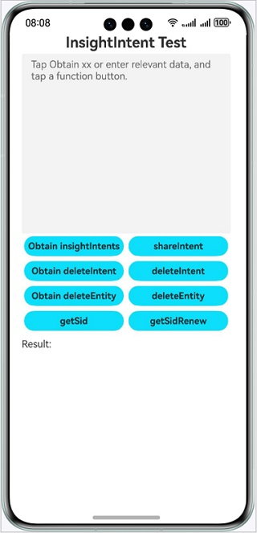
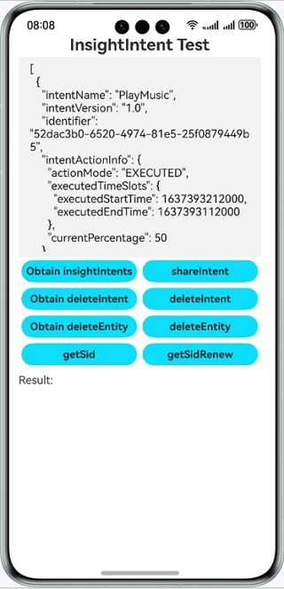
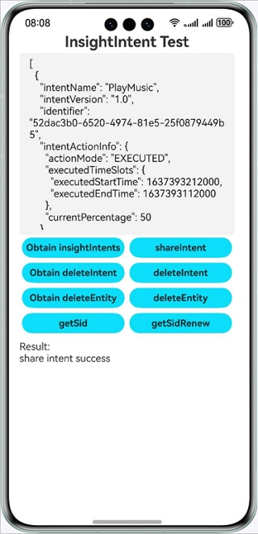
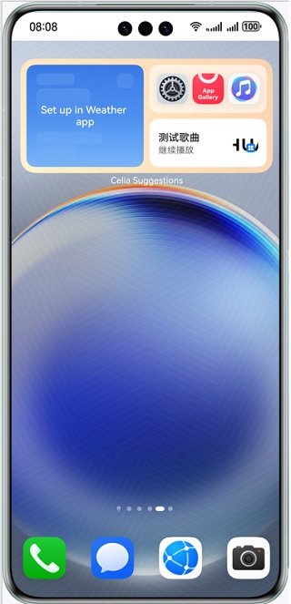
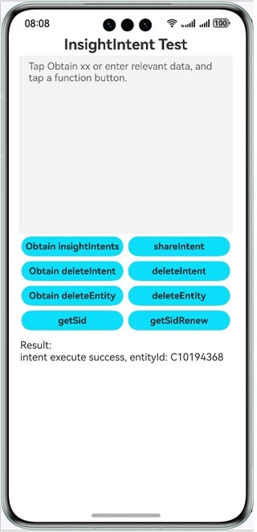
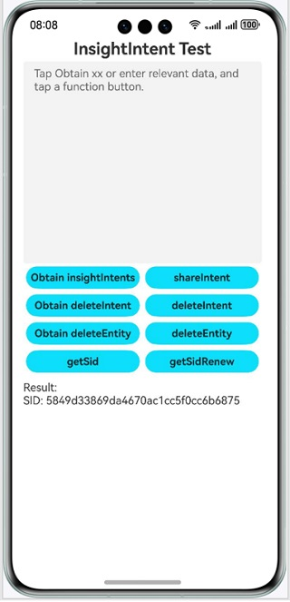
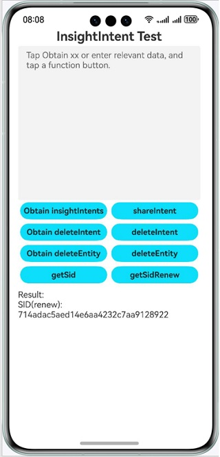

# Intents Kit

## Overview
- This sample demonstrates how to use **@kit.IntentsKit** for intent sharing and use **InsightIntentExecutor** of **@kit.AbilityKit** for intent calls, based on Intents Kit.

## Preview

### Intent Sharing
1. Access the intent sharing UI.

   

2. Tap **Obtain insightIntents** to obtain the sample data of **insightIntent**. The obtained sample data will be displayed in the text box in the upper part of the intent sharing UI.

   

3. Tap **shareIntent** to share data and obtain the intent sharing result in the result area at the bottom of the intent sharing UI.

   

### Intent Call

- After the intent to be shared is processed, it will be displayed in a widget in Celia Suggestions. Tap the displayed widget to execute the intent call logic.

#### Calling an Intent Using a Template Widget in Celia Suggestions
1. Find the target template in Celia Suggestions. A template widget for the music domain is used as an example in this project.

   

2. Tap the template widget. Redirection will be performed based on the logic of the intent registration configuration. The intent sharing UI is displayed as an example, and the parameters returned after the intent is called are displayed in the result area at the bottom of the sharing UI.

   

### Obtaining an SID
1. Tap **getSid** to obtain an SID and display it in the result area (the cached SID is preferentially obtained).

   

2. Tap **getSidRenew** to forcibly obtain a new SID and display it in the result area.

   

## Project Directory
```
entry/src/main/
| --- ets
|     | --- entryability
|     |     | --- EntryAbility.ets                                  // Intent sharing UI ability.
|     |     | --- InsightIntentExecutorImpl.ets                     // Intent call logic.
|     | --- pages
|     |     | --- Index.ets                                         // Intent sharing UI.
|     | --- utils
|     |     | --- FileReader.ets                                    // Used to read the intent sample data file.
|     |     | --- InsightIntentSharer.ets                           // Intent sharing and getSid API call.
|     |     | --- Logger.ets                                        // Log printing.
| --- resources
|     | --- base
|     |     | --- profile
|     |     |     | --- insight_intent.json                         // Intent registration configuration.
|     |     |     | --- main_pages.json                             // App UI list.
|     | --- rawfile
|     |     | --- config
|     |     |     | --- deleteEntity.json                           // Example of deleting entity data through the API.
|     |     |     | --- deleteIntent.json                           // Example of deleting intent data through the API.
|     |     |     | --- shareIntent.json                            // Example of sharing intent data through the API.
```

## How to Implement

Intent sharing is implemented in **InsightIntentSharer**. For details about the source code, please see **InsightIntentSharer.ets**.

- Intent sharing: Create an **insightIntent.InsightIntent** data entity, use **insightIntent.shareIntent** to share the intent data, and execute the post-sharing logic through a promise or callback.

Intent calls are implemented in **InsightIntentExecutorImpl**. For details about the source code, please see **InsightIntentExecutorImpl.ets**.

- Intent calls: Override the **onExecuteInUiAbilityForegroundMode** method, determine the intent name based on the **name** parameter, and obtain the parameters for calling the intent through the **param** parameter.

## Required Permissions

### Dependencies
1. This example depends on @ohos/hvigor-ohos-plugin 4.3.0 or later.
2. If you are using a version of DevEco Studio that is later than the recommended version for this sample, please update the hvigor plugin according to the prompt from DevEco Studio.
3. To obtain an SID, you need to connect to the Internet, sign in with your HUAWEI ID, and agree to the user agreement and privacy policy of Celia Suggestions.

### Constraints
1. <font>**Developers currently cannot independently complete testing for intent sharing and calls. Please follow the Intents Kit integration process and submit an acceptance request via email to Huawei's Intents Kit contact person. The contact person will assist you in completing the test acceptance.**</font>
2. The sample app is only supported on Huawei phones and tablets with standard systems.
3. The HarmonyOS version must be HarmonyOS NEXT Developer Beta1 or later.
4. The DevEco Studio version must be DevEco Studio NEXT Developer Beta1 or later.
5. The HarmonyOS SDK version must be HarmonyOS NEXT Developer Beta1 SDK or later.
