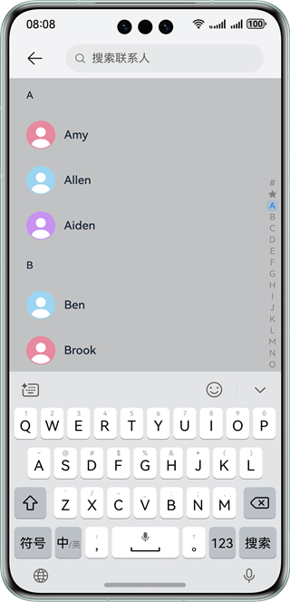
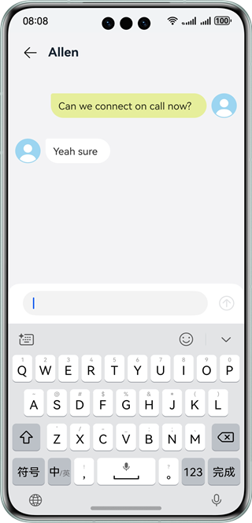
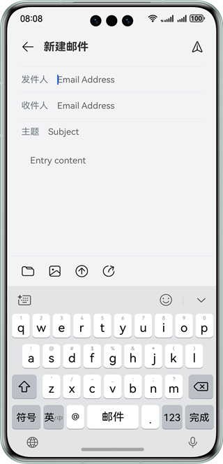
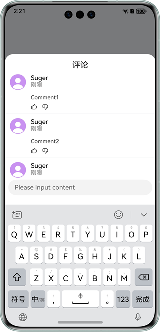

# 实现软键盘弹出功能

### 介绍

本示例展示了输入框分别在屏幕顶部和底部时软键盘弹出对页面布局的影响，通过设置软键盘的避让模式为KeyboardAvoidMode.RESIZE、设置NavDestination的mode为NavDestinationMode.DIALOG和设置toast的showMode为ToastShowMode.TOP_MOST等方式实现布局的避让，帮助开发者在多种软件盘弹出场景下实现合理的页面布局。

### 效果预览
| 聊天列表页面                        | 聊天页面                          | 邮件页面                          |
|-------------------------------|-------------------------------|-------------------------------|
|  |  |  |
| 评论页面                          | 
|  | 

使用说明

1、点击搜索按钮，顶部栏变为搜索框，点击搜索框在下方弹出软键盘，中间列表不变形。

2、点击任一联系人，进入聊天页面，点击下方输入框弹出软键盘，中间列表被挤压，顶部栏不动。

3、进入邮件页面，点击发件人，弹出软键盘，通过设置软键盘的避让模式为KeyboardAvoidMode.RESIZE（压缩模式），来解决底部操作栏被遮挡的问题。

4、进入评论页面，点击输入框，弹出软键盘，通过设置NavDestination的mode为NavDestinationMode.DIALOG弹窗类型，并设置软键盘避让模式为压缩模式，解决页面上抬的距离过多的问题。

### 工程目录
```
├──entry/src/main/ets
│  ├──common
│  │  └──constants
│  │     └──CommonConstants.ets             // 常量类
│  ├──entryability
│  │  └──EntryAbility.ets                   // 程序入口类
│  ├──pages
│  │  ├──ChatListPage.ets                   // 聊天列表页面
│  │  ├──Comment.ets                        // 评论页面
│  │  ├──ContactPage.ets                    // 聊天页面
│  │  ├──CustomDialogAvoid.ets    
│  │  ├──ExamplePage.ets    
│  │  ├──ExamplePageMode.ets   
│  │  ├──GetKeyboardHeightDemo.ets
│  │  ├──GetSafeAreaHeightDemo.ets
│  │  ├──GetSafeAreaHeightDemoMode.ets         
│  │  ├──Index.ets                          // 主页面
│  │  ├──MailHomePage2.ets
│  │  ├──MailPage.ets                       // 邮件页面
│  │  └──NavDestinationModeDemo.ets 
│  ├──view
│  │  └──dialog
│  │     └──CommentDialog.ets               // 评论窗口
│  └──viewmodel
│     ├──ChatData.ets                       // 聊天数据类
│     └──ContactData.ets                    // 联系人数据类
└──entry/src/main/resources                 // 应用静态资源目录
```
### 具体实现

* 输入框在顶部时，软键盘默认从底部弹出且不挤压页面布局。
* 输入框在底部时，软键盘从底部弹出会挤压页面布局，此时对不想要被挤压的组件需要配置安全区域。
* 软键盘自动弹出，需要设置TextInput的defaultFocus为true
* 弹窗不避让软键盘，需要设置消息弹窗showMode为ToastShowMode.TOP_MOST
* 设置软键盘的避让模式为KeyboardAvoidMode.RESIZE（压缩模式），可以解决底部操作栏被遮挡的问题

### 相关权限

不涉及。

### 依赖

不涉及。

### 约束与限制

1.本示例仅支持标准系统上运行，支持设备：华为手机。

2.HarmonyOS系统：HarmonyOS 5.0.5 Release及以上。

3.DevEco Studio版本：DevEco Studio 5.0.5 Release及以上。

4.HarmonyOS SDK版本：HarmonyOS 5.0.5 Release SDK 及以上。