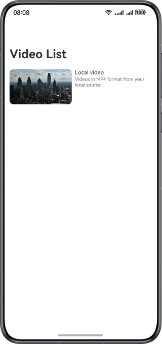
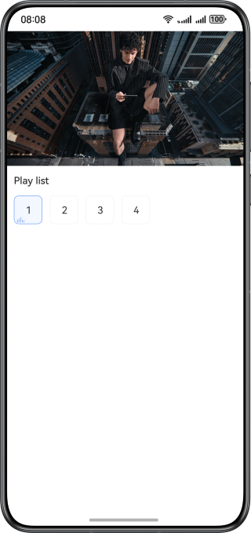
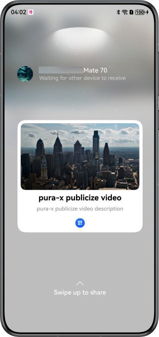

# Tap to Transfer for Videos Through Share Kit

### Overview

This sample shows how to use Share Kit and App Linking to share video playback across devices. You can use the
harmonyShare.on() method to register a Tap-to-Transfer event listener, and use the sharableTarget.share() method in the
callback to share URLs of App Linking, providing a seamless user experience.

### Effect

| Home Page                     | Playback Page                | Preview                         |
|-------------------------------|------------------------------|---------------------------------|
|  |  |  |

**How to Use**

1. Before running your project, configure App Linking and manually sign your application. For details,
   see [Using App Linking for App-to-App Redirection](https://developer.huawei.com/consumer/en/doc/harmonyos-guides/app-linking-startup).
2. Open the [KnockController.ets](entry/src/main/ets/controller/KnockController.ets) file, replace the content parameter in the share() method with a valid link, and change the host field of uris in
   the [module.json5](./entry/src/main/module.json5) file to a valid domain name.
3. Install and run the sample code on both device A and device B. Ensure that the screens are unlocked and turned on,
   and Huawei Share on both devices is enabled (enabled by default).
4. Access the video playback page on device A, and let both devices tap the tops for transfer.
5. After you swipe up the preview image of a video on device A, device B will receive the image and start the
   application for video playback.

### Project Structure

```
├──entry/src/main/ets 
│  ├──controller          
│  │  ├──AVPlayerController.ets             // Video playback control 
│  │  └──KnockController.ets                // Tap to Transfer control 
│  ├──entryability                         
│  │  └──EntryAbility.ets                   // Entry ability 
│  ├──entrybackupability                   
│  │  └──EntryBackupAbility.ets             // Data backup and restoration 
│  ├──model                                
│  │  └──VideoData.ets                      // Video data 
│  ├──pages                                
│  │  ├──Index.ets                          // Home page 
│  │  └──VideoPlay.ets                      // Video playback page, on which Tap to Transfer is implemented 
│  ├──utils                            
│  │  ├──ImageUtil.ets                      // Image processing utility 
│  │  └──Logger.ets                         // Logger 
│  │  └──TimeConvert.ets                    // Time conversion utility 
│  └──view                                 
│     ├──AVPlayerControllerView.ets         // Video playback control component 
│     ├──EpisodeChoose.ets                  // Video episode selection component 
│     └──VideoPlayingView.ets               // Video playback component 
└──service 
   └──index.html                            // Web page for video playback, which needs to be deployed on the server         
```

### How to Implement

* Use the systemShare module of Share Kit to implement Tap to Transfer.
* Use App Linking to start an application.

### Required Permissions

**N/A**

### Module Dependencies

**N/A**

### Constraints

1. The sample app is supported on Huawei phones and PC running the standard system.
2. The HarmonyOS version must be HarmonyOS 6.0.0 Beta1 or later.
3. The DevEco Studio version must be DevEco Studio 6.0.0 Beta1 or later.
4. The HarmonyOS SDK version must be HarmonyOS 6.0.0 Beta1 SDK or later.