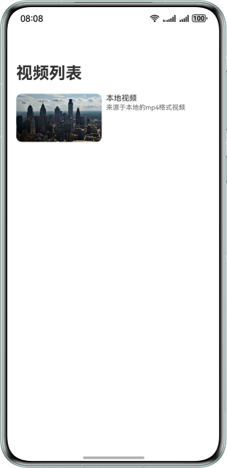
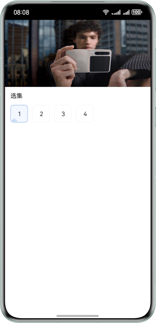
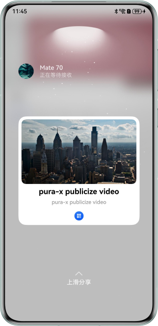

# 基于Share Kit实现碰一碰视频快速分享

### 介绍

本示例利用Share Kit与App Linking的结合，实现了快速跨设备分享视频并直接进入应用内视频播放页面的功能。通过harmonyShare.on()
方法注册碰一碰监听事件，并在回调中使用sharableTarget.share()方法分享App Linking链接，从而提供了一步直达的流畅用户体验。

### 效果图预览

| 首页                         | 播放页面                      | 碰一碰分享预览                      |
|----------------------------|---------------------------|------------------------------|
|  |  |  |

**使用说明**

1. 在运行项目前，需要完成App Linking的配置，以及对应用进行手动签名，具体可以参考[使用App Linking实现应用间跳转](https://developer.huawei.com/consumer/cn/doc/harmonyos-guides/app-linking-startup)。
2. 在完成App Linking的配置后，请前往[KnockController.ets](entry/src/main/ets/controller/KnockController.ets)文件，将share()方法中的content参数替换为真实可用的链接地址，同时将[module.json5](./entry/src/main/module.json5)文件中uris的host修改为可用的域名。
3. 设备A和设备B均安装运行示例代码，在亮屏、解锁的状态下并且都已开启华为分享服务（系统默认开启）
4. 设备A进入视频播放页面，和设备B顶部轻碰触发碰一碰分享。
5. A设备在分享界面上滑预览图，设备B接收到图片，并且直接拉起应用视频播界面。

### 工程结构

```
├──entry/src/main/ets
│  ├──controller         
│  │  ├──AVPlayerController.ets             // 视频播放控制类             
│  │  └──KnockController.ets                // 碰一碰分享控制类
│  ├──entryability                        
│  │  └──EntryAbility.ets                   // 程序入口类
│  ├──entrybackupability                  
│  │  └──EntryBackupAbility.ets             // 数据备份恢复类
│  ├──model                               
│  │  └──VideoData.ets                      // 视频数据
│  ├──pages                               
│  │  ├──Index.ets                          // 首页
│  │  └──VideoPlay.ets                      // 视频播放页，包含碰一碰分享功能实现。
│  ├──utils                           
│  │  ├──ImageUtil.ets                     // 图片处理工具类
│  │  ├──Logger.ets                        // 日志打印工具类
│  │  └──TimeConvert.ets                   // 时间转换工具类
│  └──view                                
│     ├──AVPlayerControllerView.ets         // 视频播放控制器组件
│     ├──EpisodeChoose.ets                  // 视频选集组件
│     └──VideoPlayingView.ets               // 视频播放组件
└──service
   └──index.html                            // 视频播放放Web页面，需要部署在服务器              
```

### 具体实现
* 通过Share Kit的systemShare模块实现碰一碰分享功能。
* 通过App Linking实现应用拉起功能。

### 相关权限

**不涉及**

### 模块依赖

**不涉及**

### 约束与限制

1. 本示例仅支持标准系统上运行，支持设备：华为手机、华为PC。
2. HarmonyOS系统：HarmonyOS 6.0.0 Beta1及以上。
3. DevEco Studio版本：DevEco Studio 6.0.0 Beta1及以上。
4. HarmonyOS SDK版本：HarmonyOS 6.0.0 Beta1 SDK及以上。