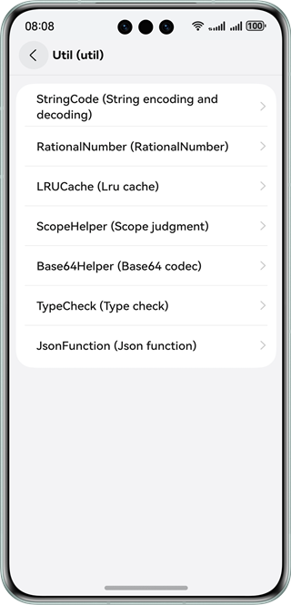

# Language Base Class Library

### Overview
This sample shows the basic functions of each sub-module of the language base class library, including:

- @ohos.convertxml (XML-to-JavaScript Conversion)
- @ohos.taskpool (Starting the TaskPool)
- @ohos.uri (URI String Parsing)
- @ohos.util (util)
- @ohos.util.ArrayList (Linear Container ArrayList)
- @ohos.util.Deque (Linear Container Deque)
- @ohos.util.HashMap (Nonlinear Container HashMap)
- @ohos.util.HashSet (Nonlinear Container HashSet)
- @ohos.util.LightWeightMap (Nonlinear Container LightWeightMap)
- @ohos.util.LightWeightSet (Nonlinear Container LightWeightSet)
- @ohos.util.LinkedList (Linear Container LinkedList)
- @ohos.util.List (Linear Container List)
- @ohos.util.PlainArray (Nonlinear Container PlainArray)
- @ohos.util.Queue (Linear Container Queue)
- @ohos.util.Stack (Linear Container Stack)
- @ohos.util.TreeMap (Nonlinear Container TreeMap)
- @ohos.util.TreeSet (Nonlinear Container TreeSet)
- @ohos.xml (XML Parsing and Generation)
- @ohos.convertxml (XML-to-JavaScript Conversion)

### Preview

|                Home Page                 |                 **Util**                 |
|:----------------------------------------:|:----------------------------------------:|
|  |  |

How to Use

1. The home page displays the menus of each sub-module of the language basic library. Tap a sub-module to go to the corresponding module page.
2. Tap function buttons on the page of each sub-module to implement each function.
3. Util comes with level-2 menus. Tap a menu to access the corresponding level-2 page, including:

   * StringCode: encodes and decodes character strings. Tap function buttons to implement each function.
   * RationnalNumber: Rational number comparison. Tap function buttons to implement each function.
   * LRUCache: LRU buffer. Tap function buttons to implement each function.
   * ScopeHelper: determines the scope. Tap function buttons to implement each function.
   * Base64Helper: Base64 encoding and decoding. Tap function buttons to implement each function.
   * TypeCheck: checks the type. Tap function buttons to implement each function.
   * JsonFunction: common JSON method. Tap function buttons to implement each function.
4. On the **Xml & ConvertXml** page, tap function buttons to implement each function.
5. On the **TaskPool** page, tap **Execute task** to execute the task or **Cancel task** to cancel the task.
6. On the URL page, tap function buttons to implement each function.
7. On the ArrayList page, tap the plus sign (+) to add data, or tap the delete button to delete a data record.
8. On the Deque page, tap the plus sign (+) to add data, or tap the delete button to delete a data record.
9. On the HashMap page, tap the plus sign (+) to add data, or tap the delete button to delete a data record.
10. On the HashSet page, tap the plus sign (+) to add data, or tap the delete button to delete a data record.
11. On the LightWeightMap page, tap the plus sign (+) to add data, or tap the delete button to delete a data record.
12. On the LightWeightSet page, tap the plus sign (+) to add data, or tap the delete button to delete a data record.
13. On the LinkedList page, tap the plus sign (+) to add data, or tap the delete button to delete a data record.
14. On the List page, tap the plus sign (+) to add data, or tap the delete button to delete a data record.
15. On the PlainArray page, tap the plus sign (+) to add data, or tap the delete button to delete a data record.
16. On the Queue page, tap the plus sign (+) to add data, or tap the delete button to delete a data record.
17. On the Stack page, tap the plus sign (+) to add data, or tap the delete button to delete a data record.
18. On the TreeMap page, tap the plus sign (+) to add data, or tap the delete button to delete a data record.
19. On the TreeSet page, tap the plus sign (+) to add data, or tap the delete button to delete a data record.

### Project Directory

```
LanguageBaseClassLibrary
├──common/src/main/ets                        // Common components and tools
│  ├──components 
│  │  ├──BaseDataSource.ets                   // Basic data source
│  │  ├──CustomDataSource.ets                 // Custom data source, used together with LazyForEach.
│  │  └──EmptyPage.ets                        // Empty page component
│  └──util
│     ├──Logger.ets                           // Logger
│     └──ResourceUtil.ets                     // Resource management util class
├──common/src/main/resources                  // Directory of resource files
├──entry/src/main/ets                         // Home page of the language base class library application
│  ├──entryability
│  │  └──EntryAbility.ets     
│  └──pages
│     ├──AddInformationView.ets               // Page for adding a contact
│     ├──AddKeyValuePairView.ets              // Page for adding the key-value pair
│     ├──AddStringView.ets                    // Page for add a string
│     └──Index.ets                            // Home page
├──entry/src/main/resources                   // Directory of resource files
├──feature/capabilities/src/main/ets          // Function set
│  ├──capabilities                            // Components of each submodule
│  │  ├──ArrayListView.ets                    // ArrayList component
│  │  ├──ConvertXml.ets                       // ConvertXml component
│  │  ├──DequeView.ets                        // DequeView component
│  │  ├──HashMapView.ets                      // HashMapView component
│  │  ├──HashSetView.ets                      // HashSetView component
│  │  ├──LightWeightMapView.ets               // LightWeightMapView component
│  │  ├──LightWeightSetView.ets               // LightWeightSetView component
│  │  ├──LinkedListView.ets                   // LinkedListView component
│  │  ├──ListView.ets                         // ListView component
│  │  ├──PlainArrayView.ets                   // PlainArrayView component
│  │  ├──QueueView.ets                        // QueueView component
│  │  ├──StackView.ets                        // StackView component
│  │  ├──TaskPool.ets                         // TaskPool component
│  │  ├──TreeMapView.ets                      // TreeMapView component
│  │  ├──TreeSetView.ets                      // TreeSetView component
│  │  ├──Url.ets                              // URL component
│  │  └──Util.ets   
│  ├──components             
│  │  ├──arkTSUtilcomponents                  // ArkTSUtil components
│  │  ├──arraylistcomponents                  // Arraylist components
│  │  ├──dequecomponents                      // Deque components
│  │  ├──hashmapcomponents                    // Hashmap components
│  │  ├──hashsetcomponents                    // Hashset components
│  │  ├──lightweightmapcomponents             // Lightweightmap components
│  │  ├──lightweightsetcomponents             // Lightweightset components
│  │  ├──linkedlistcomponents                 // Linkedlist components
│  │  ├──listcomponents                       // List components
│  │  ├──plainarraycomponents                 // PlainArray components
│  │  ├──queuecomponents                      // Queue components
│  │  ├──stackcomponents                      // Stack components
│  │  ├──treemapcomponents                    // Treemap components
│  │  ├──treesetcomponents                    // Treeset components
│  │  ├──utilcomponents                       // Util components
│  │  ├──ColumnOperation.ets                  // Component for displaying column operations
│  │  ├──DeleteView.ets                       // Component for deleting a button
│  │  ├──GridOperation.ets                    // Component for displaying function buttons in different columns based on the window size
│  │  ├──InformationItemView.ets              // Component of the contact item
│  │  ├──KeyValueItemView.ets                 // Component of the Key/Value item
│  │  └──ValueItemView.ets                    // Component of the value item
│  ├──model                                   // Data model
│  │  ├──Information.ets
│  │  ├──KeyValuePair.ets
│  │  └──ScopeNumber.ets
│  ├──utils                                   // Utils class
│  │  ├──ConvertXmlUtil.ets
│  │  ├──JsonUtil.ets
│  │  ├──LRUCacheUtil.ets
│  │  ├──RationalNumberUtil.ets
│  │  └──UrlUtil.ets
│  └──Constant.ts        
├──feature/capabilities/src/main/resources     // Directory of resource files            
├──feature/menuitems/src/main/ets              // Menu
│  ├──components                               // Components
│  │  ├──ItemGroup.ets
│  │  ├──MainItem.ets
│  │  └──MenuNavRouter.ets
│  └──menulist                                 
│     └──MenuList.ets                          // Menu-related custom components
└──feature/menuitems/src/main/resources        // Directory of resource files      
```

### How to Implement

1. Menu display on the home page: Use a module and menu items to implement the menu component. Transfer the **strarray** resources of the menu to be displayed and tap the corresponding component. The **Navigation** and **NavRouter** components are used to access the function page when a menu is tapped. The **LocalStorage** component is used to share data in the app ability. When a menu is tapped, it is marked with **selectedLabel**. The label is used to display the corresponding function component in **Capabilities** of **entry**.
2. Xml & ConvertXml: used to parse and generate XML files, convert XML files into JS objects, and implement corresponding functions by tapping buttons.
3. TaskPool: used to create background tasks and perform operations on them, for example, executing or canceling a task.
4. URL: used to add, delete, modify, and query the search parameters of the URL string. This helps readers understand the URL structure and usage. You can tap the button to implement the corresponding function.
5. Util: Different functions in util are used to implement the following functions:
   * StringCode: JSON string encoding and decoding
   * RationnalNumber: rational number comparison
   * LRUCache: LRU buffer
   * ScopeHelper: scope determination
   * Base64Helper: Base64 codec
   * TypeCheck: type check
   * JsonFunction: converts JSON objects into character strings and adds, deletes, modifies, and queries JSON data.
6. ArrayList: displays the usage of the data type of the linear container ArrayList, including adding and deleting.
7. Deque: displays the usage of the data type of the linear container Deque, including header insertion, header deletion, and tail deletion.
8. HashMap: displays the usage of the HashMap data type of a non-linear container, including adding and deleting key-value pairs.
9. HashSet: displays the usage of the HashSet data type of a non-linear container, including adding and deleting data.
10. LightWeightMap: displays the usage of the data type of the non-linear container LightWeightMap, including adding and deleting key-value pairs.
11. LightWeightSet: displays the usage of the data type of the non-linear container LightWeightSet, including adding and deleting.
12. LinkedList: displays the usage of the data type of the linear container LinkedList, including tail addition, header deletion, and tail deletion.
13. List: displays the usage of the data type of the linear container list, including adding and deleting data.
14. PlainArray: displays the usage of the data type of the non-linear container PlainArray, including adding and deleting data.
15. Queue: displays the usage of the data type of the linear container queue, including tail adding and header deletion.
16. Stack: displays the usage of the data type of the linear container stack, including adding and deleting the tail.
17. TreeMap: displays the usage of the data type of the non-linear container TreeMap, including adding and deleting key-value pairs.
18. TreeSet: displays the usage of the data type of the non-linear container TreeSet, including adding and deleting data.

### Required Permissions

N/A

### Dependencies

N/A

### Constraints

1. Device type: Huawei phones

2. The HarmonyOS version must be HarmonyOS 5.0.5 Release or later.

3. The DevEco Studio version must be DevEco Studio 5.0.5 Release or later.

4. The HarmonyOS SDK version must be HarmonyOS 5.0.5 Release or later.
