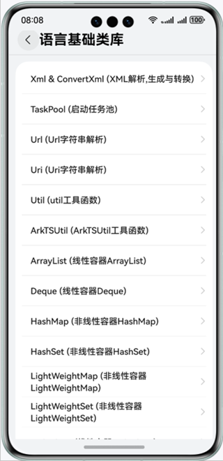
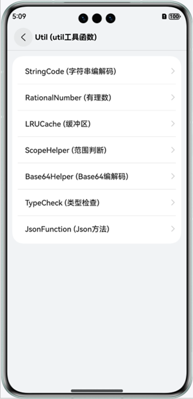

# 实现语言基础类库功能

### 介绍
本示例集合ArkTS语言基础类库的各个子模块，展示了各个模块的基础功能，帮助开发者掌握ArkTS语言基础类库各子模块的使用方法。包含：

- @ohos.convertxml (xml转换JavaScript)
- @ohos.taskpool (启动任务池)
- @ohos.uri (URI字符串解析)
- @ohos.util (util工具函数)
- @ohos.ArkTSUtils (ArkTSUtils工具函数)
- @ohos.util.ArrayList (线性容器ArrayList)
- @ohos.util.Deque (线性容器Deque)
- @ohos.util.HashMap (非线性容器HashMap)
- @ohos.util.HashSet (非线性容器HashSet)
- @ohos.util.LightWeightMap (非线性容器LightWeightMap)
- @ohos.util.LightWeightSet (非线性容器LightWeightSet)
- @ohos.util.LinkedList (线性容器LinkedList)
- @ohos.util.List (线性容器List)
- @ohos.util.PlainArray (非线性容器PlainArray)
- @ohos.util.Queue (线性容器Queue)
- @ohos.util.Stack (线性容器Stack)
- @ohos.util.TreeMap (非线性容器TreeMap)
- @ohos.util.TreeSet (非线性容器TreeSet)
- @ohos.xml (xml解析与生成)
- @ohos.convertxml (xml转换JavaScript)

### 效果预览

|                **主页**                 |               **Util**                |
|:-------------------------------------:|:-------------------------------------:|
|  |  |

使用说明

1. 首页展示语言基础类库各个子模块菜单，点击进入对应的模块页面。
2. 各个子模块界面中点击功能按钮完成各个功能。
3. Util中有二级菜单，点击进入对应的二级界面，包含：
   * StringCode：字符串编解码，点击功能按钮完成各个功能。
   * RationnalNumber：有理数比较，点击功能按钮完成各个功能。
   * LRUCache：LRU缓冲区，点击功能按钮完成各个功能。
   * ScopeHelper：范围判断，点击功能按钮完成各个功能。
   * Base64Helper：Base64编解码，点击功能按钮完成各个功能。
   * TypeCheck：类型检查，点击功能按钮完成各个功能。
   * JsonFunction：Json常用方法，点击功能按钮完成各个功能。
4. ArkTSUtil中有二级菜单，点击进入对应的二级界面，包含：
   * AsonFunction：将ISendable数据类型序列化和反序列化。
5. Xml & ConvertXml界面中，点击功能按钮完成各个功能。
6. TaskPool界面中，点击Execute task执行任务，点击Cancel task取消任务。
7. Url界面中，点击功能按钮完成各个功能。
8. Url界面中，点击按钮完成uri解析。
9. ArrayList界面中，点击+号添加数据后展示数据，点击删除按钮删除对应的一条数据。
10. Deque界面中，点击+号添加数据后展示数据，点击删除按钮删除对应的一条数据。
11. HashMap界面中，点击+号添加数据后展示数据，点击删除按钮删除对应的一条数据。
12. HashSet界面中，点击+号添加数据后展示数据，点击删除按钮删除对应的一条数据。
13. LightWeightMap界面中，点击+号添加数据后展示数据，点击删除按钮删除对应的一条数据。
14. LightWeightSet界面中，点击+号添加数据后展示数据，点击删除按钮删除对应的一条数据。
15. LinkedList界面中，点击+号添加数据后展示数据，点击删除按钮删除对应的一条数据。
16. List界面中，点击+号添加数据后展示数据，点击删除按钮删除对应的一条数据。
17. PlainArray界面中，点击+号添加数据后展示数据，点击删除按钮删除对应的一条数据。
18. Queue界面中，点击+号添加数据后展示数据，点击删除按钮删除对应的一条数据。
19. Stack界面中，点击+号添加数据后展示数据，点击删除按钮删除对应的一条数据。
20. TreeMap界面中，点击+号添加数据后展示数据，点击删除按钮删除对应的一条数据。
21. TreeSet界面中，点击+号添加数据后展示数据，点击删除按钮删除对应的一条数据。

### 工程目录

```
LanguageBaseClassLibrary
├──common/src/main/ets                        // 公共组件及工具类
│  ├──components 
│  │  ├──BaseDataSource.ets                   // 基础DataSource
│  │  ├──CustomDataSource.ets                 // 自定义DataSource，LazyForEach时使用
│  │  └──EmptyPage.ets                        // 空白页组件
│  └──util
│     ├──Logger.ets                           // 日志工具类
│     └──ResourceUtil.ets                     // 资源管理工具类
├──common/src/main/resources                  // 资源文件目录
├──entry/src/main/ets                         // 语言基础类库应用首页
│  ├──entryability
│  │  └──EntryAbility.ets     
│  └──pages
│     ├──AddInformationView.ets               // 添加联系人页面
│     ├──AddKeyValuePairView.ets              // 添加Key/Value页面
│     ├──AddStringView.ets                    // 添加String页面
│     └──Index.ets                            // 主页入口
├──entry/src/main/resources                   // 资源文件目录
│
├──feature/capabilities/src/main/ets          // 功能集
│  ├──capabilities                            // 各个子模块功能组件
│  │  ├──ArkTSUtil.ets                        // ArkTSUtil功能组件
│  │  ├──ArrayListView.ets                    // ArrayList功能组件
│  │  ├──ConvertXml.ets                       // ConvertXml功能组件
│  │  ├──DequeView.ets                        // DequeView功能组件
│  │  ├──HashMapView.ets                      // HashMapView功能组件
│  │  ├──HashSetView.ets                      // HashSetView功能组件
│  │  ├──LightWeightMapView.ets               // LightWeightMapView功能组件
│  │  ├──LightWeightSetView.ets               // LightWeightSetView功能组件
│  │  ├──LinkedListView.ets                   // LinkedListView功能组件
│  │  ├──ListView.ets                         // ListView功能组件
│  │  ├──PlainArrayView.ets                   // PlainArrayView功能组件
│  │  ├──QueueView.ets                        // QueueView功能组件
│  │  ├──StackView.ets                        // StackView功能组件
│  │  ├──TaskPool.ets                         // TaskPool功能组件
│  │  ├──TreeMapView.ets                      // TreeMapView功能组件
│  │  ├──TreeSetView.ets                      // TreeSetView功能组件
│  │  ├──Uri.ets                              // Uri功能组件
│  │  ├──Url.ets                              // Url功能组件
│  │  └──Util.ets   
│  ├──components               
│  │  ├──arkTSUtilcomponents                  // arkTSUtil相关组件
│  │  ├──arraylistcomponents                  // arraylist相关组件
│  │  ├──dequecomponents                      // deque相关组件
│  │  ├──hashmapcomponents                    // hashmap相关组件
│  │  ├──hashsetcomponents                    // hashset相关组件
│  │  ├──lightweightmapcomponents             // lightweightmap相关组件
│  │  ├──lightweightsetcomponents             // lightweightset相关组件
│  │  ├──linkedlistcomponents                 // linkedlist相关组件
│  │  ├──listcomponents                       // list相关组件
│  │  ├──plainarraycomponents                 // plainarray相关组件
│  │  ├──queuecomponents                      // queue相关组件
│  │  ├──stackcomponents                      // stack相关组件
│  │  ├──treemapcomponents                    // treemap相关组件
│  │  ├──treesetcomponents                    // treeset相关组件
│  │  ├──utilcomponents                       // util相关组件
│  │  ├──ColumnOperation.ets                  // 展示一列功能按钮的组件
│  │  ├──DeleteView.ets                       // 删除按钮的组件
│  │  ├──GridOperation.ets                    // 根据窗口大小展示不同列的功能按钮的组件
│  │  ├──InformationItemView.ets              // 联系人Item的组件
│  │  ├──KeyValueItemView.ets                 // Key/Value Item的组件
│  │  └──ValueItemView.ets                    // Value Item的组件
│  ├──model                                   // 相关数据模型
│  │  ├──Information.ets
│  │  ├──KeyValuePair.ets
│  │  └──ScopeNumber.ets
│  ├──utils                                   // 相关工具类
│  │  ├──ConvertXmlUtil.ets
│  │  ├──JsonUtil.ets
│  │  ├──LRUCacheUtil.ets
│  │  ├──RationalNumberUtil.ets
│  │  └──UrlUtil.ets
│  └──Constant.ts        
├──feature/capabilities/src/main/resources     // 资源文件目录       
│             
├──feature/menuitems/src/main/ets              // 菜单
│  ├──components                               // 菜单相关自定义组件
│  │  ├──ItemGroup.ets
│  │  ├──MainItem.ets
│  │  └──MenuNavRouter.ets
│  └──menulist                                 
│     └──MenuList.ets                          // 菜单相关自定义组件
└──feature/menuitems/src/main/resources        // 资源文件目录       
```

### 具体实现

1. 首页菜单展示：使用一个module，menuitems完成菜单组件的实现，传入要展示的菜单的strarray类型的资源和菜单点击对应的组件即可。使用Navigation和NavRouter组件实现菜单点击进入功能界面，使用LocalStorage实现应用内Ability内数据共享，点击菜单时标记selectedLabel，在entry中的Capabilities组件中，通过selectedLabel显示对应的功能组件。
2. Xml & ConvertXml：使用xml和convertxml实现xml的解析和生成以及xml转换为js对象，点击按钮实现对应的功能。
3. TaskPool：使用taskpool实现创建后台任务（Task），并对所创建的任务进行如任务执行、任务取消的操作。
4. Url：使用URL对URL字符串的查找参数进行了增删改查的一系列操作，使得读者对URL的结构用途更加明了，点击按钮实现对应的功能。
5. Uri: 使用URI字符串解析的功能将URI字符串进行解析。
6. Util，使用util中不同的功能函数实现以下功能：
   * StringCode：字符串编解码。
   * RationnalNumber：有理数比较。
   * LRUCache：LRU缓冲区。
   * ScopeHelper：范围判断。
   * Base64Helper：Base64编解码。
   * TypeCheck：类型检查。
   * JsonFunction：Json对象转字符串，以及对Json数据的增删改查等方法。
7. ArkTSUtil,使用ArkTSUtil的功能函数实现ISendable类型数据的序列化与反序列化。
8. ArrayList：展示线性容器ArrayList的数据类型的使用，包括添加、删除。
9. Deque：展示线性容器Deque的数据类型的使用，包括头部插入、头部删除、尾部删除。
10. HashMap：展示非线性容器HashMap的数据类型的使用，包括添加键值对、删除键值对。
11. HashSet：展示非线性容器HashSet的数据类型的使用，包括添加、删除。
12. LightWeightMap：展示非线性容器LightWeightMap的数据类型的使用，包括添加键值对、删除键值对。
13. LightWeightSet：展示非线性容器LightWeightSet的数据类型的使用，包括添加、删除。
14. LinkedList：展示线性容器LinkedList的数据类型的使用，包括尾部添加、头部删除、尾部删除。
15. List：展示线性容器List的数据类型的使用，包括添加、删除。
16. PlainArray：展示非线性容器PlainArray的数据类型的使用，包括添加、删除。
17. Queue：展示线性容器Queue的数据类型的使用，包括尾部添加、头部删除。
18. Stack：展示线性容器Stack的数据类型的使用，包括尾部添加、尾部删除。
19. TreeMap：展示非线性容器TreeMap的数据类型的使用，包括添加键值对、删除键值对。
20. TreeSet：展示非线性容器TreeSet的数据类型的使用，包括添加、删除。

### 相关权限

不涉及。

### 依赖

不涉及。

### 约束与限制

1.设备类型：华为手机。

2.HarmonyOS系统：HarmonyOS 5.0.5 Release及以上。

3.DevEco Studio版本：DevEco Studio 5.0.5 Release及以上。

4.HarmonyOS SDK版本：HarmonyOS 5.0.5 Release SDK及以上。
