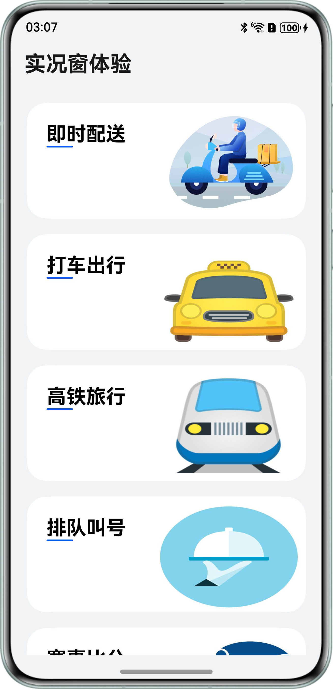
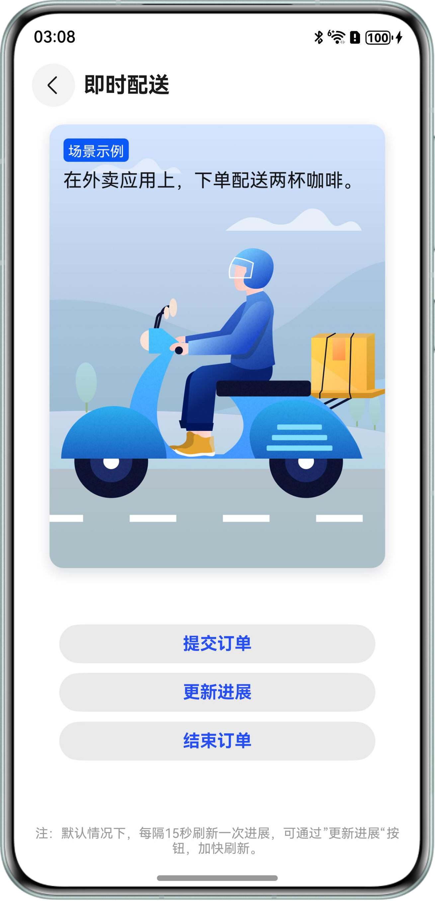
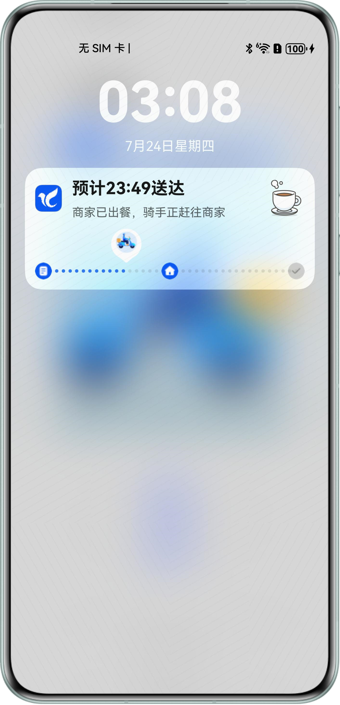
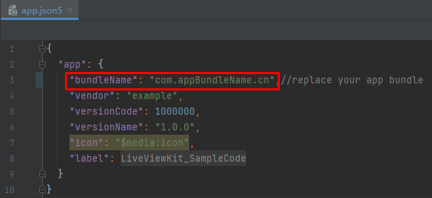
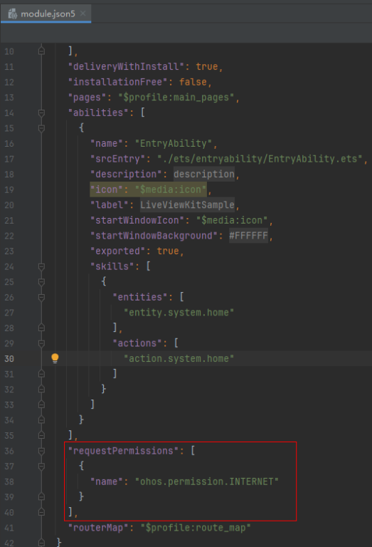

# Live View Kit-实现多场景实况窗展示功能

## 简介

本示例基于Live View Kit（实况窗服务）实现即时配送场景、航班出行等场景下实况窗的创建、更新和结束功能。

## 相关概念

- 实况窗：实况窗是一种帮助用户聚焦正在进行的任务，方便快速查看和即时处理的通知形态。实况窗具有时效性、时段性、变化性的特点。
- 组件：Demo中主要使用了Text、Image等组件。
- liveViewManager：本模块提供Live View Kit的基础能力，包括创建、更新和停止实况窗、获取实况窗和检查实况窗开关的功能。

## 实际效果

### 界面展示

在应用主页面中有多个场景的卡片，点击对应卡片，即可跳转到该场景的页面。
通过场景页面中的各个按钮，可以进行实况窗的创建、更新与结束，查看该场景中实况窗更新的流程（流程仅供参考，用户可自行定义）。

| 应用主页面                            | 场景页面(以即时配送为例)               | 实况窗样例(以即时配送为例)                      |
|----------------------------------|-----------------------------|-------------------------------------|
|  |  |  |

### 场景与状态

- 即时配送：待支付、待商家接单、待骑手接单、骑手已接单、骑手已到店、商品配送中、商品放入取餐柜和商品已送达
- 打车出行：呼叫车辆中、行程即将开始、司机正在赶来、司机已到达上车点、正在去往目的地、行程结束、待支付
- 高铁旅行：计划出发、已安检、检票提醒、已检票、停止检票、已出发、列车运行中、已到达
- 排队叫号：取号、排队中、即将到号、叫号中、排队完成
- 赛事比分：第一节开始、更新进展（进展一/进展二/进展三）、暂停、暂停结束、中场休息、第二节开始、比赛结束
- 导航：导航开始、提供导向（导向一/导向二）、路线变更、导航结束
- 航旅出行：计划出发、待值机、已值机、已安检、开始登机、催促登机、已登机、结束登机、即将起飞、已起飞、已到达、提醒行李转盘、结束提醒、用户退票、航班取消、航班晚点、改签
- 计时：正计时、倒计时、暂停计时、继续计时、结束计时
- 共享租赁：提交订单、更新进展、结束订单、暂停租赁
- 取餐：待支付、等待商家确认、正在备餐、待取餐、已取餐、订单已完成、取消订单
- 运动锻炼：开始运动、更新进展（进展一/进展二/进展三）、运动结束、运动暂停

场景设计规范可查看[实况窗场景节点设计参考](https://developer.huawei.com/consumer/cn/doc/harmonyos-guides/liveview-design-formula#section596543013594)。

## 工程目录

```
├─entry/src/main/ets                // 代码区  
│ ├─components                      // 存放UI组件目录
│ │ ├─BottomTip.ets                 // 底部提示组件
│ │ ├─InstantPageButton.ets         // 页面按钮组件
│ │ └─InstantPageSplit.ets          // 页面分割线组件
│ ├─entryability
│ │ └─EntryAbility.ets              // 程序入口类
│ ├─pages                           // 存放页面文件目录
│ │ ├─Index.ets                     // 应用主页面，选择实况窗应用场景
│ │ ├─InstantDelivery.ets           // 即时配送页面
│ │ ├─TaxiHailing.ets               // 打车出行页面
│ │ ├─TrainDeparture.ets            // 高铁旅行页面
│ │ ├─QueueingUp.ets                // 排队叫号页面
│ │ ├─MatchScore.ets                // 赛事比分页面
│ │ ├─Navigation.ets                // 导航页面
│ │ ├─FlightTravel.ets              // 航旅出行页面
│ │ ├─Timer.ets                     // 计时页面
│ │ ├─RentShare.ets                 // 共享租赁页面
│ │ ├─PickUp.ets                    // 取餐页面
│ │ └─Workout.ets                   // 运动锻炼页面
│ ├─utils                           // 存放工具类文件目录
│ │ ├─CommonUtil.ets                // 通用方法工具类
│ │ ├─ContextUtil.ets               // 上下文工具类
│ │ ├─ImageUtil.ets                 // 图片工具类
│ │ ├─LogUtil.ets                   // 日志工具类
│ │ ├─DeliveryLiveViewUtil.ets      // 即时配送实况窗工具类
│ │ ├─TaxiLiveViewUtil.ets          // 打车出行实况窗工具类
│ │ ├─TrainLiveViewUtil.ets         // 高铁旅行实况窗工具类
│ │ ├─QueueLiveViewUtil.ets         // 排队叫号实况窗工具类
│ │ ├─ScoreLiveViewUtil.ets         // 赛事比分实况窗工具类
│ │ ├─NavigationLiveViewUtil.ets    // 导航实况窗工具类
│ │ ├─FlightLiveViewUtil.ets        // 航旅出行实况窗工具类
│ │ ├─TimerUtil.ets                 // 计时实况窗工具类
│ │ ├─RentLiveViewUtil.ets          // 共享租赁实况窗工具类
│ │ ├─PickLiveViewUtil.ets          // 取餐实况窗工具类
│ │ └─WorkoutLiveViewUtil.ets       // 运动锻炼工具类
└─entry/src/main/resources          // 资源文件目录
```

## 相关权限

- 若您需要使用本Demo，请替换AppScope/app.json5文件内的bundleName为您的包名。
  
- 若您自己的包名未申请权益，请参考[指导](https://developer.huawei.com/consumer/cn/doc/harmonyos-guides/liveview-preparations)，先开通推送服务权益与实况窗权益。
- 若您需要联网下载图片等，需在module.json5文件添加网络权限，requestPermissions节点内添加"name": "ohos.permission.INTERNET"权限，如下图所示

  

## 使用说明

1. 本Demo仅提供在本地创建、更新与结束实况窗的能力(不能后台更新，若要后台更新，请使用Push Kit)。若要使用Push Kit更新，可参考[推送实况窗消息服务](https://developer.huawei.com/consumer/cn/doc/harmonyos-guides/push-update-liveview)，用已有服务器调用对应的REST API。
2. 在“实况窗体验”页面，点击**即时配送**按钮，跳转到“即时配送”页面。
3. 在“即时配送”页面，点击**提交订单**按钮将创建一个待支付状态的实况窗。
4. 创建实况窗后，点击**更新进展**按钮可刷新实况窗状态。默认情况下，每隔15秒实况窗状态会自动更新一次。
5. 点击**结束订单**，将终止当前实况窗生命周期，15秒留存期后可点击**提交订单**再次创建实况窗。
6. 其它场景流程同**即时配送**场景，本Demo旨在展示不同场景下的对应卡片样式与更新流程。
7. 通过设置[LiveView](https://developer.huawei.com/consumer/cn/doc/harmonyos-references/liveveiw-liveviewmanager#section411410371767)结构体的内容，可以自定义实况卡片/胶囊等形态的内容与样式，为方便开发者接入，我们提供了[“实况窗各场景参数与模板映射关系指导表”](./实况窗各场景参数与模板映射关系指导.xlsx)。
   - 若使用Live View Kit在本地创建/更新/结束，可参考其中“参数（端）”条目的参数。
   - 若使用Push Kit在云端创建/更新/结束，可参考其中“云侧”条目下的参数。

## 约束与限制

1. 支持设备：华为手机、华为平板。
2. HarmonyOS系统：HarmonyOS 6.0.0 Release及以上。
3. DevEco Studio版本：DevEco Studio 6.0.0 Release及以上。
4. HarmonyOS SDK版本：HarmonyOS 6.0.0 Release SDK及以上。