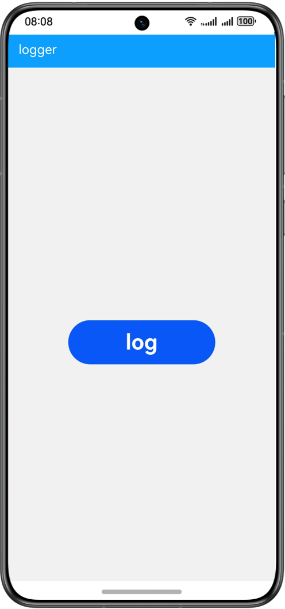

# 基于hilog实现日志打印功能

### 介绍

本示例使用hilog日志系统，提供日志打印类，使应用/服务可以按照指定级别、标识和格式字符串输出日志内容，帮助开发者了解应用/服务的运行状态，更好地调试程序。

### 效果预览
| 首页                                     |
|----------------------------------------|
|  |

使用说明：

1.进入应用会自动生成一个空的日志文件。

2.点击log按钮即可输出日志，并将日志生成到日志文件当中。

### 工程目录
```
├──entry
│  ├──src/main/ets
│  │  ├──entryability
│  │  │  └──EntryAbility.ets           // 程序入口类
│  │  └──pages           
│  │     └──Index.ets                  // 主页面
│  └──src/main/resources               // 应用静态资源目录
└──log
   ├──src/main/ets
   │  └──components	                    
   │     └──mainpage                 
   │  	    ├──Configure.ets		   // 日志打印配置项
   │        ├──Configure.ts            // 配置项类型
   │        ├──Logger.ets              // 日志打印类
   │        ├──LoggerModel.ts          // 封装日志打印类
   │        └──LogLevel.ts             // 日志等级枚举值
   └──src/main/resources              
```

### 具体实现
+ 日志输出功能封装在Logger，源码参考:[Logger.ets](log/src/main/ets/components/mainpage/Logger.ets):
    + 日志输出：Logger类根据Configure的types参数将日志分为三个类型，其中file类型会将日志写入本地文件，console类型调用ConsoleLoggerStrategy类输出，hilog类型调用HilogLoggerStrategy类输出;
    + 日志文件写入本地：FileLoggerStrategy类使用@ohos.file.fs将日志写入本地文件中，本示例只是展示了文件写入文件操作的使用方法，在实战场景中，建议把耗时操作放入子线程中运行。

### 相关权限

不涉及。

### 依赖

不涉及。

### 约束与限制

1.本示例仅支持标准系统上运行，支持设备：华为手机。

2.HarmonyOS系统：HarmonyOS 5.0.5 Release及以上。

3.DevEco Studio版本：DevEco Studio 5.0.5 Release及以上。

4.HarmonyOS SDK版本：HarmonyOS 5.0.5 Release SDK及以上。


