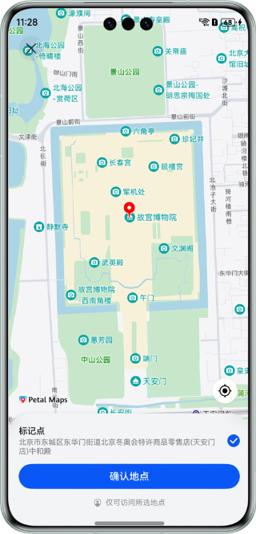

# 地图服务

## 介绍

本示例展示了使用地图服务提供的地图展示、移动地图、添加Marker/MapCircle/MapPolyline/MapPolygon、静态图、位置搜索、地点详情和选点高级控件的能力。

需要使用地图服务接口@hms.core.map.map.d.ts、@hms.core.map.mapCommon.d.ts、@hms.core.map.MapComponent.d.ets、@hms.core.map.sceneMap.d.ts、@hms.core.map.site.d.ts、@hms.core.map.staticMap.d.ts、@hms.core.map.navi.d.ts。

## 效果预览


| **应用首页**                   |         **基础功能页面**         |        **移图效果展示1**         |              **移图效果展示2**               |    
|:---------------------------|:--------------------------:|:-------------------------:|:------------------------------------:|
|  |  |  |  |  


| **应用首页**                   |         **基础功能页面**         |        **我的位置**         |              **修改位置样式**               |    
|:---------------------------|:--------------------------:|:-------------------------:|:------------------------------------:|
|  |  |  |  |  


| **应用首页**                   |          **覆盖物添加页面**           |            **添加标记**             |            **添加多边形**             |    
|:---------------------------|:-----------------------------:|:-------------------------------:|:--------------------------------:|
|  |  |  |  |  


| **应用首页**                   |         **静态图添加页面**         |               **获取静态图页面**               |  
|:---------------------------|:--------------------------:|:---------------------------------------:|
|  |  |  |


| **应用首页**                   |          **路径规划页面**           |           **批量算路-驾车结果**            |            **轨迹纠正结果**            |   
|:---------------------------|:-----------------------------:|------------------------------------|----------------------------------|
|  |  |  |  | 


| **应用首页**                   |         **高级控件页面**         |         **地点详情页**         |             **地图选点页**             |   
|:---------------------------|:--------------------------:|:---------------------------:|------------------------------------|
|  |  |  |  | 


| **应用首页**                   |         **检索页面**         |         **关键字查询结果**         |             **逆地理查询结果**             |   
|:---------------------------|:--------------------------:|:---------------------------:|------------------------------------|
|  |  |  |  | 


使用说明：
使用前请参考地图服务开发指南[配置AppGallery Connect](https://developer.huawei.com/consumer/cn/doc/harmonyos-guides/map-config-agc)章节，开通地图权限。
使用前请参考编写与调试应用[配置调试签名](https://developer.huawei.com/consumer/cn/doc/harmonyos-guides/ide-signing#section18815157237)章节，配置签名。
1. 在手机的主屏幕，点击”地图服务Demo“，启动应用，在主界面可见“MapController”、“Overlay”、“StaticMap”、“NaviDemo”、“AdvancedControls”按钮。
2. 点击“MapController”按钮，可见地图展示页面，点击“moveCamera”按钮,可执行移动地图功能，每隔一段时间进行一次移图操作，并展示移图的位置和参数。
3. 点击“MapController”按钮，可见地图展示页面，点击“setTrue”、“setMyLocation”、位置控件、“setMyLocationStyle”按钮,点击这4个按钮均可打开位置开关，并移动到我的位置，然后替换我的位置自定义图标。
4. 点击“Overlay”按钮，可见地图展示页面，点击“MarkerSample”按钮,可以添加Marker覆盖物，然后每隔一段时间进行一次marker的属性设置；点击“PolygonSample”按钮，可以添加矩形覆盖物,然后每隔一段时间进行一次MapPolygon的属性设置。
5. 点击“StaticMap”按钮，可见“getStaticMap”按钮,点击按钮,可以获取静态图图片。
6. 点击“NaviDemo”按钮，可见路径规划页面，点击“getDrivingMatrix”按钮，可以获取批量算路-驾车结果，点击“snapToRoads”按钮，可以获取路径纠正结果。 
7. 点击“AdvancedControls”按钮，可见地图展示页面，点击“queryLocation”按钮，可以拉起地点详情控件页，点击“chooseLocation”按钮，可以拉起地图选点控件页； 
8. 点击“AdvancedControls”按钮，可见地图展示页面，点击“TextSearch”按钮，可以获取关键字搜索结果，点击“Geocode”按钮，可以获取逆地理搜索结果。


## 工程目录
```
├─entry/src/main/ets                    // 代码区域
│  ├─entryability                       
│  │   └─EntryAbility.ets               // 本地启动ability
│  └─pages                              // 代码目录
│     ├─AdvancedControlsDemo.ets        // 地点详情控件、地图选点控件和地点搜索控件
│     ├─Index.ets                       // 应用首页
│     ├─MapControllerDemo.ets           // 地图的主要功能入口
│     ├─NaviDemo.ets                    // 路径规划
│     ├─OverlayDemo.ets                 // 地图覆盖物
│     └─StaticMapDemo.ets               // 静态图
└─entry/src/main/resources              // 项目资源目录
````


## 具体实现
在@hms.core.map.map中定义了地图移动，我的位置，添加Marker,MapPolygon等接口API：

* moveCamera(update: CameraUpdate): void;
* getCameraPosition(): mapCommon.CameraPosition;
* setMyLocationEnabled(myLocationEnabled: boolean): void;
* setMyLocationControlsEnabled(enabled: boolean): void;
* setMyLocation(location: geoLocationManager.Location): void;
* setMyLocationStyle(style: mapCommon.MyLocationStyle): Promise<void>;
* addMarker(options: mapCommon.MarkerOptions): Promise<Marker>;
* addPolygon(options: mapCommon.MapPolygonOptions): Promise<MapPolygon>;
* addCircle(options: mapCommon.MapCircleOptions): Promise<MapCircle>;
* addPolyline(options: mapCommon.MapPolylineOptions): Promise<MapPolyline>;

在@hms.core.map.staticMap定义了静态图获取API：
* function getMapImage(options: StaticMapOptions): Promise<image.PixelMap>;

在@hms.core.map.sceneMap定义了高级控件API：
* function queryLocation(context: common.UIAbilityContext, options: LocationQueryOptions): Promise<void>;
* function chooseLocation(context: common.UIAbilityContext, options: LocationChoosingOptions): Promise<LocationChoosingResult>;

在@hms.core.map.site定义了搜索API：
* function searchByText(searchByTextParams: SearchByTextParams): Promise<SearchByTextResult>;
* function nearbySearch(nearbySearchParams: NearbySearchParams): Promise<NearbySearchResult>;
* function queryAutoComplete(queryAutoCompleteParams: QueryAutoCompleteParams): Promise<QueryAutoCompleteResult>;
* function searchById(searchByIdParams: SearchByIdParams): Promise<SearchByIdResult>;
* function reverseGeocode(reverseGeocodeParams: ReverseGeocodeParams): Promise<ReverseGeocodeResult>;

在@hms.core.map.navi定义了导航API:
* function getDrivingRoutes(params: DrivingRouteParams): Promise<RouteResult>;
* function getWalkingRoutes(params: RouteParams): Promise<RouteResult>;
* function getCyclingRoutes(params: RouteParams): Promise<RouteResult>;
* function getDrivingMatrix(params: DrivingMatrixParams): Promise<MatrixResult>;
* function getWalkingMatrix(params: MatrixParams): Promise<MatrixResult>;
* function getCyclingMatrix(params: MatrixParams): Promise<MatrixResult>;
* function snapToRoads(params: SnapToRoadsParams): Promise<SnapToRoadsResult>;

业务使用时,需要先进行import导入
import { MapComponent, mapCommon, map, sceneMap, site, staticMap, navi } from '@kit.MapKit';

## 相关权限

1. 应用在前台运行时获取位置权限：ohos.permission.LOCATION。
2. 应用获取设备模糊位置信息权限：ohos.permission.APPROXIMATELY_LOCATION。

## 依赖

依赖设备具备网络访问和位置获取能力。

## 约束与限制

1. 设备类型：Phone、Tablet、PC/2in1和Wearable设备。
2. HarmonyOS系统：HarmonyOS NEXT Developer Beta1及以上。
3. DevEco Studio版本：DevEco Studio NEXT Developer Beta1及以上。
4. HarmonyOS SDK版本：HarmonyOS NEXT Developer Beta1 SDK及以上。
