# Map Kit

## Overview

This sample code illustrates how to use the capabilities provided by Map Kit, including map display, map moving, Marker/MapCircle/MapPolyline/MapPolygon adding, static image, place search, and advanced controls (such as place details control and location selection control). 

The following APIs of Map Kit are used: @hms.core.map.map.d.ts, @hms.core.map.mapCommon.d.ts, @hms.core.map.MapComponent.d.ets, @hms.core.map.sceneMap.d.ts, @hms.core.map.site.d.ts, @hms.core.map.staticMap.d.ts, and @hms.core.map.navi.d.ts

## Preview


| **App home page**                  |         **Basic function page**        |       **Map moving effect 1**       |              **Map moving effect 2**              |    
|:---------------------------|:--------------------------:|:-----------------------------------:|:------------------------------------:|
| 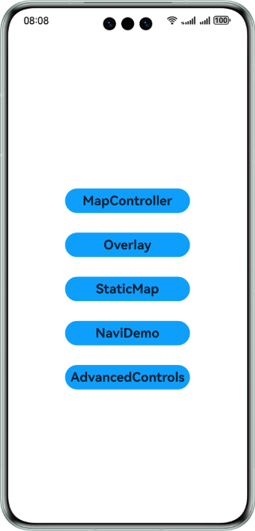 | 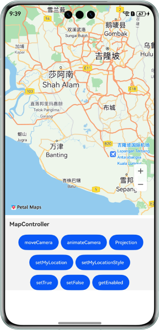 | 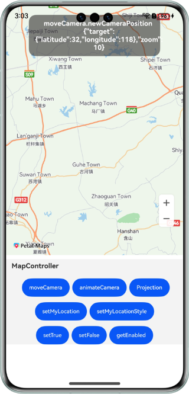 | 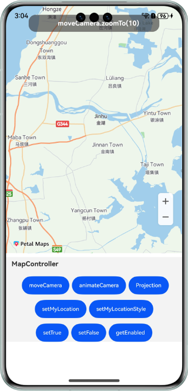 |  


| **App home page**                  |         **Basic function page**        |        **My location**        |              **Changing the my-location style**              |    
|:---------------------------|:--------------------------:|:-------------------------:|:------------------------------------:|
|  |  | 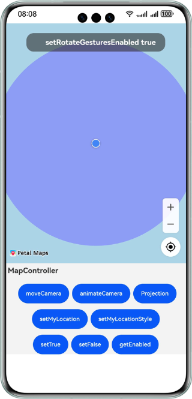 | 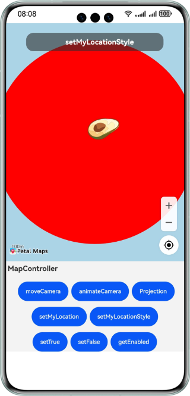 |  


| **App home page**                  |          **Overlay adding page**          |            **Adding a Marker**            |             **Adding a MapPolygon**         |    
|:---------------------------|:-----------------------------:|:-------------------------------:|:-------------------------------------------:|
|  | 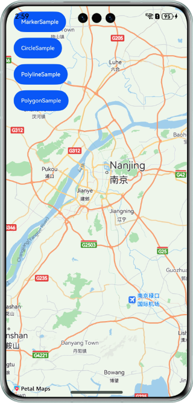 | 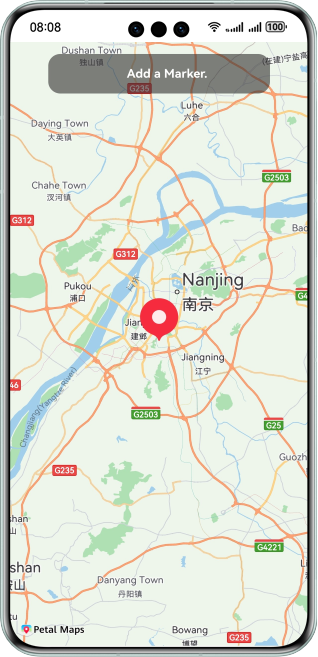 |     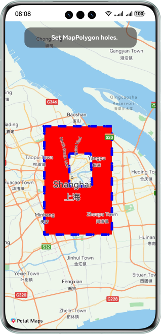      |  


| **App home page**                  |         **Page for adding a static image**        |  **Page for obtaining a static image**  |  
|:---------------------------|----------------------------|:---------------------------------------:|
|  | 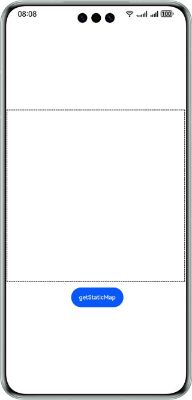 | 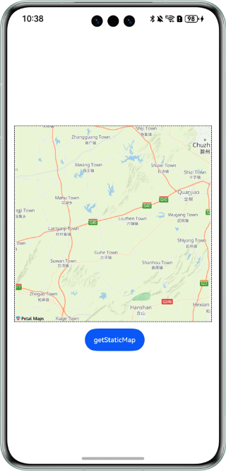 |


| **App home page**                  |          **Route planning page**          |           **Batch driving route computation result**           |            **Road snapping result**           |   
|:---------------------------|:-----------------------------:|:----------------------------------:|:--------------------------------:|
|  | 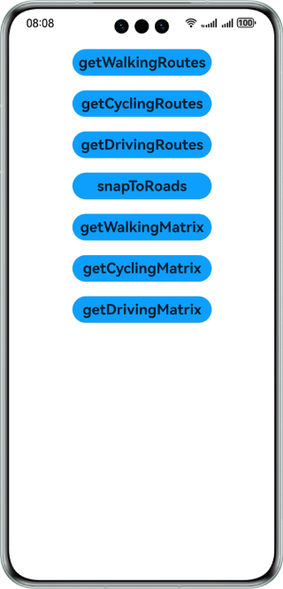 | 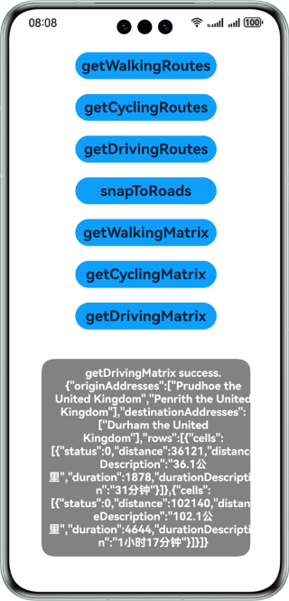 | 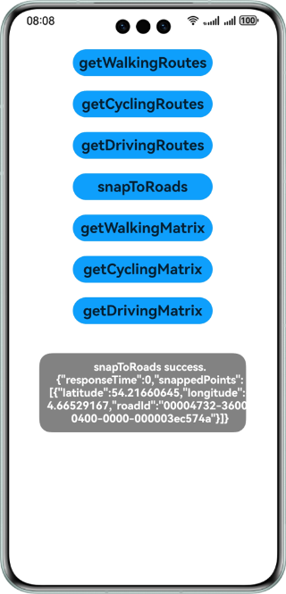 | 


| **App home page**                  |         **Advanced control page**        |         **Location details page**        |             **Map location selection page**            |   
|:---------------------------|:--------------------------:|:---------------------------:|:----------------------------------:|
|  | 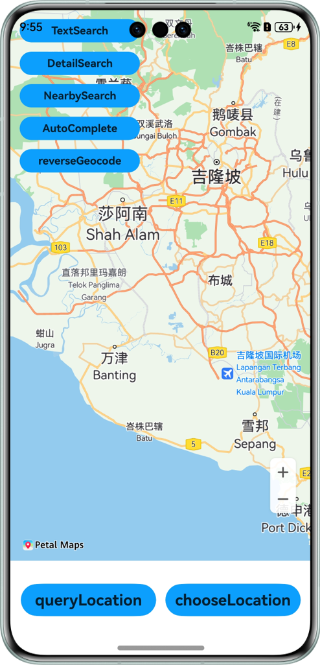 | 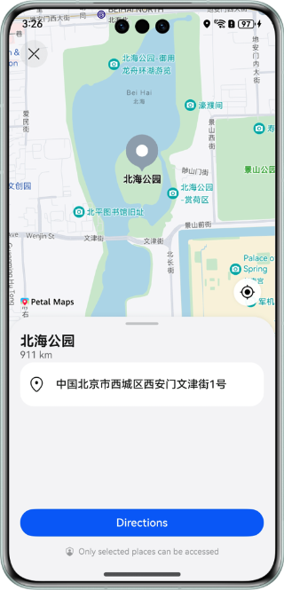 | 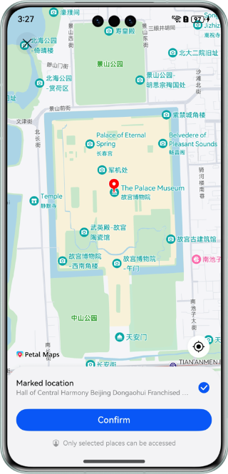 | 


| **App home page**                  |         **Search page**        |         **Keyword search result**        |             **Reverse geocoding result**            |   
|:---------------------------|:--------------------------:|:---------------------------:|:----------------------------------:|
|  |  | 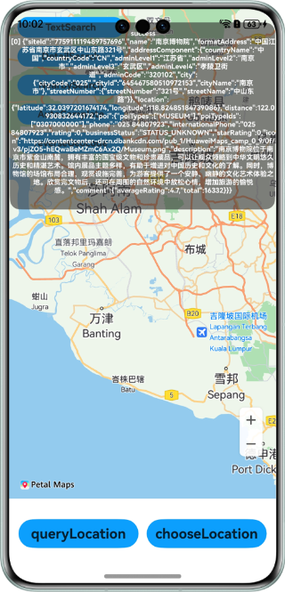 | 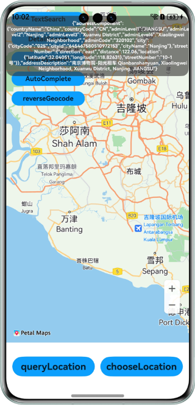 | 


How to Use:
Enable Map Kit in AppGallery Connect by referring to [Enabling Map Kit](https://developer.huawei.com/consumer/en/doc/harmonyos-guides/map-config-agc) in the Map Kit Development Guide.
Enable Coding and Debugging in Coding and Debugging to [Signing Your App/Atomic Service Automatically](https://developer.huawei.com/consumer/en/doc/harmonyos-guides/ide-signing#section18815157237) in the Configure signature. 
1. On the home screen of a mobile phone, tap **OHMapSampleDemo**. The **MapController**, **Overlay**, **StaticMap**, **NaviDemo**, and **AdvancedControls** buttons are displayed on the app home page.
2. Tap **MapController**. The map is displayed. Tap **moveCamera** to move the map. The map is moved at a specified interval with the corresponding position and parameters displayed. 
3. Tap **MapController**. On the map page that is displayed, tap **setTrue**, **setMyLocation**, the location control, or **setMyLocationStyle**. Any of the four icons can enable the location service and move to my location. Then customize the **my-location** icon.
4. Tap **Overlay**. On the map page that is displayed, tap **MarkerSample** to add a Marker. The Marker attributes are set at a specified interval. Tap **PolygonSample** to add a MapPolygon. The MapPolygon attributes are set at a specified interval. 
5. Tap **StaticMap**. Then tap **getStaticMap** to obtain a static image.
6. Tap **NaviDemo**. On the route planning page that is displayed, tap **getDrivingMatrix** to obtain the batch driving route computation result, and tap **snapToRoads** to obtain the road snapping result.
7. Tap **AdvancedControls**. On the map page that is displayed, tap **queryLocation** to display the place details control page, and tap **chooseLocation** to display the location selection control page.
8. Tap **AdvancedControls**. On the map page that is displayed, tap **TextSearch** for keyword search, and tap **Geocode** to obtain the reverse geocoding result.


## Project Directory
```
├─entry/src/main/ets                    // Code area.
│  ├─entryability                       
│  │   └─EntryAbility.ets               // Ability for local startup. 
│  └─pages                              // Code directory. 
│     ├─AdvancedControlsDemo.ets        // Place details control and map location selection control.
│     ├─Index.ets                       // App home page.
│     ├─MapControllerDemo.ets           // Main map function entry. 
│     ├─NaviDemo.ets                    // Route planning. 
│     ├─OverlayDemo.ets                 // Map overlays.
│     └─StaticMapDemo.ets               // Static images. 
└─entry/src/main/resources              // Project resource directory. 
````


## How to Implement
In **@hms.core.map.map**, APIs for map movement, my location, Marker adding, and MapPolygon adding are defined.

* moveCamera(update: CameraUpdate): void;
* getCameraPosition(): mapCommon.CameraPosition;
* setMyLocationEnabled(myLocationEnabled: boolean): void;
* setMyLocationControlsEnabled(enabled: boolean): void;
* setMyLocation(location: geoLocationManager.Location): void;
* setMyLocationStyle(style: mapCommon.MyLocationStyle): Promise<void>;
* addMarker(options: mapCommon.MarkerOptions): Promise<Marker>;
* addPolygon(options: mapCommon.MapPolygonOptions): Promise<MapPolygon>;
* addCircle(options: mapCommon.MapCircleOptions): Promise<MapCircle>;
* addPolyline(options: mapCommon.MapPolylineOptions): Promise<MapPolyline>;

In **@hms.core.map.staticMap**, the API for obtaining a static image is defined. 
* function getMapImage(options: StaticMapOptions): Promise<image.PixelMap>;

In **@hms.core.map.sceneMap**, the APIs for advanced controls are defined. 
* function queryLocation(context: common.UIAbilityContext, options: LocationQueryOptions): Promise<void>;
* function chooseLocation(context: common.UIAbilityContext, options: LocationChoosingOptions): Promise<LocationChoosingResult>;

In **@hms.core.map.site**, search APIs are defined. 
* function searchByText(searchByTextParams: SearchByTextParams): Promise<SearchByTextResult>;
* function nearbySearch(nearbySearchParams: NearbySearchParams): Promise<NearbySearchResult>;
* function queryAutoComplete(queryAutoCompleteParams: QueryAutoCompleteParams): Promise<QueryAutoCompleteResult>;
* function searchById(searchByIdParams: SearchByIdParams): Promise<SearchByIdResult>;
* function reverseGeocode(reverseGeocodeParams: ReverseGeocodeParams): Promise<ReverseGeocodeResult>;

In **@hms.core.map.navi**, navigation APIs are defined. 
* function getDrivingRoutes(params: DrivingRouteParams): Promise<RouteResult>;
* function getWalkingRoutes(params: RouteParams): Promise<RouteResult>;
* function getCyclingRoutes(params: RouteParams): Promise<RouteResult>;
* function getDrivingMatrix(params: DrivingMatrixParams): Promise<MatrixResult>;
* function getWalkingMatrix(params: MatrixParams): Promise<MatrixResult>;
* function getCyclingMatrix(params: MatrixParams): Promise<MatrixResult>;
* function snapToRoads(params: SnapToRoadsParams): Promise<SnapToRoadsResult>;

Before service use, import required APIs. 
import { MapComponent, mapCommon, map, sceneMap, site, staticMap, navi } from '@kit.MapKit';

## Required Permissions

1. Location access permission required when the app is running in the foreground: ohos.permission.LOCATION
2. Permission for the app to access the approximate device location information: ohos.permission.APPROXIMATELY_LOCATION

## Dependencies

This feature depends on a device's network access and location access capabilities. 

## Constraints

1. Device types: Phone、Tablet、PC/2in1和Wearable device.
2. The HarmonyOS version must be HarmonyOS NEXT Developer Beta1 or later.
3. The DevEco Studio version must be DevEco Studio NEXT Developer Beta1 or later.
4. The HarmonyOS SDK version must be HarmonyOS NEXT Developer Beta1 SDK or later.
