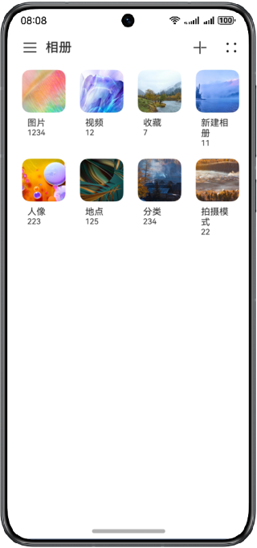
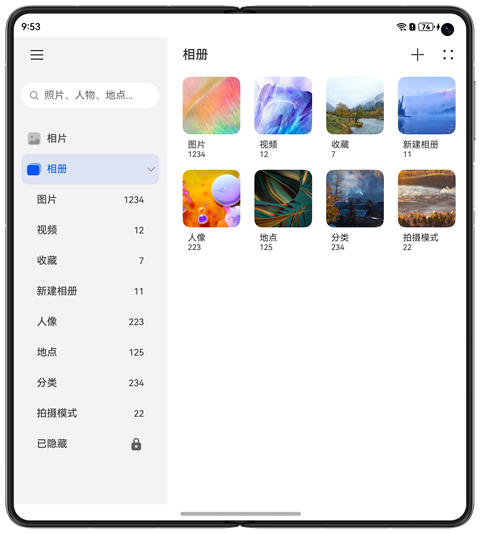
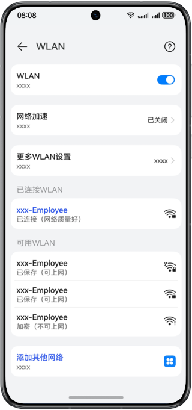
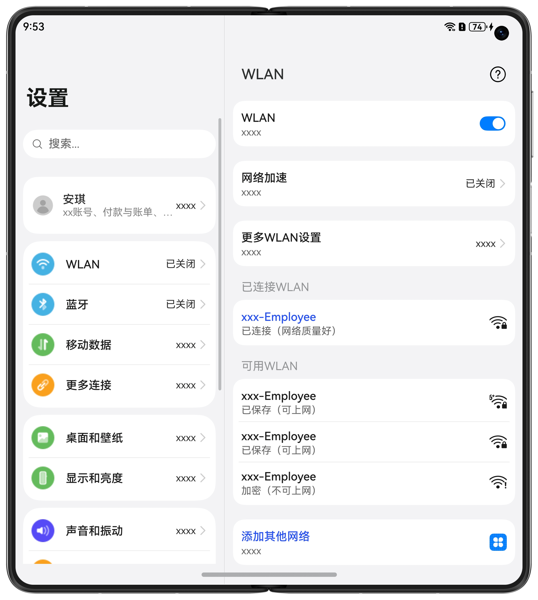

# 一次开发，多端部署-分栏控件

### 介绍

本示例分别展示了多场景下，一多分栏控件的响应式变化效果。

本示例分别用到了SideBarContainer组件与Navigation组件，对应使用场景如下：

* A+B+C：即SideBarContainer组件组合Navigation组件
* A+C：SideBarContainer组件
* B+C：Navigation组件

### 效果预览

本示例在预览器中的效果：

**A+B+C**:

| 360vp                               | 600vp                               | 840vp                               |
| ----------------------------------- | ----------------------------------- | ----------------------------------- |
|  |  |  |

**A+C**:

| 360vp                               | 600vp                               |
| ----------------------------------- | ----------------------------------- |
|  |  |

**B+C**:

| 360vp                                | 600vp                               |
| ------------------------------------ | ----------------------------------- |
|  |  |

使用说明：

1.在预览器中查看页面效果

2.在预览器中开启窗口拖拽模式，拖动窗口变化，可以查看组件的响应式变化，如下图所示： 
 


### 工程目录

```
├──entry/src/main/ets                         // 代码区
│  ├──application                                  
│  │  ├──MailBox.ets                          // 邮箱
│  │  ├──PhotoAlbum.ets                       // 图库
│  │  └──Settings.ets                         // 设置
│  ├──common  
│  │  ├──BreakpointSystem.ets                 // 媒体查询
│  │  ├──MailContent.ets                      // 邮箱详情
│  │  ├──MailNavigation.ets                   // 邮箱导航
│  │  ├──MailSideBar.ets                      // 邮箱侧边栏
│  │  ├──PhotoContent.ets            	      // 图库详情
│  │  ├──PhotoSideBar.ets             	      // 图库侧边栏     
│  │  ├──SettingItem.ets             	      // setting设置项  
│  │  └──WlanItem.ets                         // Wlan详情页
│  ├──entryability  
│  │  └──EntryAbility.ets         
│  ├──model  
│  │  └──dataType.ets                         // 侧边栏菜单数据类型
│  └──pages                                    
│     └──Index.ets                            // 首页
└──entry/src/main/resources                   // 应用资源目录

```

### 具体实现

* SideBarContainer组件，自动隐藏侧边栏的功能是由minContentWidth与minSideBarWidth属性实现的。当设置SideBarContainer组件组件的显示类型为SideBarContainerType.AUTO,并且窗口宽度达到minContentWidth + minSideBarWidth的边界值时，侧边栏自动隐藏。

* Navigation组件，自动隐藏侧边栏的功能是由minContentWidth属性实现的。当Navigation的内容区域达到minContentWidth设置的值时，navBar自动隐藏。

  

**响应式规则** 

**场景一：A+B+C**

1. 预览器窗口宽度>840vp时，显示A、B、C三列，放大缩小时，优先变化C列
2. 预览器窗口宽度<=840vp并且>600vp时，显示B、C两列，放大缩小时，优先变化C列
3. 预览器窗口宽度<=600vp并且>360vp时，仅显示C列

**场景二：A+C**

1. 预览器窗口宽度>600vp时，显示A、C三列，放大缩小时，优先变化C列
2. 预览器窗口宽度<=600vp并且>360vp时，仅显示C三列


**场景三：B+C**

1. 预览器窗口宽度>600vp时，显示B、C三列，放大缩小时，优先变化C列

2. 预览器窗口宽度<=600并且>360vp时，仅显示C三列
   

### 相关权限

不涉及。

### 依赖

不涉及

### 约束与限制

1. 本示例仅支持标准系统上运行，支持设备：华为手机、平板、PC/2in1。
2. HarmonyOS系统：HarmonyOS 5.0.5 Release及以上。
3. DevEco Studio版本：DevEco Studio 5.0.5 Release及以上。
4. HarmonyOS SDK版本：HarmonyOS 5.0.5 Release SDK及以上。
