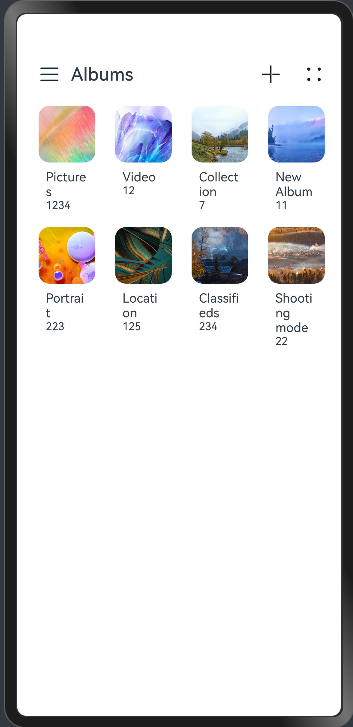
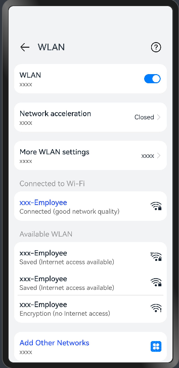
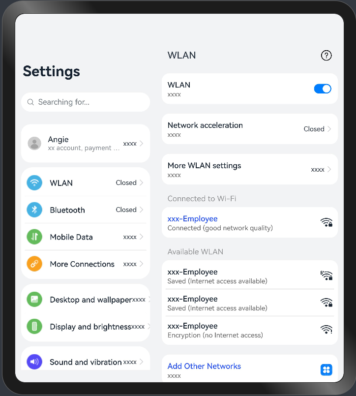
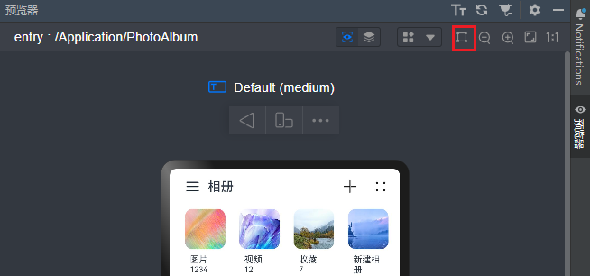

# Multi-Column Control

### Overview

This sample shows the responsive change effect of the multi-column control in various scenarios.

The SideBarContainer and Navigation components are used, and their application scenarios are as follows:

* A+B+C: combination of the SideBarContainer and Navigation components
* A+C: SideBarContainer component
* B+C: Navigation component

### Preview

Below are the preview effects.

**A+B+C**:

| 360vp                                  | 600vp                                  | 840vp                                  |
|----------------------------------------|----------------------------------------|----------------------------------------|
|  |  |  |

**A+C**:

| 360vp                                  | 600vp                                  |
|----------------------------------------|----------------------------------------|
|  |  |

**B+C**:

| 360vp                                   | 600vp                                  |
|-----------------------------------------|----------------------------------------|
|  |  |

### How to Use

1. Check the page effects in the Previewer.

2. Enable the window drag mode in the previewer and drag the window to view the responsive changes of the component, as shown in the following figure.


### Project Directory

```
├──entry/src/main/ets                         // Code area
│  ├──application                                  
│  │  ├──MailBox.ets                          // Mailbox
│  │  ├──PhotoAlbum.ets                       // Photo album
│  │  └──Settings.ets                         // Settings
│  ├──common  
│  │  ├──BreakpointSystem.ets                 // Breakpoint system
│  │  ├──MailContent.ets                      // Mail content
│  │  ├──MailNavigation.ets                   // Mailbox navigation
│  │  ├──MailSideBar.ets                      // Sidebar of the mailbox
│  │  ├──PhotoContent.ets            	      // Photo details
│  │  ├──PhotoSideBar.ets             	      // Photo sidebar    
│  │  ├──SettingItem.ets             	      // Setting item 
│  │  └──WlanItem.ets                         // WLAN details page
│  ├──entryability  
│  │  └──EntryAbility.ets         
│  ├──model  
│  │  └──dataType.ets                         // Sidebar menu data type
│  └──pages                                    
│     └──Index.ets                            // Home page
└──entry/src/main/resources                   // App resource directory

```

### How to Implement

* The SideBarContainer component implements the function of automatically hiding the sidebar using **minContentWidth** and **minSideBarWidth** attributes. When the display type of the **SideBarContainer** component is set to **SideBarContainerType.AUTO** and the window width reaches the total boundary value of **minContentWidth** and **minSideBarWidth**, the sidebar is automatically hidden.

* The Navigation component implements the function of automatically hiding the sidebar using the **minContentWidth** attribute. When the content area of the **Navigation** component reaches the value of **minContentWidth**, the navigation bar is automatically hidden.

  

**Responsive Rules**

**Scenario 1: A+B+C**

1. When the width of the previewer window is greater than 840vp, columns A, B, and C are displayed. When the previewer window is zoomed in or out, column C is changed first.
2. When the width of the previewer window is less than or equal to 840vp and greater than 600vp, columns B and C are displayed. When the previewer window is zoomed in or out, column C is changed first.
3. When the width of the previewer window is less than or equal to 600vp and greater than 360vp, only column C is displayed.

**Scenario 2: A+C**

1. When the width of the previewer window is greater than 600vp, columns A and C are displayed. When the previewer window is zoomed in or out, column C is changed first.
2. When the width of the previewer window is less than or equal to 600vp and greater than 360vp, only column C is displayed.


**Scenario 3: B+C**

1. When the width of the previewer window is greater than 600vp, columns B and C are displayed. When the previewer window is zoomed in or out, column C is changed first.

2. When the width of the previewer window is less than or equal to 600vp and greater than 360vp, only column C is displayed.
   

### Required Permissions

N/A

### Dependencies

N/A

### Constraints

1. The sample app is supported on Huawei phones, tablets, and PC/2in1 running the standard system.

2. The HarmonyOS version must be HarmonyOS 5.0.5 Release or later.

3. The DevEco Studio version must be DevEco Studio 5.0.5 Release or later.

4. The HarmonyOS SDK version must be HarmonyOS 5.0.5 Release or later.
