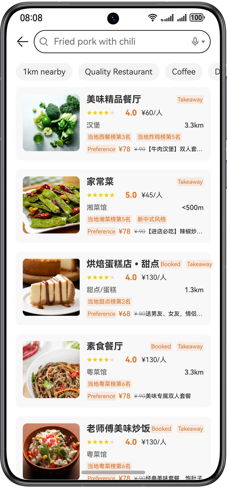
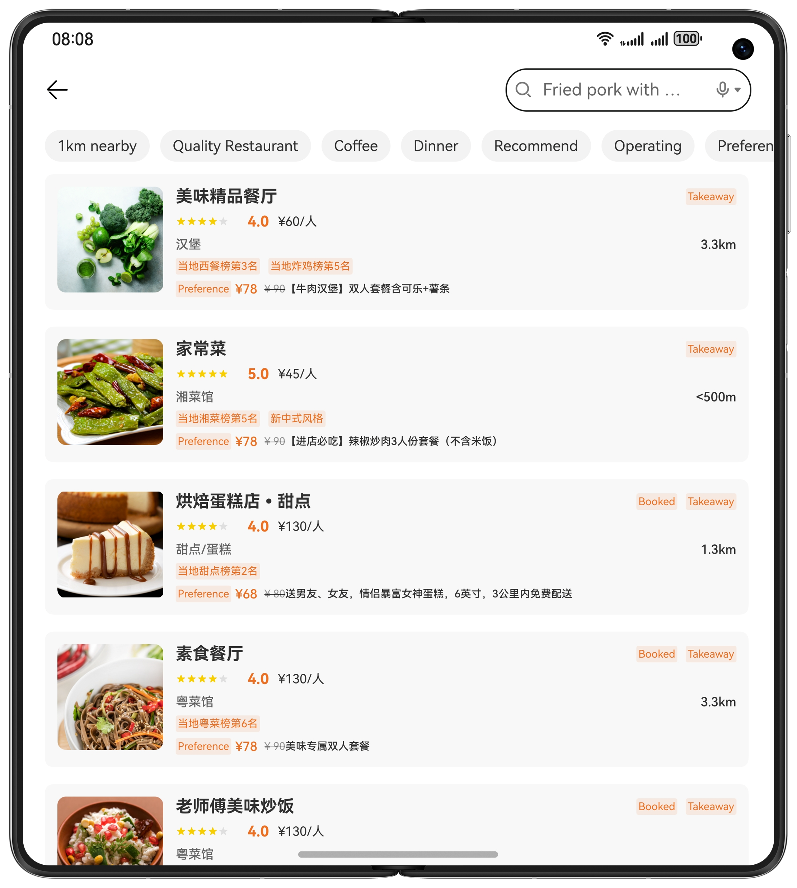

# Convenient Life (ArkTS)

### Overview

Based on the adaptive layout and responsive layout, the sample implements the convenient life page that is developed once and deployed on multiple devices. The page is implemented based on the size of the mobile phone, foldable phone, tablet, and PC/2-in-1 device.

The following figure shows the running effect on a mobile phone.



The following figure shows the running effect on a foldable phone.



The following figure shows the running effect on the tablet and PC/2-in-1 devices.


## Project Directory

```
├──entry/src/main/ets                               // Code area
│  ├──constants  
│  │  ├──BreakpointConstants.ets                    // Breakpoint constant class
│  │  ├──CommonConstants.ets                        // Common constants
│  │  ├──DishDetailConstants.ets                    // Constant class for the dish details page
│  │  ├──FoodListConstants.ets                      // Constant class of the food list page                                  
│  │  └──ShopDisplayConstants.ets                   // Constant class of the shop page
│  ├──entryability  
│  │  └─EntryAbility.ets 
│  ├──pages  
│  │  ├──DishDetails.ets                            // Dish details page
│  │  ├──FoodList.ets                               // Food list page
│  │  ├──GraphicText.ets                            // Graphic text page
│  │  ├──Index.ets                                  // Home page
│  │  ├──Living.ets                                 // Live broadcast page                                  
│  │  └──ShopDisplay.ets                            // Shop page
│  ├──utils  
│  │  ├──BreakpointType.ets                         // Breakpoint type                                 
│  │  └──Logger.ets                                 // Log printing class
│  ├──view  
│  │  ├──DishComments.ets                           // Dish comments view
│  │  ├──DishDetailsView.ets                        // Product details view
│  │  ├──DishInformation.ets                        // Product information view      
│  │  ├──FoodItem.ets                               // Food list view
│  │  ├──FoodListHeader.ets                         // Header view of the food list
│  │  ├──GraphicTextComments.ets                    // Graphic text comments view
│  │  ├──GraphicTextDescriptions.ets                // Graphic text description view
│  │  ├──GraphicTextFooter.ets                      // Bottom view of graphic text details
│  │  ├──GraphicTextHeader.ets                      // Header view of graphic text details
│  │  ├──GraphicTextSwiper.ets                      // Carousel view of graphic text details
│  │  ├──LivingComments.ets                         // Living comments view
│  │  ├──LivingHome.ets                             // Main view of the live TV channel
│  │  ├──ShopDish.ets                               // Main view of the shop dishes
│  │  ├──ShopInformation.ets                        // Shop information view
│  │  ├──ShopMenu.ets                               // Shop menu view
│  │  ├──ShopOrderList.ets                          // Shop list view
│  │  ├──ShopPop.ets                                // Shop pop-up window view
│  │  └──TakeOutDetails.ets                         // Taskout details view
│  └──viewmodel  
│     ├──DishDetailViewModel.ets                    // Dish details class
│     ├──FoodListViewModel.ets                      // Food list class
│     ├──LivingCommentsViewModel.ets                // Living comments class                                  
│     └──ShopDisplayViewModel.ets                   // Shop class       
└──entry/src/main/resources                         // App resource directory
```

### Concepts

- One-time development for multi-device deployment. As the name implies, you only need to develop and release one set of project code and then deploy it on multiple devices as demanded. This feature enables you to efficiently develop applications that are compatible with multiple devices while providing distributed user experiences for cross-device transferring, migration, and collaboration.
- Adaptive layout: When the size of an external container changes, elements can automatically change based on the relative relationship to adapt to the external container. Relative relationships include the proportion, fixed aspect ratio, and display priority.
- Responsive layout: When the size of an external container changes, elements can automatically change based on the breakpoints, grids, or specific features (such as the screen direction and window width and height) to adapt to the external container.
- GridRow: A container that is used in a grid layout, together with its child component **\<GridCol>**.
- GridCol: A container that must be used as a child component of the **\<GridRow>** container.
- PiP: In scenarios such as video playback, video conferencing, and video calls, this feature is used to display video content in a small window (PiP).

### Required Permissions

N/A

### How to Use

1. Install and open an app on a mobile phone, foldable phone, or tablet. The responsive layout and adaptive layout are used to display different effects on the app pages over different devices.
2. Open the app and view the content on the home page.
3. Tap the **FoodList** icon to view the food list.
4. Tap **GraphicText** to view the content on the graphic text details page.
5. Tap **Living** to view the live broadcast content.
6. Tap any food on the food list page to view its shop information.
7. Tap any offering on the shop page for its details.

### Constraints

1. The sample app is supported on Huawei phones, tablets, and PC/2in1 running the standard system.
2. HarmonyOS: HarmonyOS 5.0.5 Release or later
3. DevEco Studio: DevEco Studio 5.0.5 Release or later
4. HarmonyOS SDK: HarmonyOS 5.0.5 Release SDK or later
