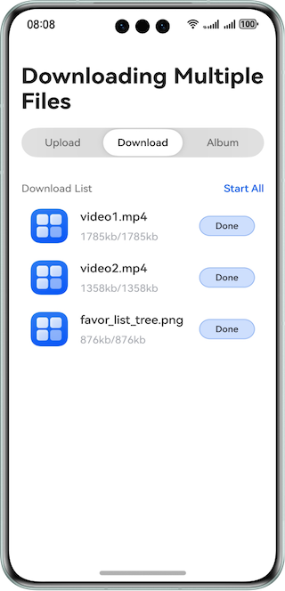

# Downloading Multiple Files

### Overview

This sample shows how to use the APIs provided by the **request** module to listen for and manage the download progress and status of multiple files.

### Preview


### Project Directory

```
├──entry/src/main/ets/
│  ├──constants
│  │  └──Constants.ets                  // Common constants
│  ├──entryability
│  │  └──EntryAbility.ets               // Entry ability
│  ├──pages                 
│  │  └──Index.ets                      // Home page
│  └──view     
│     ├──FileDownloadItem.ets           // List item            
│     └──ProgressButton.ets             // Progress button
└──entry/src/main/resources             // Static resources of the app
```

### How to Implement

1. On the Index page, use the **List** component to implement the download file list (enter the URLs of the files to be downloaded in the **downloadUrlArray** variable).
2. Use **FileDownloadItem** to implement the list view.
3. Set download parameters in each list item, create a download task, register a listener, obtain the file download status from the listener callback, and bind the data to the corresponding component.
4. Provide the start, pause, and resume operations for each download task.

### Required Permissions

- **ohos.permission.INTERNET**: allows an app to access Internet.

### Dependencies
N/A

### Constraints

1. The sample is only supported on Huawei phones with standard systems.

2. The HarmonyOS version must be HarmonyOS 5.0.5 Release or later.

3. The DevEco Studio version must be DevEco Studio 5.0.5 Release or later.

4. The HarmonyOS SDK version must be HarmonyOS 5.0.5 Release SDK or later.
