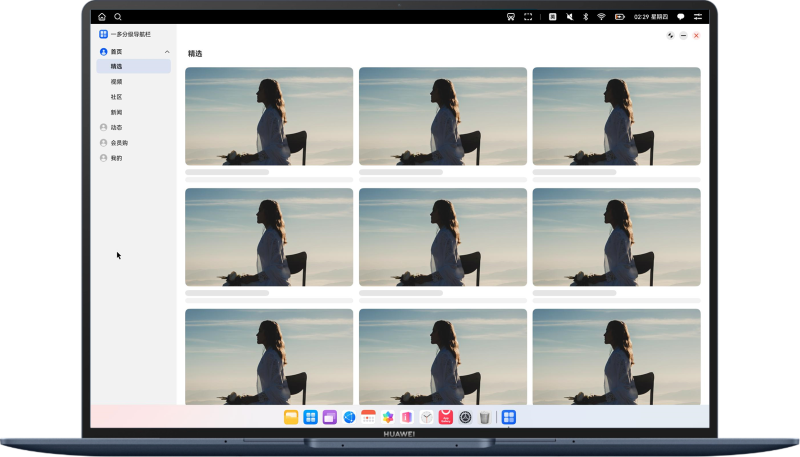

# 一次开发，多端部署-分级导航栏

### 简介

本示例基于自适应布局和响应式布局，实现多设备上的分级导航栏效果。在sm、md断点下，展示为底部页签和顶部页签；在lg断点下，展示为侧边页签和顶部页签；在xl断点下，展示为侧边栏分级导航。为开发者提供分级导航栏的开发方案。

### 预览效果

| 手机                             | 折叠屏                            | 平板                             | PC/2in1                        |
|--------------------------------|--------------------------------|--------------------------------|--------------------------------|
|  |  |  |  |

### 使用说明

1. 分别在手机、折叠屏、平板、PC/2in1设备上安装并打开应用，不同设备的应用页面通过响应式布局和自适应布局呈现不同的效果。
2. 首页内容，支持上下滑动。
3. 点击顶部页签/侧边栏中二级目录切换内容区信息。
4. 点击底部/侧边页签/侧边栏一级目录切换不同功能页面。

### 工程目录
```
├──entry/src/main/ets                     // 代码区
│  ├──common
│  │  └──utils
│  │     ├──BreakpointType.ets            // 断点工具类
│  │     └──WindowUtils.ets               // 窗口工具类
│  ├──entryability
│  │  └──EntryAbility.ets                 // 程序入口类
│  ├──entrybackupability
│  │  └──EntryBackupAbility.ets
│  ├──model
│  │  ├──TabDataModel.ets                 // 导航目录数据类
│  │  └──VideoDataModel.ets               // 内容区数据类
│  ├──pages
│  │  └──Index.ets                        // 首页
│  ├──view
│  │  ├──Home.ets                         // 主页
│  │  ├──SideBarView.ets                  // 侧边栏
│  │  ├──TopTabView.ets                   // 顶部页签
│  │  └──VideoInfoView.ets                // 内容区域页
│  └──viewmodel
│     ├──TabViewModel.ets                 // 导航目录数据
│     └──VideoViewModel.ets               // 内容区数据
└──entry/src/main/resources               // 应用静态资源目录
```

### 具体实现

1. 通过断点实现响应式布局，在不同断点下呈现不同的布局效果。
2. 在sm、md、lg断点下使用Tabs和List组件组合实现分级导航栏。
3. 在xl断点下使用SideBarContainer组件实现分级导航栏。

### 相关权限

不涉及。

### 约束与限制

1. 本示例仅支持标准系统上运行，支持设备：华为手机、平板、PC/2in1。
2. HarmonyOS系统：HarmonyOS 5.0.5 Release及以上。
3. DevEco Studio版本：DevEco Studio 5.0.5 Release及以上。
4. HarmonyOS SDK版本：HarmonyOS 5.0.5 Release SDK及以上。