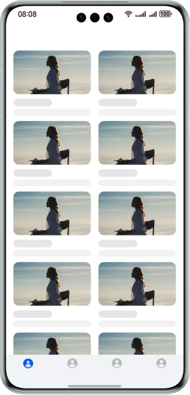
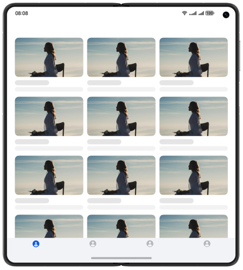
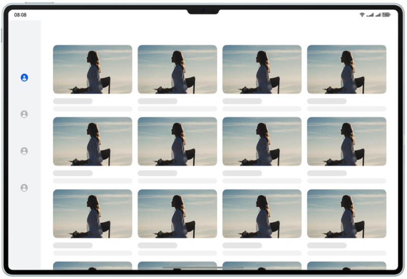
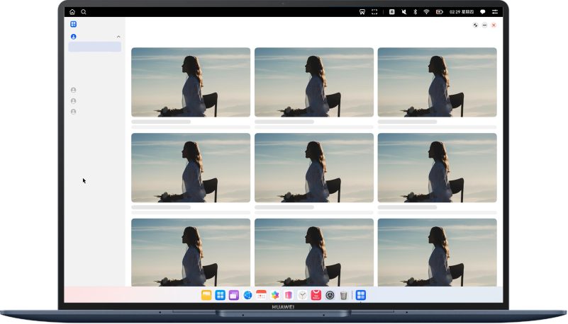

## Navigation Bar

### Overview

This sample shows the style of the navigation component in different device forms.

* On a small- or mini-system device, tabs are used, and the content and navigation components are displayed in top-down style. You can touch tabs at the bottom to switch the content.
* On a medium- or large-system device, side bars are used, and the content and navigation components are displayed in left-right style. You can touch the level-1 and level-2 menus on the side bar to switch the content.

In this sample, the adaptive layout and responsive layout are used for adaptation among multiple devices or multiple window sizes. The component provides window breakpoint events to ensure that applications can be properly displayed on different devices or in different window sizes.

### Preview

Below are the preview effects of this sample on devices with different system sizes.

| phones                            | Foldable                       | tablets                             | PC/2in1                           |
|--------------------------------|--------------------------------|--------------------------------|-----------------------------------|
|  |  |  |  |

How to Use

1. Open the home page and open the previewer in DevEco Studio to view the preview effect.
2. Enable the window drag mode in the previewer and drag the window to view the responsive changes of the component, as shown in the following figure.
3. Manually drag the window to switch the application window between the small-/mini-system, medium-system, and large-system devices modes and view their preview effects.
4. In the application window of medium-and large-system devices, tap the icon in the upper left corner to switch the sidebar style.

### Project Directory

```
├──entry/src/main/ets                         // Code area
│  ├──common
│  │  ├──BreakpointSystem.ets                 // Breakpoint system
│  │  ├──CommonMainTabs.ets                   // Main tabs
│  │  ├──CommonSubTabs.ets                    // Subtabs
│  │  ├──Configuration.ets                    // Style configuration
│  │  ├──RecommendationList.ets               // Recommendation list
│  │  └──SideBarController.ets                // Sidebar controller     
│  ├──entryability  
│  │  └──EntryAbility.ets         
│  ├──model  
│  │  ├──MenuType.ets                         // Sidebar menu type
│  │  ├──SideListData.ets                     // Sidebar data
│  │  └──StyleType.ets                        // Style type
│  └──pages     
│     └──AppStore.ets                         // Home page
└──entry/src/main/resources                   // App resource directory
                             
```

### How to Implement

This sample describes how to use the adaptive layout and responsive layout capabilities to adapt the app to windows of different sizes and split a page into two parts.

#### Overall Layout

1. The breakpoint event provided by the GridRow component is used to obtain the breakpoint of the current window. The **visibility** attribute is used to place the [Tabs](https://developer.huawei.com/consumer/cn/doc/harmonyos-references/ts-container-tabs-0000001821000917) component in small-system devices and SideBarContainer component in medium- and large-system devices for display or hide.

2. You can set different style attributes for components through breakpoints to achieve the optimal display effect.

#### Sidebar/Bottom TabsController

1. The sidebar content is displayed horizontally on small-system devices and vertically on medium- and large-system devices through the Flex container.

2. The content area can be displayed or hidden through different window breakpoints.

3. The level-1 menu of the sidebar on medium- and large-system devices corresponds to the outermost TabsController component of small-system devices, and the level-2 menu on medium- and large-system devices corresponds to the inner TabsController component of small-system devices.

4. A sidebar provides both the list and tabs. You can tap the icon in the upper left corner of the sidebar to switch between the two forms. In list mode, the content area is small, and only the icon or icon and text are displayed based on the window breakpoint. In tabs mode, the content area is large, and the icon and text are both displayed.

#### Content Area

1. The Swiper component obtains window breakpoints and sets the **displayCount** attribute to display different numbers of images in different windows.

2. As for the content browsing continuity, the browsing progress in the content area is retained during window switching and will not be refreshed.

### Required Permissions

N/A

### Dependencies

N/A

### Constraints

1. The sample app is supported on Huawei phones, tablets, and 2in1 running the standard system.

2. The HarmonyOS version must be HarmonyOS 5.0.5 Release or later.

3. The DevEco Studio version must be DevEco Studio 5.0.5 Release or later.

4. The HarmonyOS SDK version must be HarmonyOS 5.0.5 Release or later.
