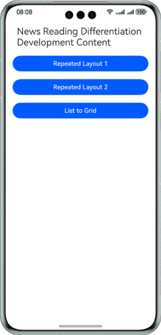
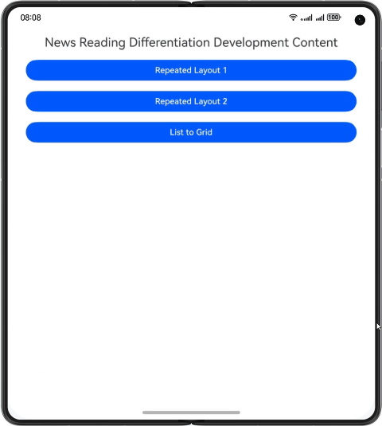
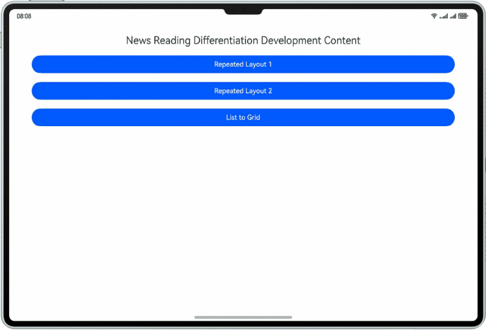

# One development, multiple deployment-News Page

## Overview

This sample implements a news page based on the adaptive layout and responsive layout, allowing the same set of codebase to fit into device of different sizes, such as mobile phones, foldable devices, and tablets.

## Preview
Effect on a mobile phone



Effect on a foldable phone



Effect on a tablet




## Project Directory

```
├──entry/src/main/ets                                   // Core code
│  ├──common                                            
│  |  └──Constants.ets                                  // Constants
│  ├──entryability
│  |   └──EntryAbility.ets
│  ├──pages
│  |  ├──Index.ets                                      // Home page
│  |  ├──MediaNews.ets                                  // Page that displays media news
│  |  ├──NewsChannel.ets                                // Page that displays different new channels or categories
│  |  └──NewsListPage.ets                               // Page that lists news articles in a list format
│  ├──view
│  |  ├──Header.ets                                     // Header component for pages
│  |  ├──HotList.ets                                    // Component that displays a list of hot or trending news
│  |  ├──LeftTextRightImageBgGray.ets                   // Component with a layout where text is on the left and an image is on the right on a gray background
│  |  ├──LeftTextRightImageBgWhite.ets                  // Component with a layout where text is on the left and an image is on the right on a white background
│  |  ├──NewsWithImages.ets                             // Component with a layout where an image is below a block of text
│  |  ├──TopImageBottomText.ets                         // Component with a layout where an image is above a block of text
│  |  ├──TopTextBottomVideo.ets                         // Component with a layout where text is above a vide player
│  |  └──VideoCard.ets                                  // Card component for videos
│  └──viewmodel
│     ├──HotListViewModel.ets                           // Data and logic for displaying a list of hot or trending news
│     ├──ImageAndTextViewModel.ets                      // Data model that includes text on the left and an image on the right.
│     ├──ImageAndTextViewModelForPageNewsChannel.ets    // Data for the NewsChannel page
│     ├──MultiImageViewModel.ets                        //  Model for a list of images
│     ├──MultiImageViewModelForMediaNews.ets            // Data for the MediaNews page
│     ├──TopImageBottomTextViewModel.ets                // Data for a layout where an image is above the text
│     └──VideoListViewModel.ets                         // ViewModel for a list of videos
└──entry/src/main/resources                             // Static resources of the app
```

## How to Implement

The media news page uses the repeated layout. Use a grid layout to control the number of displayed columns based on breakpoints. Use **onBreakChange()** of the **GridRow** component to update the breakpoint values and the number of data source items when the interface size changes. Specifically, set **columns** of **GridRow** to **1** for small (sm) and medium (md) breakpoints, and set **columns** to **2** for large (lg) or larger breakpoints.

The news channel page also uses the repeated layout. Use a grid layout to control the number of displayed columns based on breakpoints. Set **columns** of **GridRow** to **1** for sm and md breakpoints, and set **columns** to **2** for lg or larger breakpoints. Different from the media news, the news abstract on the news channel page is not displayed under sm and md breakpoints, but displayed in a maximum of two lines under lg breakpoints. Specifically, set **visibility** of the **Text** component based on breakpoints. Set **visibility** to **Visibility.Hidden** for sm and md breakpoints and to **Visibility.Visible** for lg breakpoints. To display a maximum of two lines, set **maxLines** of the **Text** component to **2**. In addition, set **textOverflow** to **overflow: TextOverflow.Ellipsis**, which displays the extra part as an ellipsis (...).

The news list page uses the list-to-grid layout. Specifically, use the **List** component for sm breakpoints and the grid layout for larger breakpoints. Display the content in two columns for md breakpoints, and set the number of columns occupied by **GridCol** as required. Display the content in four columns for lg breakpoints, and set number of columns occupied by GridCol as required.


## Required Permissions

N/A

## Constraints

1. The sample app is supported only on Huawei phones and tablets running the standard system.

2. The HarmonyOS version must be HarmonyOS 5.0.5 Release or later.

3. The DevEco Studio version must be DevEco Studio 5.0.5 Release or later.

4. The HarmonyOS SDK version must be HarmonyOS 5.0.5 Release SDK or later.
