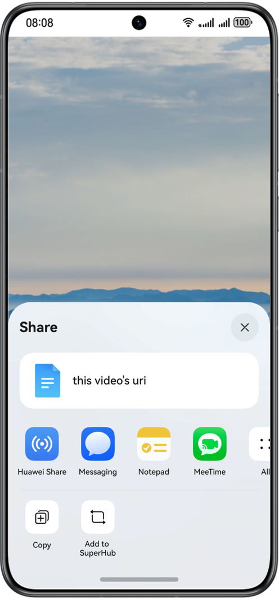

# Short Video Supporting Multi-Device Deployment

### Overview

This sample implements a short video app based on the adaptive layout and responsive layout, achieving one-time development for multi-device deployment. It uses the three-layer project architecture for code reuse and tailors the pages to different device sizes such as mobile phones, foldable devices, and PC/2-in-1 devices.

### Preview


### How to Use

Touch the share button to open the sharing dialog box. This dialog box appears as a semi-modal window on a mobile phone, a centered window on a foldable device, and a touch-following window on a tablet.

### Project Directory
```
├──commons
│  └──base/src/main/ets
│     └──constants
│        └──BreakpointConstants.ets       // Constants
├──features
│  ├──home/src/main/ets
│  │  ├──constants
│  │  │  └──HomeConstants.ets             // Constants
│  │  └──view
│  │     └──Home.ets                      // Home page
│  └──home/src/main/resources             // Static resources
└──products
   ├──entry/src/main/ets
   │  ├──common
   │  │  └──constants
   │  │     └──CommonConstants.ets        // Common constants
   │  ├──entryability
   │  │  └──EntryAbility.ets              // Entry ability
   │  └──pages
   │     └──MainPage.ets                  // Home page
   └──entry/src/main/resources            // Static resources
```
### How to Implement

Use Share Kit to implement the sharing feature.

### Required Permissions

N/A

### Dependencies

N/A

### Constraints

1. The sample app is supported only on Huawei phones running the standard system.

2. The HarmonyOS version must be HarmonyOS 5.0.5 Release or later.

3. The DevEco Studio version must be DevEco Studio 5.0.5 Release or later.

4. The HarmonyOS SDK version must be HarmonyOS 5.0.5 Release or later.
