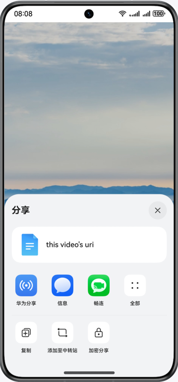

# 多设备短视频界面

### 介绍

本示例基于自适应布局和响应式布局，实现一次开发，多端部署的短视频页面。通过“三层工程架构”实现代码复用，并根据手机、折叠屏以及PC/2in1不同的设备尺寸实现对应页面。

### 效果预览


### 使用说明

点击分享按钮，拉起分享弹窗。在手机上是半模态弹窗，折叠屏上是居中弹窗，而平板上是跟手弹窗。

### 工程目录
```
├──commons
│  └──base/src/main/ets
│     └──constants
│        └──BreakpointConstants.ets       // 常量类
├──features
│  ├──home/src/main/ets
│  │  ├──constants
│  │  │  └──HomeConstants.ets             // 常量类
│  │  └──view
│  │     └──Home.ets                      // 主页面view
│  └──home/src/main/resources             // 应用静态资源目录
└──products
   ├──entry/src/main/ets
   │  ├──common
   │  │  └──constants
   │  │     └──CommonConstants.ets        // 常量类
   │  ├──entryability
   │  │  └──EntryAbility.ets              // 程序入口类
   │  └──pages
   │     └──MainPage.ets                  // 主页面
   └──entry/src/main/resources            // 应用静态资源目录
```
### 具体实现

* 使用Share Kit（分享服务）实现分享功能。

### 相关权限

不涉及。

### 依赖

不涉及。

### 约束与限制

1. 本示例仅支持标准系统上运行，支持设备：华为手机。

2. HarmonyOS系统：HarmonyOS 5.0.5 Release及以上。

3. DevEco Studio版本：DevEco Studio 5.0.5 Release及以上。

4. HarmonyOS SDK版本：HarmonyOS 5.0.5 Release SDK及以上。