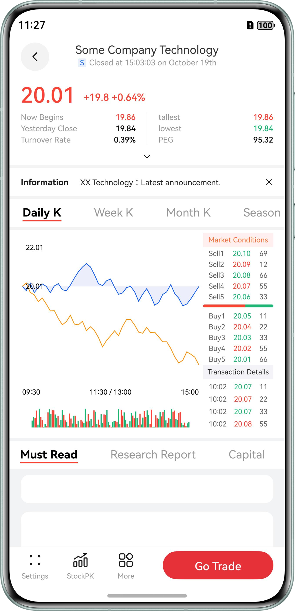

# Multi-Device Stock Page

## Overview

This sample demonstrates how to develop a stock trading application that can be deployed across devices based on adaptive and responsive layouts. The application layout can adapt to different device types, such as mobile phones, foldable screens, and tablets. It also supports the split-screen mode on large-screen foldable phones, tri-fold phones, and tablets, facilitating users to compare stock details.

## Effect


The effects are as follows.

**Home page for selecting stocks:**


| Mobile Phone                                    | Foldable Screen (Unfolded)                             | Tablet                                           |
|-------------------------------------------------|--------------------------------------------------------|--------------------------------------------------|
|  |  |  |

**Stock details page:**

| Mobile Phone                                      | Foldable Screen (Unfolded)                               | Tablet (Full Screen)                               |
|---------------------------------------------------|----------------------------------------------------------|----------------------------------------------------|
|  |  |  |

**Split-screen layout:**

| Mobile Phone | Foldable Screen (Unfolded)                                 | Tablet (Full Screen)                                |
|--------------|------------------------------------------------------------|-----------------------------------------------------|
| N/A          |   |  |

**Stock purchase dialog:**

| Mobile Phone                                    | Foldable Screen (Unfolded)                             | Tablet                                           |
|-------------------------------------------------|--------------------------------------------------------|--------------------------------------------------|
|  |  |  |

**Stock purchase confirmation dialog:**

| Mobile Phone                                           | Foldable Screen (Unfolded)                                    | Tablet                                                  |
|--------------------------------------------------------|---------------------------------------------------------------|---------------------------------------------------------|
|  |  |  |

How to Use

* Home page
  1. On the home page, tap any stock to go to the stock details page.
* Stock details page
  1. Foldable screen (unfolded) or tablet: Tap the split-screen icon in the upper right corner of the screen to enter the split-screen mode.
  2. Tablet: On the right content area, tap the zoom icon in the upper left corner to enter the full-screen mode. You can tap the back icon in the upper left corner to exit the full-screen mode.
  3. Tap the **Go Trade** button in the lower part of the page. A stock purchase dialog is displayed. In the dialog, tap **Buy**. In the subsequent dialog that appears, tap **Confirm Purchase**.

## Project Directory

```
├──entry/src/main/ets                              // Code area 
│  ├──chartmodels 
│  │  ├──BarChartView.ets                          // Bar chart component logic 
│  │  ├──ChartAxisFormatter.ets                    // Line chart data formatting 
│  │  └──LineChartModel.ets                        // Line chart component logic 
│  ├──entryability   
│  │  └──EntryAbility.ets                          // Application entry 
│  ├──entrybackupability   
│  │  └──EntryBackupAbility.ets                    // Data backup and restoration 
│  ├──models  
│  │  └──DataModel.ets                             // Stock data 
│  ├──pages   
│  │  ├──Index.ets                                 // Home page 
│  │  ├──OptionPage.ets                            // Page for selecting stocks 
│  │  └──StockDetailsPage.ets                      // Stock details page 
│  ├──utils                               
│  │  ├──BreakpointType.ets                        // Breakpoint class 
│  │  └──Logger.ets                                // Logging utility 
│  └──views 
│     ├──BuyPopUp.ets                              // Dialog component for stock purchase 
│     ├──CommonView.ets                            // Common component 
│     ├──RegularWayPopUp.ets                       // Dialog component for regular transaction 
│     ├──StockDealDetails.ets                      // Stock details component 
│     ├──StockDetailsInfo.ets                      // Stock details information component 
│     ├──StockDetailsView.ets                      // Stock details page component 
│     ├──StockTable.ets                            // Stock table list component 
│     └──TopTitleBar.ets                           // Top title bar of the stock details page 
└──entry/src/main/resources                        // Application resources
```

## How to Implement

* Use the **UIAbilityContext.startAbility()** method to implement the in-application split-screen feature.
* Change **mode** of **navigation** based on the breakpoint or status to implement the transitions between single-column and triple-column layouts.
  

## Required Permissions

N/A

## Dependencies

N/A

## Constraints

1. This sample is only supported on Huawei phones and tablets running standard systems.
2. The HarmonyOS version must be HarmonyOS 5.0.5 Release or later.
3. The DevEco Studio version must be DevEco Studio 5.0.5 Release or later.
4. The HarmonyOS SDK version must be HarmonyOS 5.0.5 Release SDK or later.
