# 多设备股票类界面

## 介绍

本篇Sample基于自适应布局和响应式布局，实现一次开发，多端部署的股票交易应用。根据不同设备尺寸（如手机、折叠屏、平板），实现了相应的页面布局。该Sample支持在大折叠、三折叠和平板设备上分屏显示，便于对比股票详情。

## 效果预览

本示例分为两个页面和两个弹框：

**自选首页**:

| 手机                                 | 折叠屏（展开态）                           | 平板                        |
|------------------------------------|------------------------------------|-----------------------------------|
| 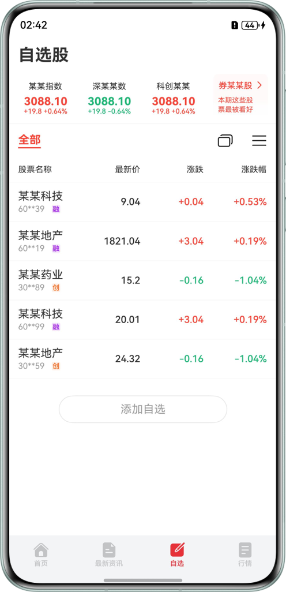 | 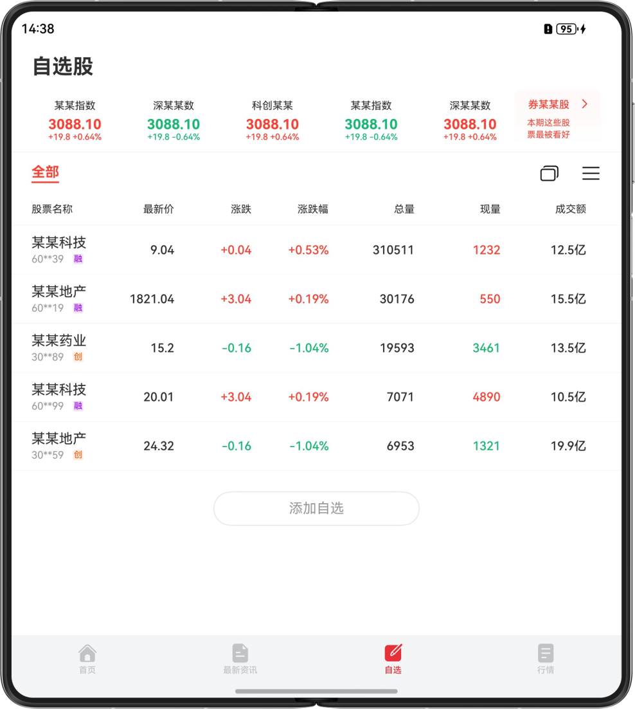 | 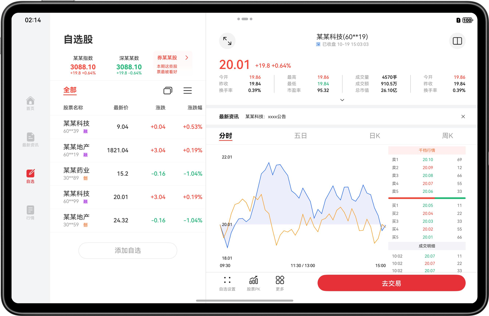 |

**股票详情页**:

| 手机                                 | 折叠屏（展开态）                           | 平板（全屏）                             |
|------------------------------------|------------------------------------|------------------------------------|
| 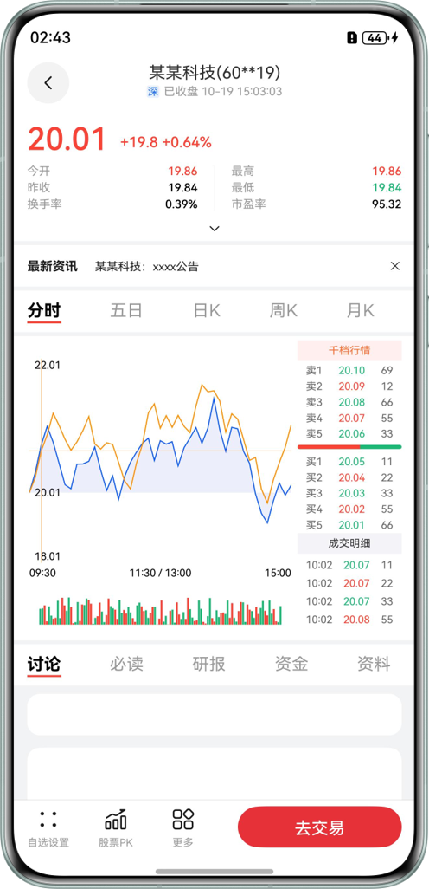 | 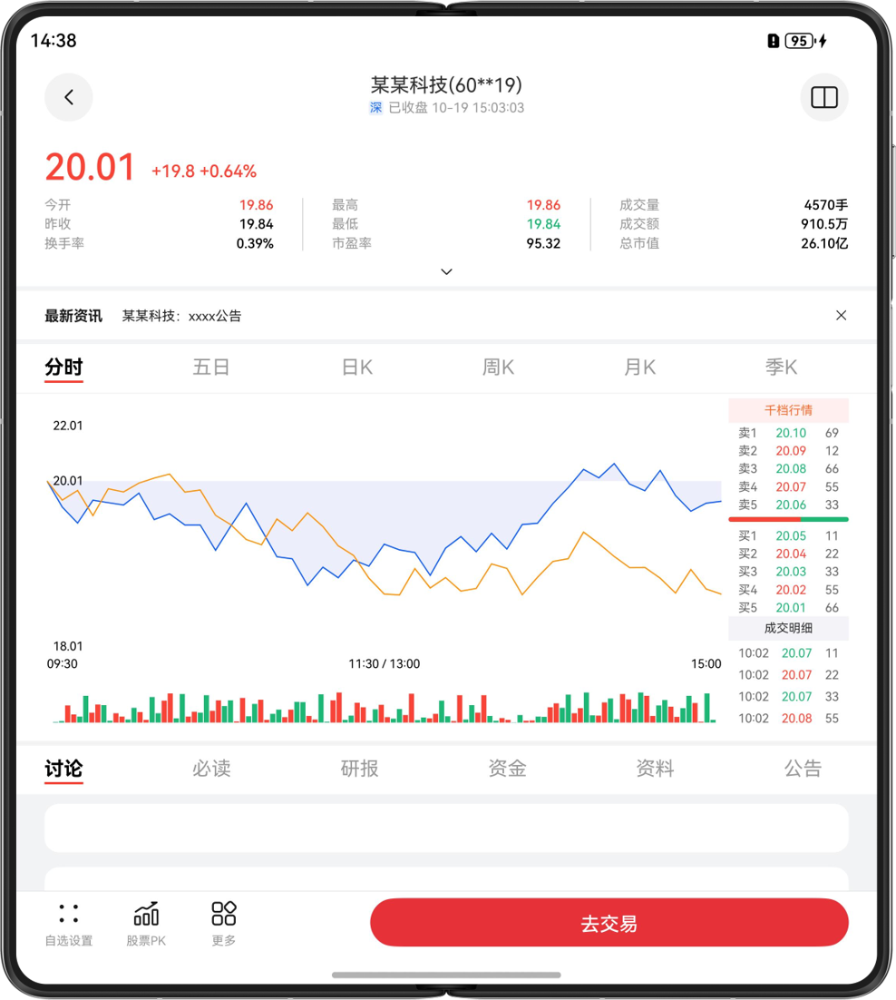 | 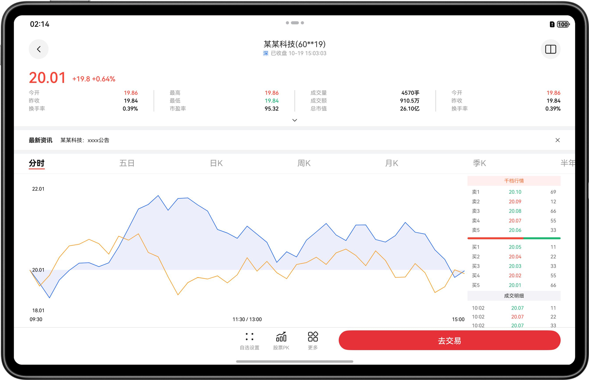 |

**应用分屏**:

| 手机  | 折叠屏（展开态）                           | 平板（全屏）                             |
|-----|------------------------------------|------------------------------------|
| 不涉及 | 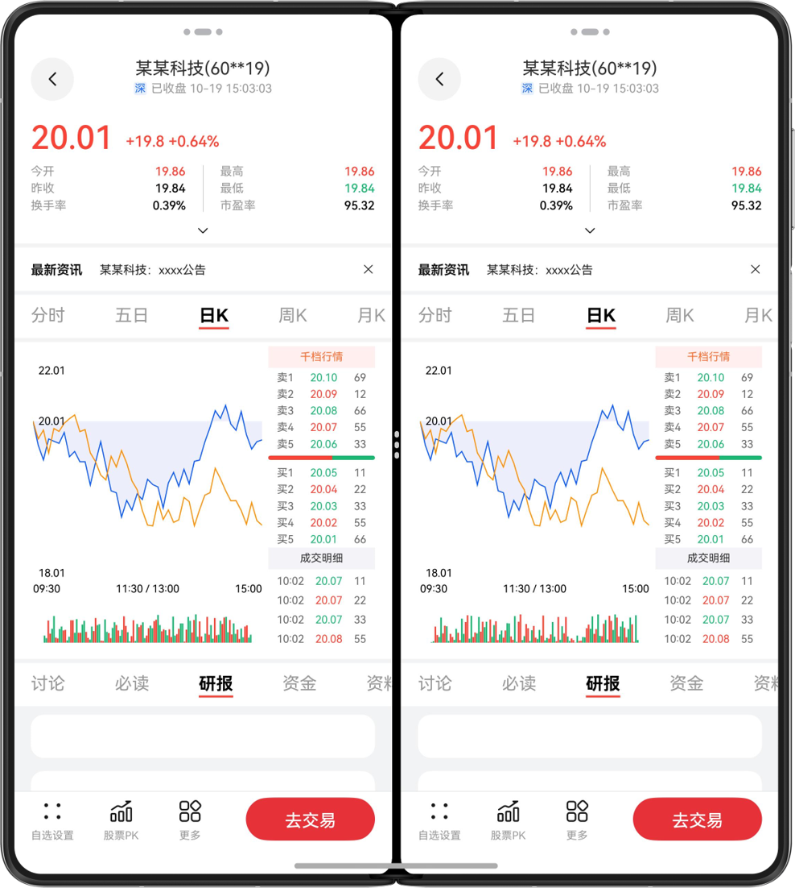 | 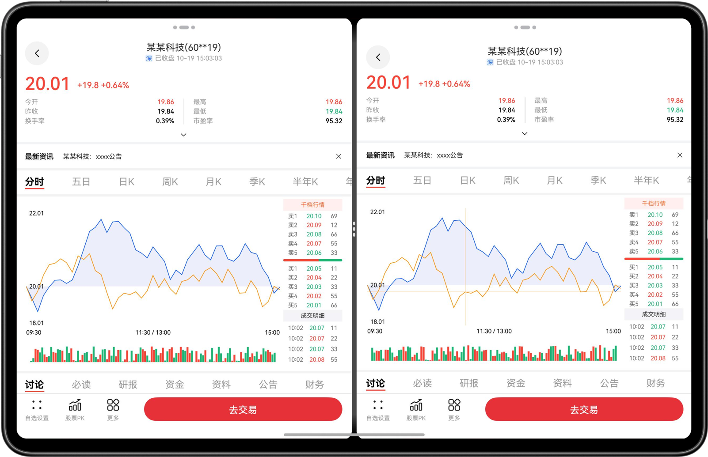 |

**买入股票弹窗**:

| 手机                                 | 折叠屏（展开态）                           | 平板                                  |
|------------------------------------|------------------------------------|-------------------------------------|
| 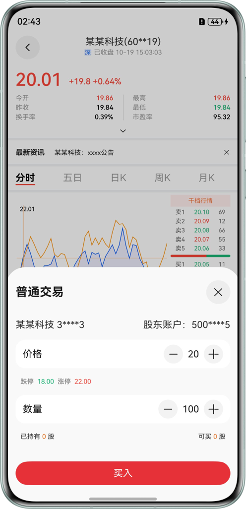 | 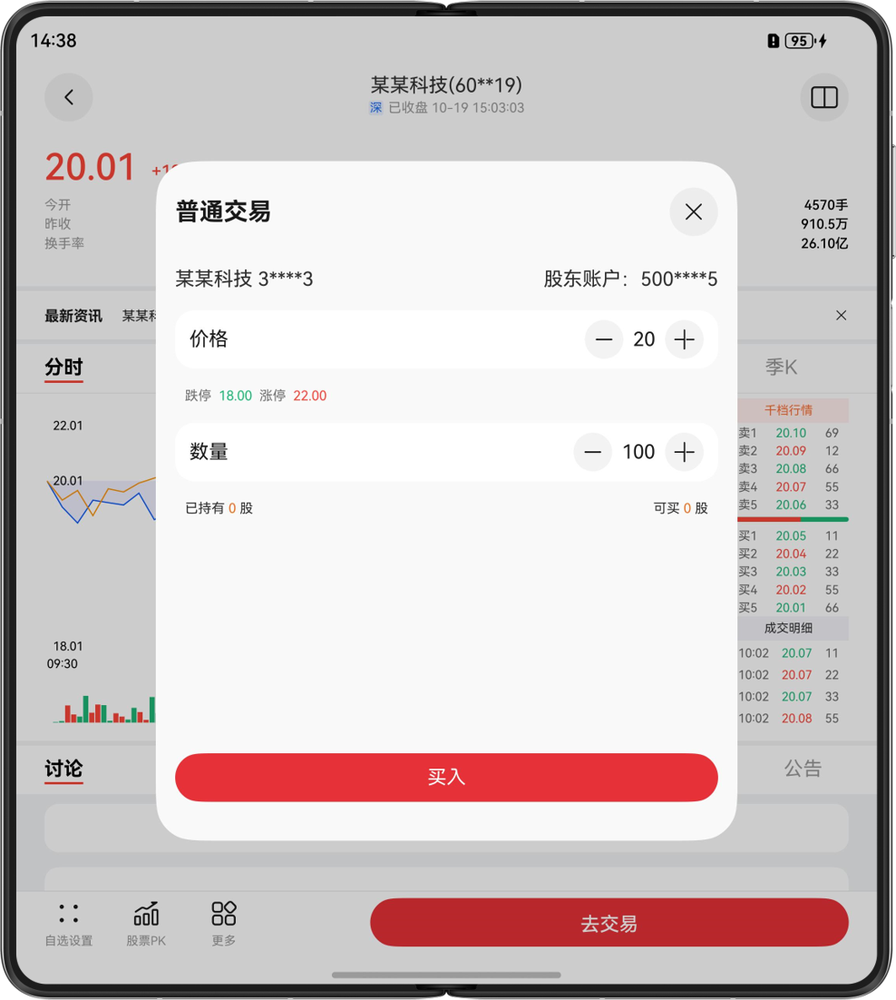 | 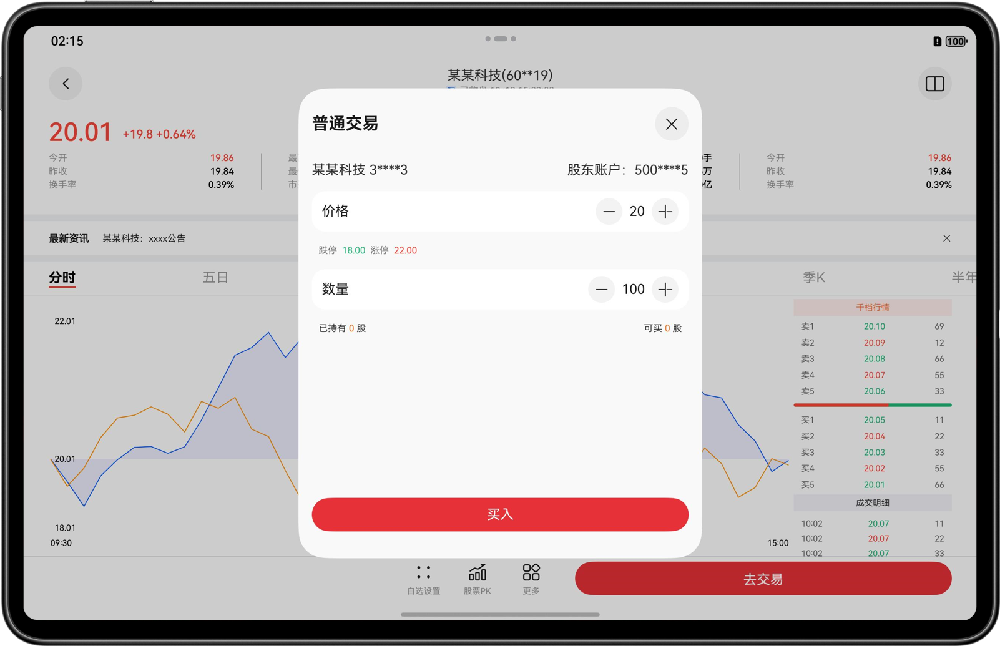 |

**确认买入股票弹窗**:

| 手机                                 | 折叠屏（展开态）                           | 平板                                  |
|------------------------------------|------------------------------------|-------------------------------------|
| 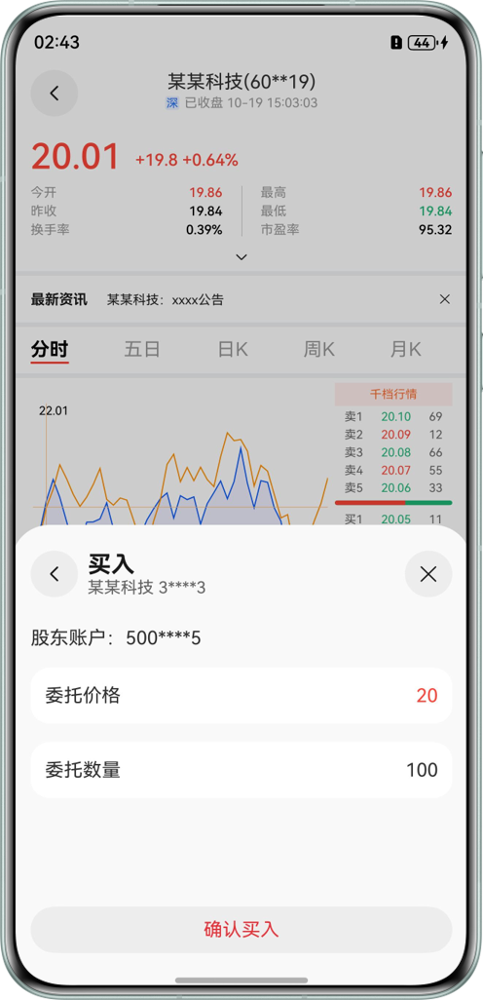 | 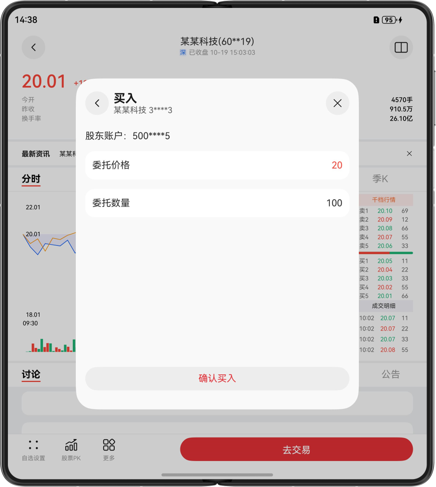 | 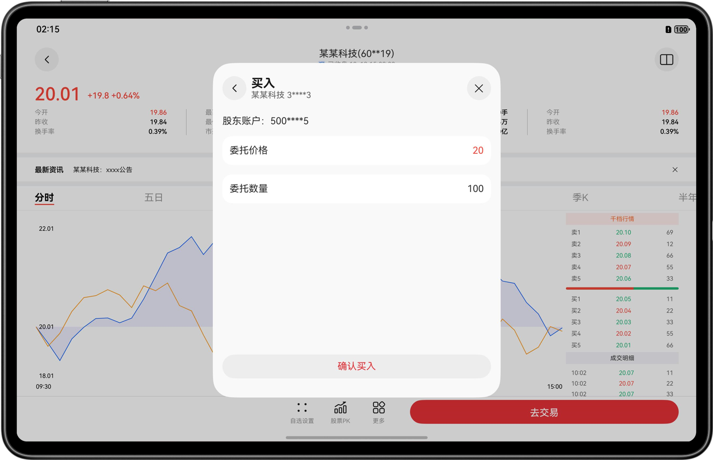 |

使用说明：

* 自选首页

  1. 自选页面，点击任意股票，跳转到股票详情页。

* 股票详情页

  1. 折叠屏（展开态）或平板：点击页面右上角的“分屏”图标，应用进入分屏模式；
  
  2. 平板：右侧“内容区”页面，点击页面左上角的“放大”图标，应用进入全屏。全屏下，点击页面左上角的“返回”图标，应用退出全屏；
  
  3. 点击页面下方的“去交易”按钮，页面弹出“买入股票弹窗”。当前弹框，点击“买入”按钮，弹出“确认买入股票弹窗”。

## 工程目录

```
├──entry/src/main/ets                              // 代码区
│  ├──chartmodels
│  │  ├──BarChartView.ets                          // 柱状图组件逻辑 
│  │  ├──ChartAxisFormatter.ets                    // 折线图数据格式化 
│  │  └──LineChartModel.ets                        // 折线图组件逻辑  
│  ├──entryability  
│  │  └──EntryAbility.ets                          // 程序入口
│  ├──entrybackupability  
│  │  └──EntryBackupAbility.ets                    // 数据备份恢复类
│  ├──models 
│  │  └──DataModel.ets                             // 股票类数据
│  ├──pages  
│  │  ├──Index.ets                                 // 应用首页
│  │  ├──OptionPage.ets                            // 自选页                               
│  │  └──StockDetailsPage.ets                      // 股票详情页
│  ├──utils                              
│  │  ├──BreakpointType.ets                        // 断点类
│  │  └──Logger.ets                                // 日志
│  └──views
│     ├──BuyPopUp.ets                              // 买入弹窗组件 
│     ├──CommonView.ets                            // 公共组件 
│     ├──RegularWayPopUp.ets                       // 普通交易弹窗组件 
│     ├──StockDealDetails.ets                      // 股票详情组件 
│     ├──StockDetailsInfo.ets                      // 股票详情信息组件 
│     ├──StockDetailsView.ets                      // 股票详情页组件 
│     ├──StockTable.ets                            // 股票表格列表组件 
│     └──TopTitleBar.ets                           // 股票详情页顶部标题栏     
└──entry/src/main/resources                        // 应用资源目录

```

## 具体实现

* 使用UIAbilityContext.startAbility()方法实现应用内分屏功能。
* 根据不同断点或状态改变navigation的mode属性，实现单栏和三栏的切换效果。

## 相关权限

不涉及。

## 依赖

不涉及。

## 约束与限制

1. 本示例仅支持标准系统上运行，支持设备：华为手机、平板。

2. HarmonyOS系统：HarmonyOS 6.0.0 Release及以上。

3. DevEco Studio版本：DevEco Studio 6.0.0 Release及以上。

4. HarmonyOS SDK版本：HarmonyOS 6.0.0 Release SDK及以上。