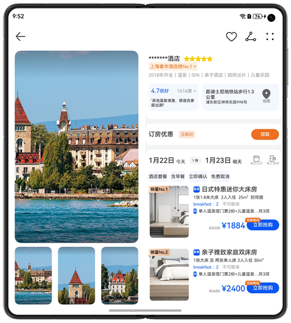
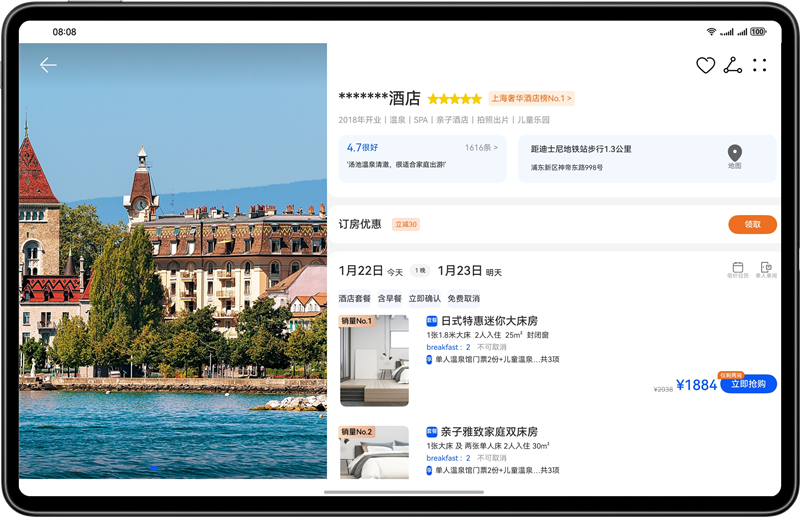
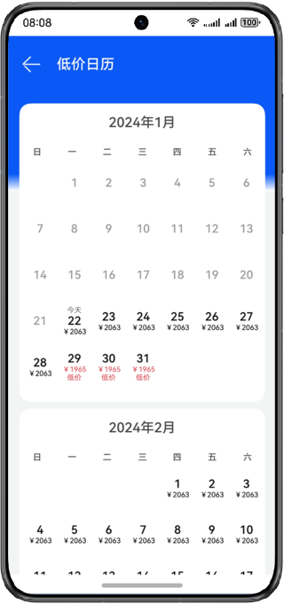
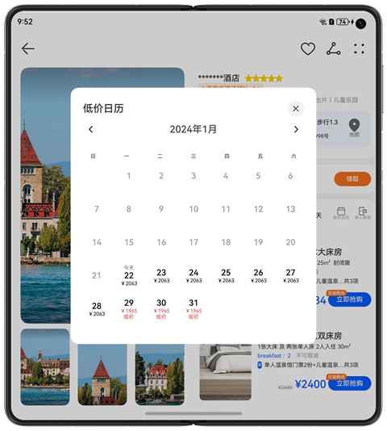
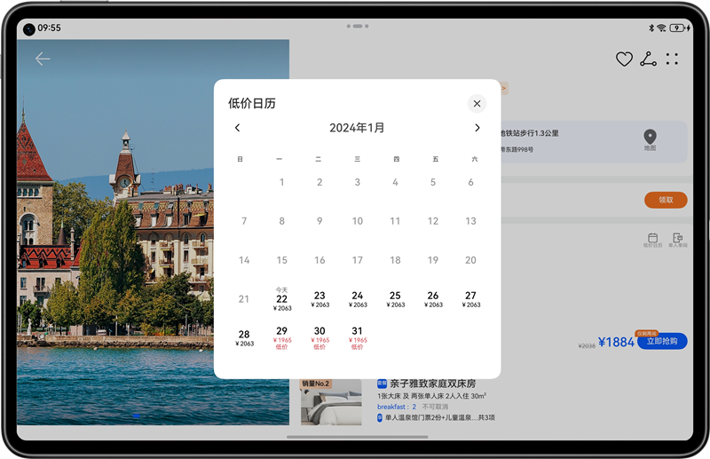
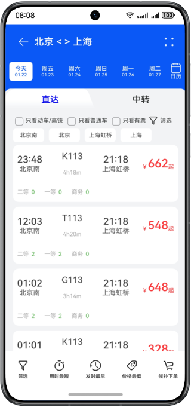
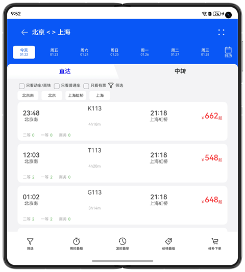
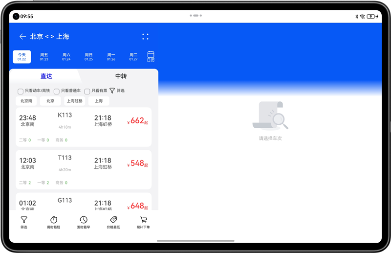

# 多设备旅行订票界面

### 介绍

本示例主要使用栅格布局和List组件相结合的方式，实现了旅行住宿差异化的多场景响应式变化效果。

### 效果预览

本示例在预览器中的效果：

**酒店详情页**:

| 手机                               | 折叠屏（展开态）                                | tablet                                      |
|----------------------------------|-----------------------------------------|---------------------------------------------|
|  |  |  |

**低价日历效果**:

| 手机                                | 折叠屏（展开态）                                  | tablet                                         |
|------------------------------------|-------------------------------------------|------------------------------------------------|
|  |  |  |

**查询车票页**:

| 手机                                 | 折叠屏（展开态）                                       | tablet                                       |
|-------------------------------------|------------------------------------------------|----------------------------------------------|
|  |  |  |

使用说明：

1.可以在预览器中查看页面效果，也可在对应设备上查看页面效果。

2.也可以在PC/2in1上拖动窗口变化，查看组件的响应式变化。

3.在首页点击酒店详情页及低价日历按钮，会跳转至酒店详情页，手机的顶部图片会在滚动至最顶部展开，离开顶部收起， 折叠屏左侧下方的小图可滚动，点击小图会更换大图，平板为左侧可滑动切换图片的布局。

4.在酒店详情页点击低价日历按钮，手机会跳转页面，折叠屏和平板会弹窗。

5.在首页点击查询车票页，会跳转至查询车票页，其中，日期按钮、多选框点击筛选、最下面的一排按钮中间三个排序按钮均有功能实现。

### 工程目录

```
├──entry/src/main/ets                                // 代码区
│  ├──commons                                  
│  │  ├──constants   
│  │  │  ├─BreakpointConstants.ets                   // 断点常量类               
│  │  │  └─CommonConstants.ets                       // 常量类 
│  │  └──utils          
│  │     ├─BreakpointType.ets                        // 断点类型类
│  │     └─Logger.ets                                // 日志打印类
│  ├──entryability  
│  │  └─EntryAbility.ets 
│  ├──pages  
│  │  ├──HotelDetailsPage.ets                         // 酒店详情页
│  │  ├──Index.ets                                    // 首页 
│  │  ├──LowPriceCalendarPage.ets                     // 低价日历页                                  
│  │  └──SearchTicketPage.ets                         // 查询车票页
│  ├──view  
│  │  ├──CalendarView.ets                             // 低价日历弹窗
│  │  ├──HotelDetailsContentView.ets                  // 酒店详情总视图
│  │  ├──HotelDetailsOrderView.ets                    // 酒店预订视图       
│  │  ├──HotelDetailsPictureView.ets                  // 酒店banner图
│  │  ├──HotelDetailsRoomItemView.ets                 // 酒店房间列表视图 
│  │  ├──HotelDetailsRoomView.ets                     // 酒店房间预约总视图
│  │  ├──LowPriceView.ets                             // 低价日历视图
│  │  ├──SearchTicketListView.ets                     // 查询车票页车票列表视图
│  │  ├──SearchTicketTabView.ets                      // 查询车票页子页签视图
│  │  ├──SearchTicketView.ets                         // 查询车票页总视图
│  │  └──SearchTopView.ets                            // 查询车票页顶部视图
│  └──viewmodel  
│     ├──CalendarItem.ets                             // 低价日历类
│     ├──HotelRoomItem.ets                            // 酒店房间类
│     ├──SearchTicketBarItem.ets                      // 查询车票页子页签类                                   
│     ├──SearchTicketCheckboxItem.ets                 // 查询车票多选框类
│     ├──SearchTicketDateItem.ets                     // 查询车票日期类
│     └──TicketItem.ets                               // 车票信息类        
└──entry/src/main/resources                           // 应用资源目录

```

### 具体实现

* 使用栅格布局监听断点变化，不同断点List组件的子组件间隔不同，同时设置Flex布局的justifyContent属性为FlexAlign.Center，实现居中对齐自适应拉伸。
* 使用Blank组件实现中间空格自适应拉伸。

### 相关权限

不涉及。

### 依赖

不涉及。

### 约束与限制

1. 本示例仅支持标准系统上运行，支持设备：华为手机、平板、PC/2in1。
2. HarmonyOS系统：HarmonyOS 5.0.5 Release及以上。
3. DevEco Studio版本：DevEco Studio 5.0.5 Release及以上。
4. HarmonyOS SDK版本：HarmonyOS 5.0.5 Release SDK及以上。
