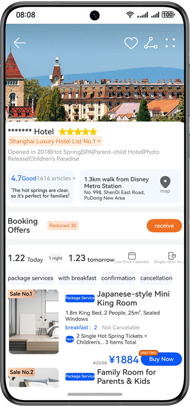
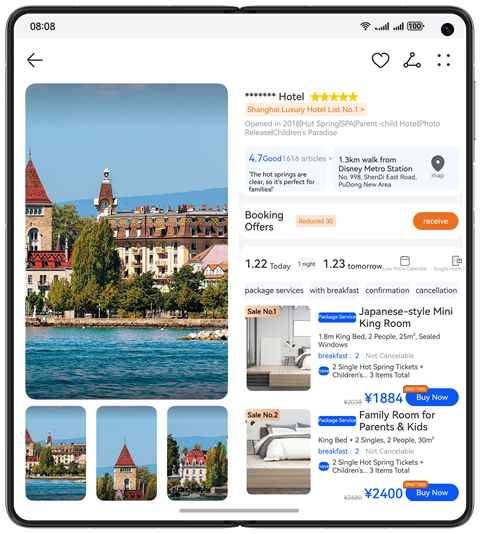
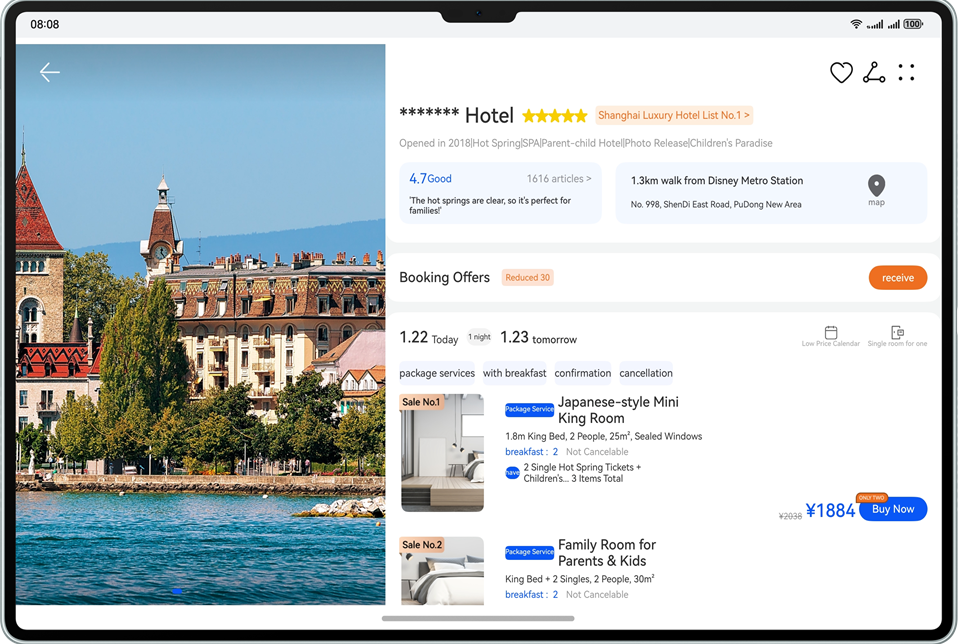
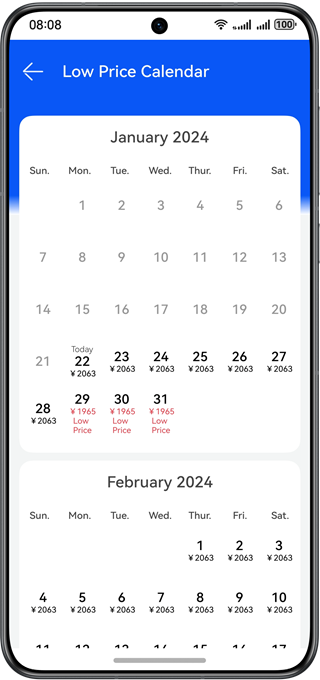
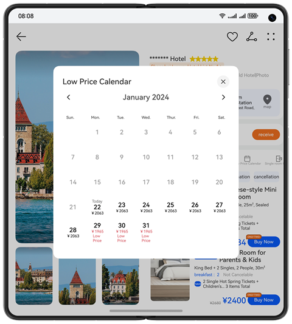
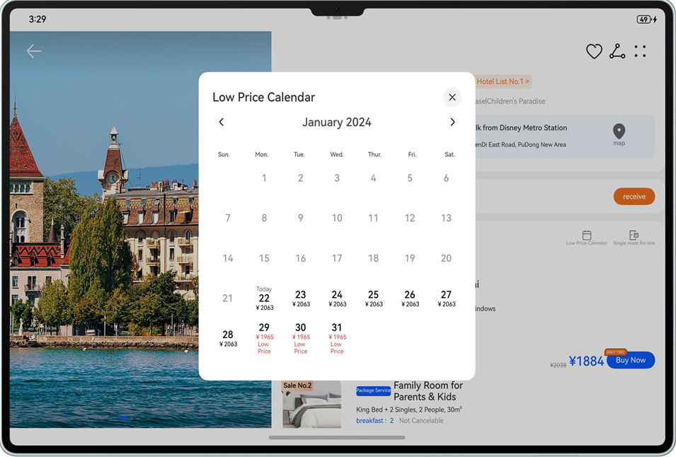
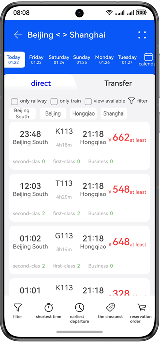
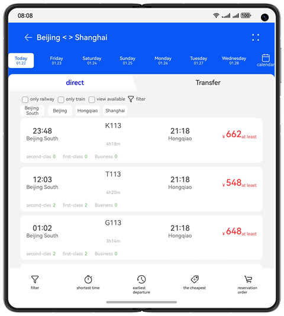
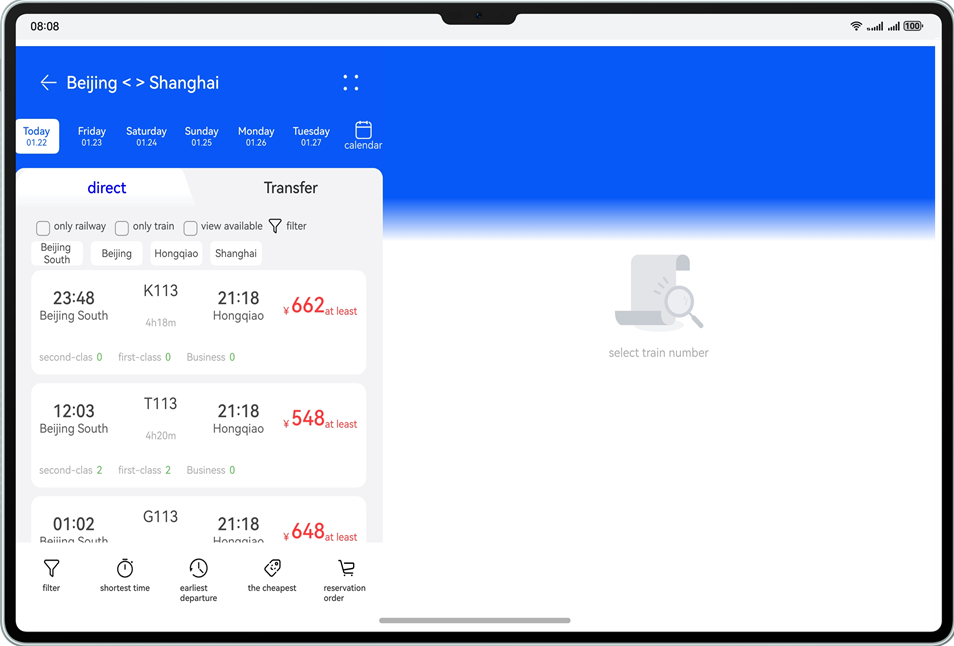

# Travel Accommodation

### Overview

This sample shows how to use the grid layout and **List** component to achieve responsive layouts of content for travel accommodation apps on different devices, such as smartphones, foldable screens, and tablets.

### Preview

Below are the preview effects.

**Details page:**

| Smartphone                                       | Foldable phone (unfolded)                       | tablet                                         |
|--------------------------------------------------|-------------------------------------------------|------------------------------------------------|
|  |  |  |

**Effect of low-price calendars:**

| Smartphone                                          | Foldable phone (unfolded)                          | tablet                                            |
|-----------------------------------------------------|----------------------------------------------------|---------------------------------------------------|
|  |  |  |

**Ticket query page:**

| Smartphone                                        | Foldable phone (unfolded)                        | tablet                                          |
|---------------------------------------------------|--------------------------------------------------|-------------------------------------------------|
|  |  |  |


### How to Use
1. You can view the page effect in the Previewer of DevEco Studio or on the device.

2. You can also drag the window on PC/2-in-1 devices to view the responsive change of the component.

3. On the home screen, touch the hotel details screen and low-price calendar button to go to the hotel details page. The image on the top of the phone will be expanded when slid to the top and collapsed when slid to other positions. The small image in the lower left corner of a foldable phone can be scrolled. Touch the small image will change it to a larger one. For tablets, you can swipe on the left to switch the image layout.

4. On the hotel details page, touch the low-price calendar button. Mobile phones will redirect to the target page, whereas foldable phones and tablets will display a pop-up window.

5. On the home page, tap the ticket query page. On the ticket query page, the date button, check box, and three sorting buttons in the middle of the bottom row are available.

### Project Directory

```
├──entry/src/main/ets                               // Code area
│  ├──commons                                  
│  │  ├──constants   
│  │  │  ├─BreakpointConstants.ets                   // Breakpoint constant class              
│  │  │  └─CommonConstants.ets                       // Common constants
│  │  └──utils          
│  │     ├─BreakpointType.ets                        // Breakpoint type
│  │     └─Logger.ets                                // Log printing class
│  ├──entryability  
│  │  └─EntryAbility.ets 
│  ├──pages  
│  │  ├──HotelDetailsPage.ets                         // Hotel details page
│  │  ├──Index.ets                                    // Home page
│  │  ├──LowPriceCalendarPage.ets                     // Low-price calendar page                                 
│  │  └──SearchTicketPage.ets                         // Ticket query page
│  ├──view  
│  │  ├──CalendarView.ets                             // Low-price calendar pop-up window
│  │  ├──HotelDetailsContentView.ets                  // General view of hotel details
│  │  ├──HotelDetailsOrderView.ets                    // Hotel reservation view      
│  │  ├──HotelDetailsPictureView.ets                  // Hotel banner view
│  │  ├──HotelDetailsRoomItemView.ets                 // Hotel room list view
│  │  ├──HotelDetailsRoomView.ets                     // Hotel room reservation view
│  │  ├──LowPriceView.ets                             // Low-price calendar view
│  │  ├──SearchTicketListView.ets                     // Ticket list view of the ticket query page
│  │  ├──SearchTicketTabView.ets                      // Tab view of the ticket query page
│  │  ├──SearchTicketView.ets                         // General view of the ticket query page
│  │  └──SearchTopView.ets                            // Top view of the ticket query page
│  └──viewmodel  
│     ├──CalendarItem.ets                             // Low-price calendar
│     ├──HotelRoomItem.ets                            // Hotel room
│     ├──SearchTicketBarItem.ets                      // Subtab of the ticket query page                                  
│     ├──SearchTicketCheckboxItem.ets                 // Check box of the ticket query page
│     ├──SearchTicketDateItem.ets                     // Ticket date query
│     └──TicketItem.ets                               // Ticket information       
└──entry/src/main/resources                           // App resources

```

### How to Implement

* Use the grid layout to listen for breakpoint changes. Use different spacing between subcomponents of different breakpoint list components. Set **justifyContent** of the Flex layout to **FlexAlign.Center** to implement center alignment and adaptive stretching.
* Use the **Blank** component to implement adaptive stretching of spaces in the middle.

### Required Permissions

N/A

### Dependencies

N/A

### Constraints

1. The sample app is supported on Huawei phones, tablets, and PC/2in1 running the standard system.

2. The HarmonyOS version must be HarmonyOS 5.0.5 Release or later.

3. The DevEco Studio version must be DevEco Studio 5.0.5 Release or later.

4. The HarmonyOS SDK version must be HarmonyOS 5.0.5 Release or later.
