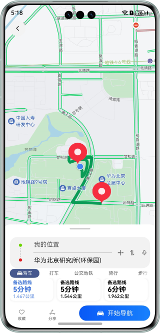

# 多设备地图导航界面

### 介绍

本示例主要使用Map Kit的相关能力实现多端上地图的查看、搜索地点、路径规划及服务卡片和实况胶囊等典型场景。

### 效果预览

首页运行效果图如下：

| 手机                                  | 折叠屏                                 |
|-------------------------------------|-------------------------------------|
|  |  |

搜索结果页运行效果如下：

| 手机                                    | 折叠屏                                   |
|---------------------------------------|---------------------------------------|
|  |  |

路线规划页运行效果如下：

| 手机                                   | 折叠屏                                  |
|--------------------------------------|--------------------------------------|
|  |  |

服务卡片运行效果如下：

| 手机                                  | 折叠屏                                 |
|-------------------------------------|-------------------------------------|
|  |  |

实况窗运行效果如下：

| 手机（通知中心）                            | 折叠屏（通知中心）                           |
|-------------------------------------|-------------------------------------|
|  |  |

### 相关概念

- 一次开发，多端部署：一套代码工程，一次开发上架，多端按需部署。支撑开发者快速高效的开发支持多种终端设备形态的应用，实现对不同设备兼容的同时，提供跨设备的流转、迁移和协同的分布式体验。
- 自适应布局：当外部容器大小发生变化时，元素可以根据相对关系自动变化以适应外部容器变化的布局能力。相对关系如占比、固定宽高比、显示优先级等。
- 响应式布局：当外部容器大小发生变化时，元素可以根据断点、栅格或特定的特征（如屏幕方向、窗口宽高等）自动变化以适应外部容器变化的布局能力。
- GridRow：栅格容器组件，仅可以和栅格子组件（GridCol）在栅格布局场景中使用。
- GridCol：栅格子组件，必须作为栅格容器组件（GridRow）的子组件使用。
- 地图服务：使用Map Kit相关能力可以实现地图及对地图的操作。
- 实况窗服务：使用Live View Kit相关能力可以实现实况窗及实况胶囊。


### 相关权限

1. 获取位置权限：ohos.permission.APPROXIMATELY_LOCATION，ohos.permission.LOCATION。
2. 使用Map Kit能力需要参考指南配置AppGallery Connect开通相关服务。
3. 使用Live View Kit相关能力需要参考指南实况窗开发准备开通相关权益。

### 依赖

不涉及。

### 使用说明

1. 确保设备处于联网状态并开启获取位置信息功能，分别在手机、折叠屏安装并授予权限打开应用，不同设备的应用页面通过响应式布局和自适应布局呈现不同的效果。
2. 首页内容面板默认为中档位，点击地图控制面板的显隐，拖动顶部bar控制面板高度，支持三档位调节。
3. 点击搜索框拉起输入法，输入内容后点击完成提交输入内容，通过周边搜索接口获取附近相关地点列表。
4. 搜索结果支持默认高度及高档位查看，默认档位时为横向列表，高档位时为纵向列表。点击输入框后侧取消按钮返回首页。
5. 点击面板默认档位时搜索结果页面的“路线”按钮，进入路线规划页面，默认交通方式为驾车，最多规划三条路线，默认展示第一种规划方案。
6. 面板为默认档位时，路线规划结果以横向列表的形式展示。高档位时以纵向列表的形式展示。低档位时只展示输入框区域。
7. 点击不同路线，在地图上展示不同的规划结果。

注：使用前请先参考指南开通地图服务，若使用实况窗请申请实况窗权限

### 工程目录

```
├──commons
│  ├──base/src/main/ets
│  │  ├──constants
│  │  │  ├──BreakpointConstants.ets       // 断点常量类
│  │  │  └──CommonConstants.ets           // 常量类
│  │  └──utils
│  │     ├──BreakpointType.ets            // 断点类型
│  │     ├──ColumnTab.ets                 // 页签
│  │     ├──DeviceScreen.ets              // 屏幕尺寸
│  │     ├──FunctionType.ets              // 功能定义
│  │     ├──LocationUtil.ets              // 位置工具类
│  │     └──Logger.ets                    // 日志类
│  └──base/src/main/resources             // 应用静态资源目录
├──features
│  ├──home/src/main/ets
│  │  ├──constants
│  │  │  └──HomeConstants.ets             // 常量类
│  │  └──view
│  │  │  ├──ColumnView.ets                // 首页景点内容
│  │  │  ├──GridView.ets                  // 面板功能内容
│  │  │  ├──HomeFullView.ets              // 首页
│  │  │  ├──ListView.ets                  // 景点列表
│  │  │  ├──SearchBar.ets                 // 搜索框
│  │  │  └──SearchResult.ets              // 搜索内容
│  │  └──viewmodel
│  │     └──AttractionModel.ets           // 景点类
│  └──home/src/main/resources             // 应用静态资源目录
│  ├──live/src/main/ets
│  │  ├──constants
│  │  │  └──LiveConstants.ets             // 常量类
│  │  └──viewmodel
│  │     └──LiveViewController.ets        // 实况窗相关方法
│  └──live/src/main/resources             // 应用静态资源目录
│  ├──map/src/main/ets
│  │  ├──constants
│  │  │  └──MapConstants.ets              // 常量类
│  │  └──view
│  │  │  ├──MapView.ets                   // 地图背板
│  │  │  └──TabView.ets                   // 面板页签
│  │  └──viewmodel
│  │     └──FooterTabViewModel.ets        // 页签
│  └──map/src/main/resources              // 应用静态资源目录
│  ├──route/src/main/ets
│  │  ├──constants
│  │  │  └──RouteConstants.ets            // 常量类
│  │  └──view
│  │  │  ├──RouteContentView.ets          // 路线页面框架
│  │  │  ├──RoutePlanView.ets             // 路线规划结果
│  │  │  └──RouteTabView.ets              // 路线页面页签
│  │  └──viewmodel
│  │     ├──CalculateModel.ets            // 计算路线信息
│  │     ├──DrawRouteModel.ets            // 绘制路线
│  │     ├──SearchSiteModel.ets           // 搜索地点
│  │     └──TabViewModel.ets              // 页签
│  └──route/src/main/resources            // 应用静态资源目录
└──products
   ├──phone/src/main/ets
   │  ├──entryability
   │  │  └──EntryAbility.ets              // 程序入口类
   │  ├──form
   │  │  ├──constants
   │  │  │  └──FormConstants.ets          // 卡片常量类
   │  │  ├──pages
   │  │  │  └──FormCard.ets               // 卡片
   │  │  └──viewmodel.ets
   │  │     └──FormViewData.ets           // 卡片数据
   │  ├──formability
   │  │  └──FormAbility.ets               // 卡片Ability
   │  └──pages
   │     └──Index.ets                     // 入口页面
   └──phone/src/main/resources            // 应用静态资源目录

```

### 约束与限制

1. 本示例仅支持标准系统上运行，支持设备：华为手机。
2. HarmonyOS系统：HarmonyOS 5.0.5 Release及以上。
3. DevEco Studio版本：DevEco Studio 5.0.5 Release及以上。
4. HarmonyOS SDK版本：HarmonyOS 5.0.5 Release SDK及以上。