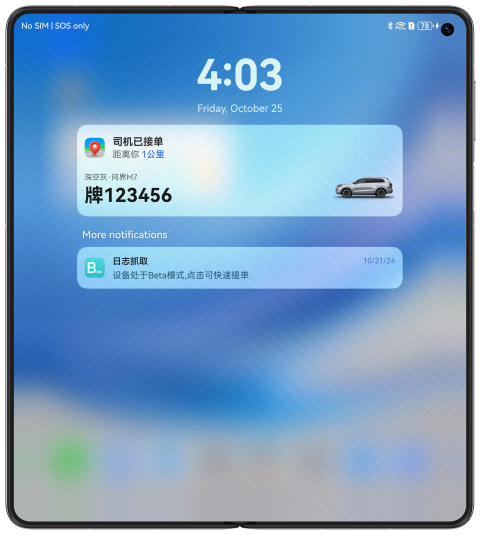

# Map Navigation (ArkTS)

### Overview

This sample describes how to use Map Kit to implement typical scenarios such as map viewing, location search, route planning, service widgets, and live caption across devices.

### Preview

Below show the running effects on the home page.

| Mobile phone                           | Foldable phone                         |
|----------------------------------------|----------------------------------------|
|  |  | 


Below show the search result pages.

| Mobile phone                             | Foldable phone                           |
|------------------------------------------|------------------------------------------|
|  |  |

Below show the running effects of the route planning pages.

| Mobile phone                            | Foldable phone                          |
|-----------------------------------------|-----------------------------------------|
|  |  |

Below show the running effects of service widgets.

| Mobile phone                           | Foldable phone                         |
|----------------------------------------|----------------------------------------|
|  |  |

Below show the running effects of live caption.

| Mobile phone (notification center)     | Foldable phone                         |
|----------------------------------------|----------------------------------------|
|  |  |

### Concepts

- One-time development for multi-device deployment. As the name implies, you only need to develop and release one set of project code and then deploy it on multiple devices as demanded. This feature enables you to efficiently develop applications that are compatible with multiple devices while providing distributed user experiences for cross-device transferring, migration, and collaboration.
- Adaptive layout: When the size of an external container changes, elements can automatically change based on the relative relationship to adapt to the external container. Relative relationships include the proportion, fixed aspect ratio, and display priority.
- Responsive layout: When the size of an external container changes, elements can automatically change based on the breakpoints, grids, or specific features (such as the screen direction and window width and height) to adapt to the external container.
- GridRow: A container that is used in a grid layout, together with its child component **<GridCol>**.
- GridCol: A container that must be used as a child component of the **<GridRow>** container.
- Map Kit: Implements map functions and perform operations on maps.
- Live View kit: Implements the live view pane and live captions.


### Required Permissions

1. **ohos.permission.APPROXIMATELY_LOCATION** and **ohos.permission.LOCATION**: allow an app to obtain the device location.
2. To use Map Kit, you need to configure AppGallery Connect and enable related services by referring to the guide.
3. To use the Live View Kit capabilities, you need to enable related permissions by referring to its development guide.

### Dependencies

N/A

### How to Use

1. Ensure that the device is connected to the Internet and the function of obtaining location information is enabled. Install the app on the mobile phone and foldable phone and grant the permission to open the app. The app pages on different devices vary due to responsive layout and adaptive layout.
2. By default, the content panel is displayed in the middle of the home page. You can tap the display or hide icon on the map control panel and drag the bar on the top to adjust the height. Three levels (top, middle, and low) are supported.
3. Touch the search box to start the input method, type content, and touch **OK** to obtain the nearby place list is through the nearby place search API.
4. The search result is displayed by default height on the top. The default level uses a horizontal list, and the high level uses a vertical list to display data. Tap the cancel button next to the text box to return to the home page.
5. Tap the routing icon on the search result page when the default level is used. On the route planning page, the default transportation mode is driving. A maximum of three routes can be planned. The first planning solution is displayed by default.
6. When the panel is at the default level, the route planning result is displayed in a horizontal list. For the panel at the high level, the route planning result is displayed in a vertical list. Only the text box area is displayed for the low-level panel.
7. Tap different routes to check different planning results on the map.

### Project Directory

```
├──commons
│  ├──base/src/main/ets
│  │  ├──constants
│  │  │  ├──BreakpointConstants.ets       // Breakpoint constant class
│  │  │  └──CommonConstants.ets           // Constant class
│  │  └──utils
│  │     ├──BreakpointType.ets            // Breakpoint type
│  │     ├──ColumnTab.ets                 // Tab
│  │     ├──DeviceScreen.ets              // Screen size
│  │     ├──FunctionType.ets              // Function definition
│  │     ├──LocationUtil.ets              // Location utility class
│  │     └──Logger.ets                    // Log class
│  └──base/src/main/resources             // Static resources
├──features
│  ├──home/src/main/ets
│  │  ├──constants
│  │  │  └──HomeConstants.ets             // Constant class
│  │  └──view
│  │  │  ├──ColumnView.ets                // Scenic spot content on the home page
│  │  │  ├──GridView.ets                  // Panel functions
│  │  │  ├──HomeFullView.ets              // Home page
│  │  │  ├──ListView.ets                  // List of scenic spots
│  │  │  ├──SearchBar.ets                 // Search box
│  │  │  └──SearchResult.ets              // Search result
│  │  └──viewmodel
│  │     └──AttractionModel.ets           // Scenic spot class
│  └──home/src/main/resources             // Static resources
│  ├──live/src/main/ets
│  │  ├──constants
│  │  │  └──LiveConstants.ets             // Constant class
│  │  └──viewmodel
│  │     └──LiveViewController.ets        // Live view methods
│  └──live/src/main/resources             // Static resources
│  ├──map/src/main/ets
│  │  ├──constants
│  │  │  └──MapConstants.ets              // Constant class
│  │  └──view
│  │  │  ├──MapView.ets                   // Map background
│  │  │  └──TabView.ets                   // Panel tab
│  │  └──viewmodel
│  │     └──FooterTabViewModel.ets        // Tab
│  └──map/src/main/resources              // Static resources
│  ├──route/src/main/ets
│  │  ├──constants
│  │  │  └──RouteConstants.ets            // Route constant class
│  │  └──view
│  │  │  ├──RouteContentView.ets          // Route page framework
│  │  │  ├──RoutePlanView.ets             // Route planning result
│  │  │  └──RouteTabView.ets              // Route tab page
│  │  └──viewmodel
│  │     ├──CalculateModel.ets            // Compute route information
│  │     ├──DrawRouteModel.ets            // Route drawing
│  │     ├──SearchSiteModel.ets           // Site search
│  │     └──TabViewModel.ets              // Tab
│  └──route/src/main/resources            // Static resources
└──products
   ├──phone/src/main/ets
   │  ├──entryability
   │  │  └──EntryAbility.ets             // Entry point class
   │  ├──form
   │  │  ├──constants
   │  │  │  └──FormConstants.ets          // Widget constant class
   │  │  ├──pages
   │  │  │  └──FormCard.ets               // Widget
   │  │  └──viewmodel.ets
   │  │     └──FormViewData.ets           // Widget data
   │  ├──formability
   │  │  └──FormAbility.ets               // Widget ability
   │  └──pages
   │     └──Index.ets                     // Home page
   └──phone/src/main/resources            // Static resources

```

### Constraints

1. The sample app is supported only on Huawei phones running the standard system.
2. The HarmonyOS version must be HarmonyOS 5.0.5 Release or later.
3. The DevEco Studio version must be DevEco Studio 5.0.5 Release or later.
4. The HarmonyOS SDK version must be HarmonyOS 5.0.5 Release or later.
