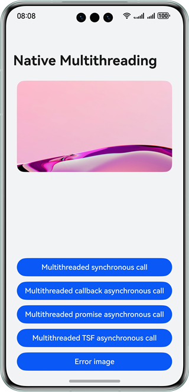

# Native Multithreading

### Overview

This sample uses the producer-consumer pattern to illustrate the development of native multithreading and inter-thread communication. On the native side, the C++ standard library is invoked to implement the producer-consumer pattern, and multiple inter-thread communication modes are used to transmit data to the ArkTS app for UI image updates.

### Preview



### Project Directory

```
├──entry/src/main/common                      
│  └──constans
│     └──CommonConstants.ets                  // Common constants
├──entry/src/main/cpp                         // C++ code                  
│  ├──types
│  │  └──libentry                             // C++ APIs
│  │     ├──index.d.ts                        
│  │     └──oh-package.josn5                 
│  ├──CMakeLists.txt                          // CMake build script
│  ├──MultiThreads.cpp                        // Native module registration
│  ├──ProducerConsumer.cpp                    // Service function implementation
│  └──ProducerConsumer.h                      
├──entry/src/main/ets                        // ets code
│  ├──entryability
│  │  └──EntryAbility.ets       
│  ├──images                                  // Custom PNG images
│  └──pages
│     └──Index.ets                            // Home page
└──entry/src/main/resources                   // Static resources
```

### Concepts

- **NAPI**: The API names provided by NAPI are the same as those in Node.js. Currently, only a subset of Node.js APIs is supported.

- **Standard libraries supported by NAPI**: C standard library, C++ library, OpenSL ES, and zlib.

- **NAPI description**: describes the usage of NAPI functions, parameters, and use cases.

- **Producer-consumer pattern**: In this model, a module generates data while another module processes it. The module that generates data is called a producer, and the module that processes data is called a consumer. In this sample, the native side implements the producer-consumer pattern using key features such as C++ threads, semaphores, and condition variables. A producer thread searches for the target file path from the string array and places it in a buffer queue. A consumer thread obtains the path from the buffer queue and returns it to the ArkTS app through thread communication.

- **Communication modes between the native thread and ArkTS main thread**
  
  - **Multithreaded synchronous call**
    In this mode, the ArkTS engine directly sends the computation result from the native code to the ArkTS app. Both the native code and the ArkTS app run on the ArkTS main thread. The producer and consumer threads use the **join()** method for synchronization.
  
  - **Multithreaded callback asynchronous call**
    In this mode, asynchronous work items are created in the native code, and the libuv thread pool and EventLoop are used to implement asynchronous calls. The worker thread is mainly used to execute service code, and the EventLoop is mainly used to return the execution result of the worker thread to the ArkTS main thread. The ArkTS engine then uses a callback to send the computation result from the native side to the ArkTS app.
  
  - **Multithreaded promise asynchronous call**
    This mode is similar to the callback asynchronous call. The difference is that the ArkTS engine sends the computation result from the native side to the ArkTS app through a promise object, rather than a callback.
  
  - **Multithreaded asynchronous call of napi_threadsafe_function**
    In this mode, a thread-safe function is created in the native code, and it is called in the C++ subthread to return the ArkTS callback to the EventLoop for asynchronous processing. Unlike an asynchronous work item that passively handles an ArkTS callback, the thread-safe function can be called multiple times within a C++ subthread. In addition, the C++ subthread for the thread-safe function is created by the developer, but the worker thread in an asynchronous work item is managed by the libuv thread pool. For details about the APIs, see **NAPI description**.

### Required Permissions

N/A

### How to Use

1. On the app page, touch the buttons to trigger different thread communication modes to obtain the image path and update the images.
2. When you touch the **Error image** button, a warning dialog box is displayed, indicating that the image path is incorrect.

### Constraints

1. The sample is only supported on Huawei phones with standard systems.

2. The HarmonyOS version must be HarmonyOS 5.0.5 Release or later.

3. The DevEco Studio version must be DevEco Studio 5.0.5 Release or later.

4. The HarmonyOS SDK version must be HarmonyOS 5.0.5 Release SDK or later.
