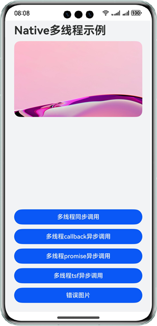

# 基于Native实现多线程开发以及线程间通信功能

### 简介

本示例以生产者-消费者模型为案例来介绍如何进行Native多线程开发以及线程间通信。Native侧通过调用C++标准库实现生产者-消费者模型，并分别使用了多种线程间通信的方式来进行ArkTS应用侧数据传输，以实现UI界面图片刷新。界面效果如图所示：



### 工程目录
```
├──entry/src/main/common                      
│  └──constans
│     └──CommonConstants.ets                  // 常量定义文件
├──entry/src/main/cpp                         // C++ 代码区                   
│  ├──types
│  │  └──libentry                             // C++接口导出
│  │     ├──index.d.ts                        
│  │     └──oh-package.josn5                 
│  ├──CMakeLists.txt                          // CMake配置文件
│  ├──MultiThreads.cpp                        // Native模块注册
│  ├──ProducerConsumer.cpp                    // 业务功能实现
│  └──ProducerConsumer.h                      
├──entry/src/main/ets                         // ets 代码区
│  ├──entryability
│  │  └──EntryAbility.ets       
│  ├──images                                  // 自定义png图片
│  └──pages
│     └──Index.ets                            // 主页界面
└──entry/src/main/resources                   // 应用资源目录
```

### 相关概念

- **NAPI：** NAPI提供的接口名与三方Node.js一致，目前支持部分接口。

- **NAPI中支持的标准库：** 目前支持标准C库、C++库、OpenSL ES、zlib。

- **NAPI接口说明：** 包含napi相关函数的用法、参数解释、以及一些应用示例。

- **生产者-消费者模型：** 某个模块负责产生数据，这些数据由另一个模块来负责处理。产生数据的模块，就形象地称为生产者；而处理数据的模块，就称为消费者。本示例中，Native侧通过C++线程、信号量以及条件变量等关键特性来实现生产者-消费者模型。生产者线程负责从字符串数组中搜索目标文件路径。搜索到后，放入缓冲队列中。消费者线程负责从缓冲队列中取出目标文件路径，并通过线程通信的方式将结果返回给ArkTS应用侧。

- **Native侧子线程与ArkTS主线程通信方式**

  - **多线程同步调用**

    该方式通过ArkTS方舟引擎将Native侧代码计算的结果直接反馈给ArkTS应用侧。此过程中，Native侧代码与ArkTS应用侧均运行在ArkTS主线程上。生产者与消费者线程则采用join()的方式来进行同步处理。

  - **多线程callback异步调用**

    该方式通过在Native侧代码创建异步工作项、依赖libuv线程池以及EventLoop事件循环机制来实现异步调用。其中，work子线程主要用于执行业务逻辑代码，EventLoop事件循环主要用于将work子线程执行的结果反馈给ArkTS主线程。最终，ArkTS方舟引擎通过回调的方式将Native侧运算结果反馈给ArkTS应用侧。

  - **多线程promise异步调用**

    该方式与callback异步调用的主体流程一致。区别在于，ArkTS方舟引擎不是通过callback回调的方式将Native侧运输结果反馈给ArkTS应用侧，而是通过延时对象进行结果解析。

  - **多线程napi_threadsafe_function异步调用**

    该方式通过在Native侧代码创建线程安全函数、在C++子线程中通过调用线程安全函数将ArkTS回调抛给EventLoop事件循环来实现异步调用。线程安全函数与异步工作项的区别在于，线程安全函数可以在C++子线程中随意多次调用，而异步工作项只能被动处理一次ArkTS回调；线程安全函数的C++子线程是由用户自己创建的，而异步工作项中的work子线程是由libuv线程池管理的。具体API可详见于上文《NAPI接口说明》。

### 相关权限

不涉及

### 使用说明

1. 单页面操作，通过不同按钮触发不同的线程通信方式，以获取图片路径，并进行图片刷新。
2. “错误图片”按钮触发后，会弹出警示弹窗，以说明图片路径错误。

### 约束与限制

1.本示例仅支持标准系统上运行，支持设备：华为手机。

2.HarmonyOS系统：HarmonyOS 5.0.5 Release及以上。

3.DevEco Studio版本：DevEco Studio 5.0.5 Release及以上。

4.HarmonyOS SDK版本：HarmonyOS 5.0.5 Release SDK及以上。