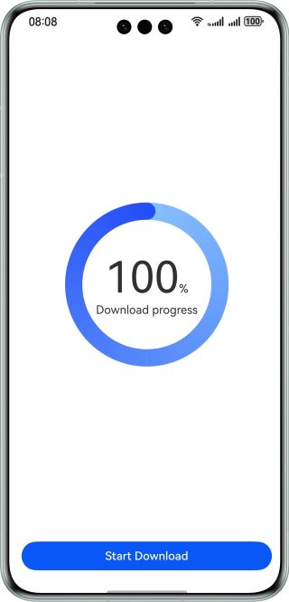

# Implementing Progress Notification on the Native Side

### Overview

This sample shows how to pass the native progress information to ArkTS synchroniously in a download scenario.

### Preview



### How to Use

1. Tap the **Start Download** button.
2. A child thread starts to simulate a download task on the native side and uses the ArkTS callback function to pass the progress information to ArkTS synchronously.

### High-Performance Knowledge

In this case, a child thread is used to execute a download task on the native side to avoid occupying main thread resources and improve performance.

### Project Directory

```
├──entry/src/main/cpp                         // C++ code
│  ├──types
│  │  └──libentry                             // C++ APIs
│  │     ├──index.d.ts                        
│  │     └──oh-package.josn5                 
│  ├──CMakeLists.txt                          // CMake configuration file
│  └──napi_init.cpp                           // Native module registration
├──entry/src/main/ets                         // ets code
│  ├──constants
│  │  └──CommonConstants.ets                  // Constant definition file 
│  ├──conversionability
│  │  └──ConversionAbility.ets       
│  └──pages
│     └──Index.ets                            // Home page
└──entry/src/main/resources                   // App resource directory
```

### Required Permissions

**N/A**

### Reference
1. [Progress](https://developer.huawei.com/consumer/cn/doc/harmonyos-references/ts-basic-components-progress)
2. [Implement cross-language interaction using Node-API](https://developer.huawei.com/consumer/cn/doc/harmonyos-guides/using-napi-interaction-with-cpp)


### Constraints

1. The sample app is supported only on Huawei phones running the standard system.
2. The HarmonyOS version must be HarmonyOS 5.0.5 Release or later.
3. The DevEco Studio version must be DevEco Studio 5.0.5 Release or later.
4. HarmonyOS SDK: HarmonyOS 5.0.5 Release SDK or later.
