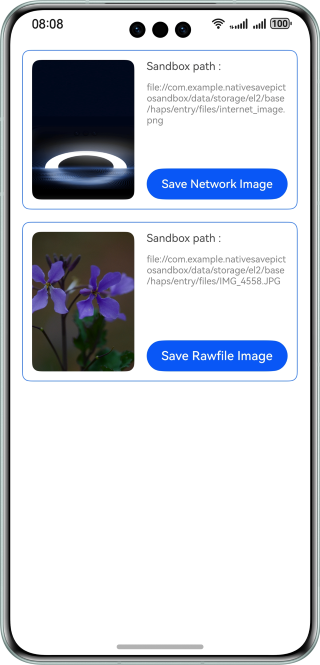

# Saving Images to the App Sandbox in Native Mode

### Overview

This sample describes how to save images on the network and those in the rawfile to the application sandbox in native mode.

### Preview



### How to Use

1. Find the image **IMG_4558.JPG** in the **rawfile** directory.

2. Connect the device to the network.

3. Tap **Save Rawfile Image**. The frontend calls the native API **saveImageOfRawfileCallback** to save the image **IMG_4558.JPG** in the rawfile to the application sandbox and returns the sandbox path to the frontend for display. Tap **Save Network Image**. The frontend calls the native API **saveImageOfInternetCallback** to save the network image to the app sandbox and return the sandbox path to the frontend for display.

### High-Performance Knowledge

N/A

### Project Directory

```
│  ├──entry/src/main/cpp                      // C++ code area
│  ├──types
│  │  └──libentry                             // C++ APIs
│  │     ├──index.d.ts                        
│  │     └──oh-package.josn5                 
│  ├──CMakeLists.txt                          // CMake file
│  └──napi_init.cpp                           // Native module registration
├──entry/src/main/ets                        // ets code
│  ├──constants
│  │  └──CommonConstants.ets                  // Common constants 
│  ├──conversionability
│  │  └──ConversionAbility.ets       
│  └──pages
│     └──Index.ets                            // Home page
└──entry/src/main/resources                   // App resources
```

### Dependencies

This sample depends on the open-source library **libcurl**.

### Required Permissions

Internet access permission: ohos.permission.INTERNET

### Constraints

1. The sample app is supported only on Huawei phones running the standard system.
2. The HarmonyOS version must be HarmonyOS 5.0.5 Release or later.
3. The DevEco Studio version must be DevEco Studio 5.0.5 Release or later.
4. The HarmonyOS SDK version must be HarmonyOS 5.0.5 Release SDK or later.
