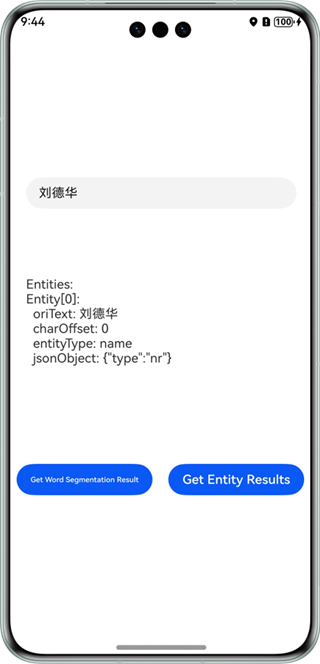

# 分词、实体抽取

## 介绍

本示例展示了基于自然语言处理服务的分词、实体抽取功能。

本示例模拟了在应用里，输入一段文字，调用分词、实体抽取能力后得到的结果。

需要使用通用文字识别接口@hms.ai.nlp.textProcessing.d.ts。

## 效果预览

|         **主页面**          |             **分词**             |             **实体抽取**             |
|:------------------------:|:--------------------------------:|:--------------------------------:|
|  |  |  | 

使用说明：

1. 在手机的主屏幕，点击”nlpDemo“，启动应用。
2. 输入一段文字。
3. 点击“Get Word Segmentation Result”按钮，展示出分词结果，点击"Get Entity Results"，展示出实体抽取结果。

### 工程目录
```
├─entry/src/main/ets                         // 代码区
│  ├─entryability
│  │  └─EntryAbility.ets       
│  └─pages
│     └─Index.ets                            // 主页界面
├─entry/src/main/resources                   // 应用资源目录
└─screenshots                                // 截图
```

## 具体实现

本示例展示的控件在@hms.ai.nlp.textProcessing.d.ts定义了分词和实体抽取的API：
~~~
*   function getWordSegment(text: string): Promise<Array<WordSegment>>;
*   function getEntity(text: string, entityConfig?: EntityConfig): Promise<Array<Entity>>;
~~~
输入一段文本后点击分词、实体结果按钮，接收处理返回的结果（文字信息）。参考entry/src/main/ets/pages/Index.ets.

## 相关权限

不涉及。

## 依赖

不涉及。

## 约束与限制

1. 本实例仅支持标准系统上运行，支持设备：华为手机、华为平板、2in1。
2. HarmonyOS系统：HarmonyOS NEXT Developer Beta1及以上。
3. DevEco Studio版本：DevEco Studio NEXT Developer Beta1及以上。
4. HarmonyOS SDK版本：HarmonyOS NEXT Developer Beta1 SDK及以上。