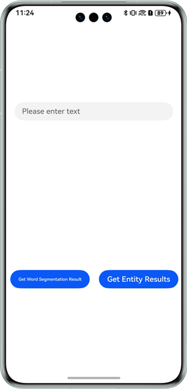

# Word Segmentation and Entity Extraction

## Overview

This sample shows the word segmentation and entity extraction functions of Natural Language Kit.

It simulates how to enter some text and obtain the word segmentation and entity extraction results.

You need to use **@hms.ai.nlp.textProcessing.d.ts**, which contains the APIs of Natural Language Kit.

## Preview

|         **Home Screen**         |             **Word Segmentation**            |             **Entity Extraction**            |
|:------------------------:|:--------------------------------:|:--------------------------------:|
|  |  |  | 

How to use:

1. On the home screen of a mobile phone, tap **nlpDemo** to start the app.
2. Enter some text.
3. Tap **Get Word Segmentation Result** to view the word segmentation result. Tap **Get Entity Results** to view the entity extraction result.

### Project Directory
```
├─entry/src/main/ets                         // Code area.
│  ├─entryability
│  │  └─EntryAbility.ets       
│  └─pages
│     └─Index.ets                            // Home page.
├─entry/src/main/resources                   // App resource directory.
└─screenshots                                // Screenshot.
```

## How to Implement

The APIs for the word segmentation and entity extraction in this sample have been defined in **@hms.ai.nlp.textProcessing.d.ts**.
~~~
*   function getWordSegment(text: string): Promise<Array<WordSegment>>;
*   function getEntity(text: string, entityConfig?: EntityConfig): Promise<Array<Entity>>;
~~~
After entering some text, tap the word segmentation and entity extraction buttons to receive the processing result (text information). For details, please refer to the **entry/src/main/ets/pages/Index.ets**.

## Required Permissions

N/A

## Dependencies

N/A

## Constraints

1. The sample app is only supported on Huawei phones, tablets, and 2-in-1 devices with standard systems.
2. The HarmonyOS version must be HarmonyOS NEXT Developer Beta1 or later.
3. The DevEco Studio version must be DevEco Studio NEXT Developer Beta1 or later.
4. The HarmonyOS SDK version must be HarmonyOS NEXT Developer Beta1 SDK or later.
