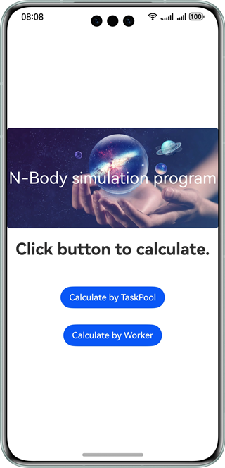
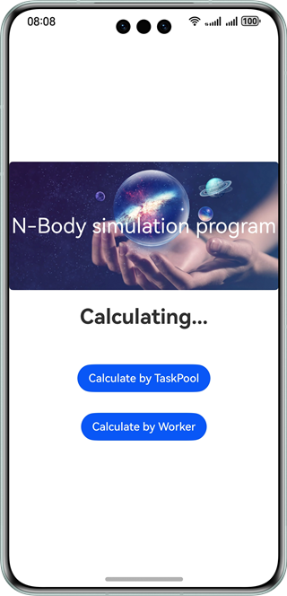
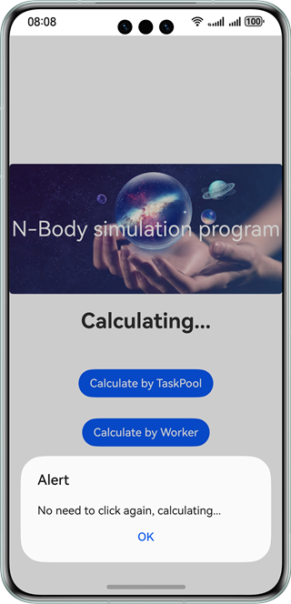
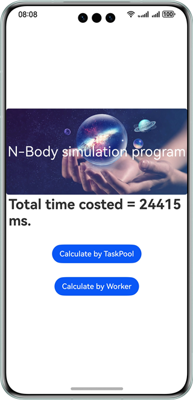

# N-Body Simulation Program

### Overview

In this sample, the ArkTS programming language is used to develop the [N-body simulation program](https://benchmarksgame-team.pages.debian.net/benchmarksgame/description/nbody.html#nbody) for the industry programming language benchmark test item [Benchmarks Game](https://salsa.debian.org/benchmarksgame-team/benchmarksgame/) to implement orbit calculation for Jupiter-like bodies.

This sample uses the @ohos.taskpool and @ohos.worker APIs, and can be used for performance tests such as Ahead Of Time (AOT).

### Preview
| Home page                                   | Calculating                                       | Repeatedly taped                              | Calculation result                           |
|---------------------------------------------|---------------------------------------------------|-----------------------------------------------|----------------------------------------------|
|  |  |  |  |

How to Use

1. Tap **Calculate by TaskPool** to create a task from the task pool for N-body calculation.

2. Tap **Calculate by Worker** to create a worker for N-Body calculation.

### Project Directory
```
├──entry/src/main/ets/
│  ├──entryability
│  │  └──EntryAbility.ets                 // Encapsulates the entire module.
│  ├──model
│  │  ├──CalculateUtil.ets                // For worker and task pool calling           
│  │  └──NBody_ETS_6.ts                   // N-body calculation
│  ├──pages
│  │  └──Index.ets                        // Home page
│  ├──utils
│  │  ├──Constants.ts                     // Encapsulates read-only constants.
│  │  └──Logger.ts                        // Encapsulates the entire log.
│  └──worker
│     └──CalculateWorker.ts               // Worker thread
└──entry/src/main/resources              // Static resources       
                                            
```
### Concepts

AOT, a pre-compilation technology, allows the code to be pre-compiled into high-performance machine code to avoid compilation performance consumption and memory consumption during running. In this way, the application can obtain performance benefits by executing high-performance machine code when running for the first time.

### How to Implement

- Use **TaskPool** to start a sub-thread and calculate the celestial body orbit in case of 5 hundred thousand time displacements. For details about the source code, see [CalculateUtil.ets ](entry/src/main/ets/model/CalculateUtil.ets).
  - Call **computeNBodyByTaskPool()** to create a task and dispatch sub-thread tasks to the taskpool thread pool.
  - Wait for the sub-thread to execute the **computeTask()** task. After the calculation is complete, return the result to the main thread.

- Use **Worker** to start a sub-thread and calculate the celestial body orbit in case of 5 million time displacements. For details about the source code, see [CalculateUtil.ets ](entry/src/main/ets/model/CalculateUtil.ets).
  - Call **computeNBodyByWorker()** to create a worker thread and send it the time displacement to be calculated.
  - After the worker thread calls **computeTask()** to complete the calculation, the result is returned to the main thread.
- **computeTask()** completes a specific computing task. For details about the source code, see [NBody_ETS_6.ts](entry/src/main/ets/model/NBody_ETS_6.ts).
  - **offsetMomentum()**: Establishes momentum conservation for the isolated system.
  - **advance()**: Updates the location information of the celestial body after the change at a specified time.
  - **energy()**: Determines the conservation of mechanical energy before and after system calculation.

### Required Permissions

N/A

### Dependencies

N/A

### Constraints

1. The sample app is supported only on Huawei phones running the standard system.

2. The HarmonyOS version must be HarmonyOS 5.0.5 Release or later.

3. The DevEco Studio version must be DevEco Studio 5.0.5 Release or later.

4. The HarmonyOS SDK version must be HarmonyOS 5.0.5 Release SDK or later.
