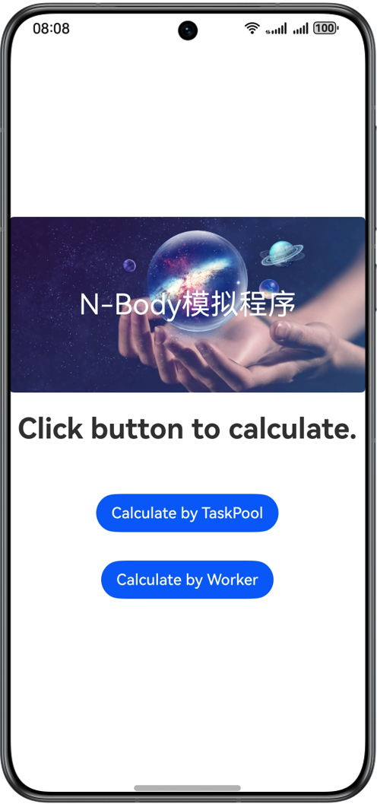
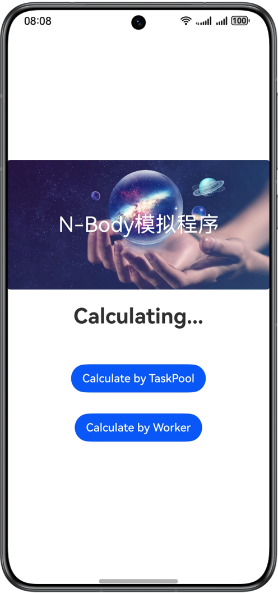
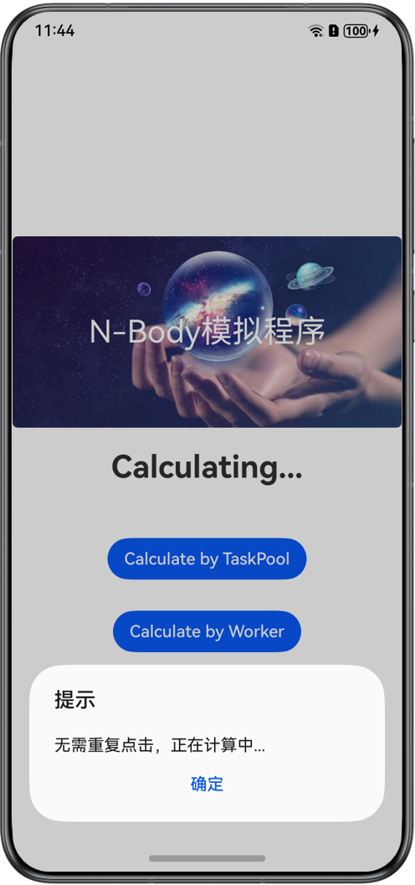
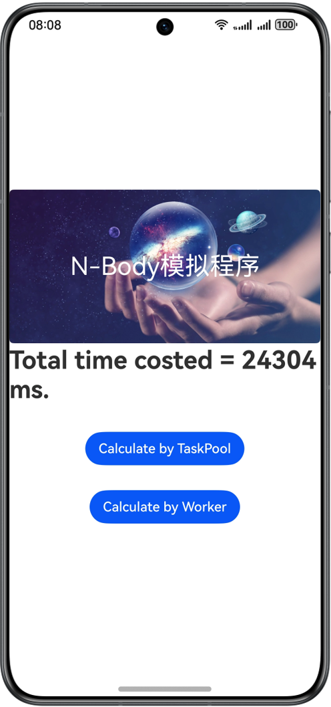

# 基于多线程实现N-Body模拟程序

### 介绍

在本示例中，使用ArkTS编程语言中的@ohos.taskpool和@ohos.worker 等接口开启多线程任务，实现了业界编程语言基准测试项目Benchmarks Game中的N体问题模拟程序，完成类木星体轨道计算，可以用于AOT(Ahead Of Time)等性能测试。

### 效果预览
| 主页                                       |计算中|重复点击|计算结果|
|------------------------------------------|-------|-------|-------|
|  ||||

使用说明

1.点击按钮Calculate By TaskPool，会从任务池创建一个任务，进行N-Body计算。

2.点击按钮Calculate By Worker，会创建一个Worker，进行N-Body计算。

### 工程目录
```
├──entry/src/main/ets/
│  ├──entryability
│  │  └──EntryAbility.ets                 // 封装整个模块启用
│  ├──model
│  │  ├──CalculateUtil.ets                // worker和taskpool都在这里调用            
│  │  └──NBody_ETS_6.ts                   // 天体轨道计算
│  ├──pages
│  │  └──Index.ets                        // 首页
│  ├──utils
│  │  ├──Constants.ts                     // 封装只读常量
│  │  └──Logger.ts                        // 封装整个日志
│  └──worker
│     └──CalculateWorker.ts               // worker线程
└──entry/src/main/resources               // 应用静态资源目录        
                                            
```
### 相关概念

AOT(Ahead Of Time)，即预先编译，在应用程序运行前，将代码预先编译成高性能机器代码，避免在运行时的编译性能消耗和内存消耗，让程序在首次运行就能通过执行高性能机器码获得性能收益。

### 具体实现

- 使用TaskPool开启子线程运行，计算50万次时间推移天体运行轨道，源码参考[CalculateUtil.ets ](entry/src/main/ets/model/CalculateUtil.ets )
  - 通过调用computeNBodyByTaskPool()创建一个task任务，并向taskpool线程池派发子线程任务。
  - 等待子线程执行任务computeTask()，计算完成后再把结果返回主线程。

- 使用Worker开启子线程运行，计算500万次时间推计算移天体运行轨道，源码参考[CalculateUtil.ets ](entry/src/main/ets/model/CalculateUtil.ets )
  - 通过调用computeNBodyByWorker()创建一个worker线程，把要计算的时间推移量发送给worker线程。
  - 等待worker线程调用computeTask()计算完成后再把结果返回主线程。
- computeTask()完成具体计算任务，源码参考[NBody_ETS_6.ts](entry/src/main/ets/model/NBody_ETS_6.ts) 
  - offsetMomentum() 建立孤立系统的动量守恒。
  - advance() 更新天体在按指定的时间变化后的位置信息。
  - energy() 判断系统计算前后机械能守恒。

### 相关权限

不涉及。

### 依赖

不涉及。

### 约束与限制

1.本示例仅支持标准系统上运行，支持设备：华为手机。

2.HarmonyOS系统：HarmonyOS 5.0.5 Release及以上。

3.DevEco Studio版本：DevEco Studio 5.0.5 Release及以上。

4.HarmonyOS SDK版本：HarmonyOS 5.0.5 Release SDK 及以上。
