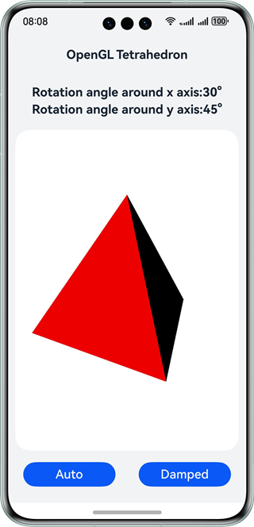
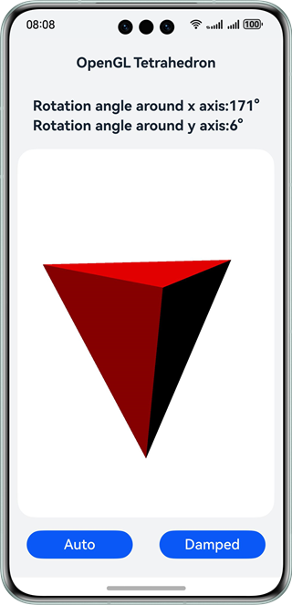

# OpenGL Tetrahedron

## Overview

The XComponent is frequently used for displaying camera preview streams and rendering game graphics. In HarmonyOS, it can be combined with the NativeWindow to create an OpenGL development environment, allowing you to display graphics rendered using OpenGL on the XComponent. This sample, based on the Native C++ template, uses OpenGL (OpenGL ES) API calls to draw a 3D shape (tetrahedron) and render it on the XComponent of the page. The sample also includes an auto rotation button for continuous spinning and a damped rotation button that slows down the rotation until it stops. In addition, you can manipulate the tetrahedron by swiping on the screen, presenting the shape from various perspectives on the page.

## Preview

| Home page                            | Rotated drawing                       |
|:------------------------------------:|:-------------------------------------:|
|  |  |

## How to Use

The app's UI demonstrates the use of the XComponent and employs OpenGL (OpenGL ES) standard APIs to render a 3D graphic (tetrahedron), with a simple linear light source for the 3D illumination. You can swipe across the screen to rotate the tetrahedron. The primary method for updating the 3D graphic's rotation angle is through the NAPI interface.

## Project Directory

```
├──entry/src/main/cpp/
│  ├──CMakeLists.txt                       // CMake build script
│  ├──app_napi.cpp                         // Native APIs
│  ├──include
│  │  ├──app_napi.h
│  │  ├──tetrahedron.h
│  │  ├──frame_handle.h
│  │  └──util
│  │     ├──log.h
│  │     ├──napi_manager.h
│  │     ├──napi_util.h
│  │     └──native_common.h
│  ├──module.cpp                           // NAPI module registration
│  ├──napi_manager.cpp
│  ├──napi_util.cpp
│  ├──frame_handle.cpp
│  ├──tetrahedron.cpp                      // OpenGL (ES) tetrahedron implementation
│  └──type
│     └──libentry
│        ├──oh-package.json5
│        └──tetrahedron_napi.d.ts          // Exported APIs
├──entry/src/main/ets
│  ├──entryability
│  │  └──EntryAbility.ets
│  ├──pages
│  │  └──Index.ets                         // Home page
│  └──utils
│  │  └──Logger.ets                        // Log utility
└──entry/src/main/resources                // Static resources
```

## How to Implement

Create a native C++ project in DevEco Studio, define the **Init** and **Update** functions in the C++ code for initializing the 3D graphics rendering environment and updating the graphics rendering, respectively. Map the NAPI interface **UpdateAngle**. On the ArkTS side, use the XComponent to implement **Index.ets**. On the C++ side, use the OpenGL ES standard APIs to handle the rendering process of the tetrahedron and to facilitate the interaction with ArkTS.

Upon app launch, the NAPI module is initialized, and **OH_NativeXComponent_GetXComponentId()** is used on the C++ side to obtain the pointer to the XComponent. This pointer is then passed to the **Init** and **Update** functions for rendering the 3D graphics. To enable the rotation of the tetrahedron via touchscreen gestures, the NAPI interface **UpdateAngle** mapping in the C++ code is called on the ArkTS side. For this to work, ArkTS must correctly import the **libtetrahedron_napi.so** file of the NAPI module and call the **UpdateAngle** API declared in **src/main/cpp/type/libentry/tetrahedron_napi.d.ts** to adjust the rotation angle of the tetrahedron.

For details about the source code, see [napi_manager.cpp](entry/src/main/cpp/napi_manager.cpp), [app_napi.cpp](entry/src/main/cpp/app_napi.cpp), and [tetrahedron.cpp](entry/src/main/cpp/tetrahedron.cpp).

Native XComponent functions are as follows:

| Name                                                                                                                                             | Description                                                                                 |
| ------------------------------------------------------------------------------------------------------------------------------------------------ | ------------------------------------------------------------------------------------------- |
| OH_NativeXComponent_GetXComponentId(OH_NativeXComponent *component, char *id, uint64_t *size)                                                    | Obtain the ID of the ArkUI XComponent.                                                      |
| OH_NativeXComponent_GetXComponentSize(OH_NativeXComponent *component, const void *window, uint64_t *width, uint64_t *height)                     | Obtains the size of the surface held by the ArkUI XComponent.                               |
| OH_NativeXComponent_GetXComponentOffset(OH_NativeXComponent *component, const void *window, double *x, double *y)                                | Obtains the offset of the ArkUI XComponent relative to the upper left vertex of the screen. |
| OH_NativeXComponent_GetTouchEvent(OH_NativeXComponent *component, const void *window, OH_NativeXComponent_TouchEvent *touchEvent)                | Obtains the touch event scheduled by the ArkUI XComponent.                                  |
| OH_NativeXComponent_GetTouchPointToolType(OH_NativeXComponent *component, uint32_t pointIndex, OH_NativeXComponent_TouchPointToolType *toolType) | Obtains the ArkUI XComponent touch point tool type.                                         |
| OH_NativeXComponent_GetTouchPointTiltX(OH_NativeXComponent *component, uint32_t pointIndex, float *tiltX)                                        | Obtains the angle between the Y-Z plane of the ArkUI XComponent touch point and the x-axis. |
| OH_NativeXComponent_GetTouchPointTiltY(OH_NativeXComponent *component, uint32_t pointIndex, float *tiltY)                                        | Obtains the angle between the X-Z plane of the ArkUI XComponent touch point and the y-axis. |
| OH_NativeXComponent_GetMouseEvent(OH_NativeXComponent *component, const void *window, OH_NativeXComponent_MouseEvent *mouseEvent)                | Obtains the mouse event scheduled by ArkUI XComponent.                                      |
| OH_NativeXComponent_RegisterCallback(OH_NativeXComponent *component, OH_NativeXComponent_Callback *callback)                                     | Registers a callback for this instance.                                                     |
| OH_NativeXComponent_RegisterMouseEventCallback(OH_NativeXComponent *component, OH_NativeXComponent_MouseEvent_Callback *callback)                | Registers a mouse event callback for this instance.                                         |

## Required Permissions

N/A

## Dependencies

N/A

## Constraints

1. The sample is only supported on Huawei phones, tablets with standard systems.

2. The HarmonyOS version must be HarmonyOS 5.0.5 Release or later.

3. The DevEco Studio version must be DevEco Studio 5.0.5 Release or later.

4. The HarmonyOS SDK version must be HarmonyOS 5.0.5 Release SDK or later.
