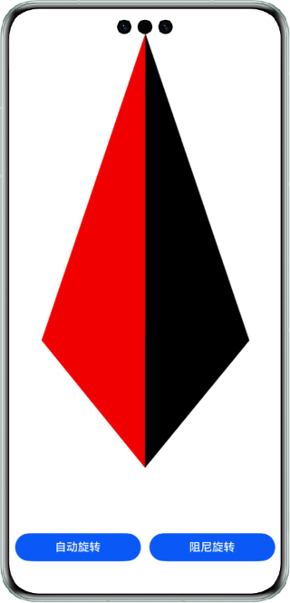
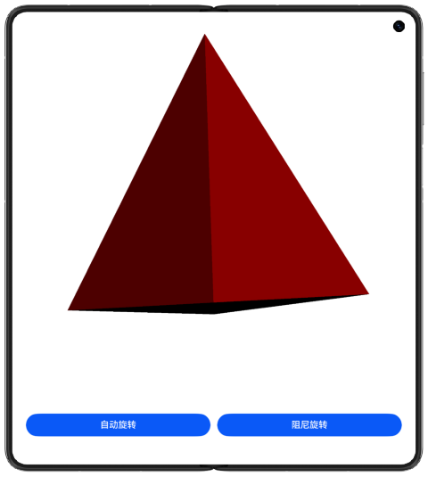
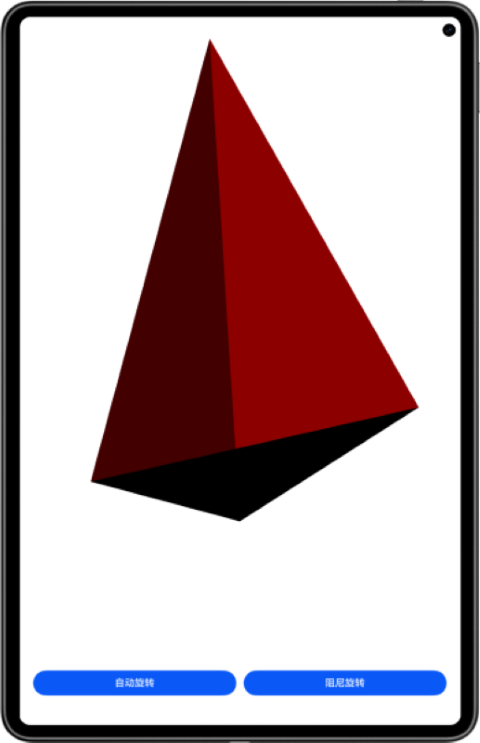

# 多设备游戏界面

## 介绍

XComponent控件常用于相机预览流的显示和游戏画面的绘制，在HarmonyOS上，可以配合Native Window创建OpenGL开发环境，并最终将OpenGL绘制的图形显示到XComponent控件。本示例基于"Native C++"模板，调用OpenGL(OpenGL ES)图形库相关API绘制3D图形（三棱锥），并将结果渲染到页面的XComponent控件中进行展示。同时，点击自动旋转按钮可以自动旋转，点击阻尼旋转可以减速旋转直至停止旋转，还可以在屏幕上通过触摸滑动手势对三棱锥进行旋转，最终得到不同角度的图形并显示到页面。

## 效果预览

|  手机   |               折叠屏               | 平板                                 |
|:-----:|:-------------------------------:|------------------------------------|
|  |  |  |

使用说明

应用界面中展示了XComponent相关控件的使用，及采用OpenGL (OpenGL ES)相关标准API绘制3D图形（三棱锥，3D渲染的光源用的是简单的线性光源）。

可在屏幕触摸滑动旋转三棱锥，或点击按钮使三棱锥进行自动或阻尼旋转，其中主要采用了napi接口来更新3D图形的旋转角度。

此外，增加了一多适配能力，OpenGL绘制三棱锥区域可自适应手机、折叠屏、平板设备，同时，支持竖屏旋转，且自动避让摄像头区域。

## 工程目录

```
├──entry/src/main/cpp/
│  ├──CMakeLists.txt                       // cmake编译配置
│  ├──app_napi.cpp                         // 调用native接口
│  ├──include
│  │  ├──app_napi.h
│  │  ├──tetrahedron.h
│  │  ├──frame_handle.h
│  │  └──util
│  │     ├──log.h
│  │     ├──napi_manager.h
│  │     ├──napi_util.h
│  │     └──native_common.h
│  ├──module.cpp                           // napi模块注册
│  ├──napi_manager.cpp
│  ├──napi_util.cpp
│  ├──frame_handle.cpp
│  ├──tetrahedron.cpp                      // OpenGL (ES) 三棱锥实现
│  └──type
│     └──libentry
│        ├──oh-package.json5
│        └──tetrahedron_napi.d.ts          // 接口导出
├──entry/src/main/ets
│  ├──entryability
│  │  └──EntryAbility.ets
│  ├──pages
│  │  └──Index.ets                         // 首页
│  └──utils
│     └──Logger.ets                        // 日志工具
└──entry/src/main/resources                // 应用静态资源目录
```

## 具体实现

通过在IDE中创建Native C++工程，在C++代码中定义接口为Init和Update用于3D图形绘制环境的初始化和图形渲染更新，并映射NAPI相关接口UpdateAngle。ArkTS侧主要利用XComponent控件实现Index.ets，C++侧主要采用OpenGL ES相关标准API实现三棱锥的绘制流程相关代码，并可与ArkTS进行交互。

应用启动时，NAPI模块也相应进行初始化，此时可通过C++侧的OH_NativeXComponent_GetXComponentId()接口，获取到当前XComponent控件的控件指针，并给到C++侧三棱锥绘制相关的Init和Update函数，实现3D图形显示。同时，为实现三棱锥的触摸屏滑动旋转效果，在C++代码中映射的NAPI接口UpdateAngle给到ArkTS侧调用。ArkTS侧需在导入NAPI模块"libtetrahedron_napi.so"正确的前提下，通过调用src/main/cpp/type/libentry/tetrahedron_napi.d.ts中声明的UpdateAngle接口更新三棱锥旋转角度。
主要源码参考：[napi_manager.cpp](entry/src/main/cpp/napi_manager.cpp)、[app_napi.cpp](entry/src/main/cpp/app_napi.cpp)和[tetrahedron.cpp](entry/src/main/cpp/tetrahedron.cpp)。

Native XComponent相关函数如下：

| 函数名称                                                                                                                                             | 描述                               |
| ------------------------------------------------------------------------------------------------------------------------------------------------ | -------------------------------- |
| OH_NativeXComponent_GetXComponentId(OH_NativeXComponent *component, char *id, uint64_t *size)                                                    | 获取ArkUI XComponent的id            |
| OH_NativeXComponent_GetXComponentSize(OH_NativeXComponent *component, const void *window, uint64_t *width, uint64_t *height)                     | 获取ArkUI XComponent持有的surface的大小  |
| OH_NativeXComponent_GetXComponentOffset(OH_NativeXComponent *component, const void *window, double *x, double *y)                                | 获取ArkUI XComponent组件相对屏幕左上顶点的偏移量 |
| OH_NativeXComponent_GetTouchEvent(OH_NativeXComponent *component, const void *window, OH_NativeXComponent_TouchEvent *touchEvent)                | 获取ArkUI XComponent调度的触摸事件        |
| OH_NativeXComponent_GetTouchPointToolType(OH_NativeXComponent *component, uint32_t pointIndex, OH_NativeXComponent_TouchPointToolType *toolType) | 获取ArkUI XComponent触摸点工具类型        |
| OH_NativeXComponent_GetTouchPointTiltX(OH_NativeXComponent *component, uint32_t pointIndex, float *tiltX)                                        | 获取ArkUI XComponent触摸点倾斜与X轴角度     |
| OH_NativeXComponent_GetTouchPointTiltY(OH_NativeXComponent *component, uint32_t pointIndex, float *tiltY)                                        | 获取ArkUI XComponent触摸点倾斜与Y轴角度     |
| OH_NativeXComponent_GetMouseEvent(OH_NativeXComponent *component, const void *window, OH_NativeXComponent_MouseEvent *mouseEvent)                | 获取ArkUI XComponent调度的鼠标事件        |
| OH_NativeXComponent_RegisterCallback(OH_NativeXComponent *component, OH_NativeXComponent_Callback *callback)                                     | 实例注册回调                           |
| OH_NativeXComponent_RegisterMouseEventCallback(OH_NativeXComponent *component, OH_NativeXComponent_MouseEvent_Callback *callback)                | 实例注册鼠标事件回调                       |

## 相关权限

不涉及。

## 依赖

不涉及。

## 约束与限制

1. 本示例仅支持标准系统上运行，支持设备：华为手机、平板。
2. HarmonyOS系统：HarmonyOS 5.0.5 Release及以上。
3. DevEco Studio版本：DevEco Studio 5.0.5 Release及以上。
4. HarmonyOS SDK版本：HarmonyOS 5.0.5 Release SDK及以上。
