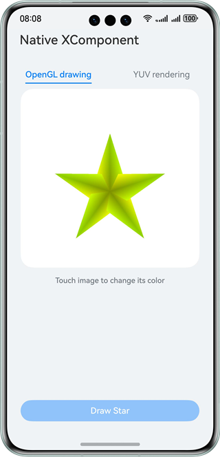
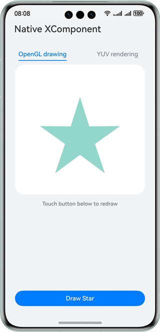
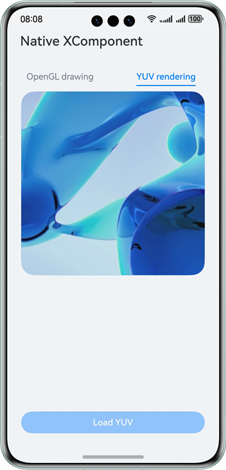

# Native XComponent

## Overview

This sample shows how to use the native XComponent interface to obtain a NativeWindow instance, obtain the layout/event information, register an event callback, draw shapes on the page through OpenGL/EGL, and render YUV images. In this sample app, you can draw a pentagon, touch the XComponent area to change the pentagon color, and render a YUV image.

## Preview

| Pentagon drawn                              | Color changed                                       | Image rendering                                    |
| ------------------------------------------- | --------------------------------------------------- | -------------------------------------------------- |
|  |  |  |

## How to Use

1. Install the HAP file and open the app.

2. Touch **Draw Star** at the bottom of the page. A pentagon is drawn.

3. Touch the XComponent area (white area on the page) to change the color of the pentagon.

4. Switch to the YUV rendering tab page and touch **Load YUV**. A YUV image is rendered on the page.

## Project Directory

```
├──entry/src/main/cpp            // C++ code
│  ├──common
│  │  └──common.h                // Common constants
│  ├──manager                    // Lifecycle management module
│  │  ├──plugin_manager.cpp
│  │  └──plugin_manager.h
│  ├──render                     // Rendering module
│  │  ├──egl_core.cpp
│  │  ├──egl_core.h
│  │  ├──plugin_render.cpp
│  │  └──plugin_render.h
│  ├──CMakeLists.txt             // CMake build script
│  └──napi_init.cpp              // NAPI module registration
├──entry/src/main/ets            // ets code
│  ├──common
│  │  └──CommonConstant.ets      // Common constants
│  ├──entryability
│  │  └──EntryAbility.ets        // Entry ability
│  ├──interface
│  │  └──XComponentContext.ets   // API class
│  ├──pages                      // Page file
│  │  └──Index.ets               // Home page
│  └──view
│     ├──OpenGLView.ets          // OpenGL drawing
│     └──YUVView.ets             // YUV rendering
└──entry/src/main/resources      // Static resources
```

## How to Implement

Create a native C++ project in DevEco Studio.

**OpenGL Image Drawing**

Define the external interface **drawPattern()** in the C++ code. You can call this interface on the ArkTS side to draw a pentagon on the page.

Obtain a NativeWindow instance and initialize the EGL environment in the **OnSurfaceCreated()** callback of the XComponent. Call **OH_NativeXComponent_GetXComponentSize()** to obtain the width and height of the XComponent, and pass in the width and height into the EGL drawing API to draw a pentagon on the NativeWindow. In the **DispatchTouchEvent()** callback, call the EGL drawing API again to draw a pentagon with the same size but different colors on the NativeWindow. In this way, the color is changed when the XComponent is touched.

**Loading YUV Images**

During the initialization of the YUV image rendering tab page, a YUV file is written to the sandbox. When you touch **Load YUV**, the C++ code reads the YUV file from the sandbox and uses the YUV rendering API to implement image rendering.

For details about the source code, see the files in the [render directory](entry/src/main/cpp/render).

## Required Permissions

N/A

## Dependencies

N/A

## Constraints

1. The sample is only supported on Huawei phones with standard systems.

2. The HarmonyOS version must be HarmonyOS 5.0.5 Release or later.

3. The DevEco Studio version must be DevEco Studio 5.0.5 Release or later.

4. The HarmonyOS SDK version must be HarmonyOS 5.0.5 Release SDK or later.
