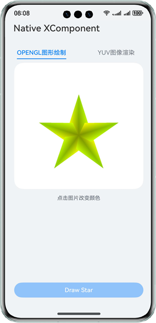
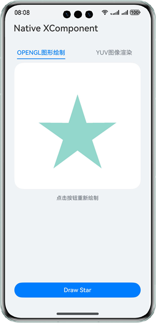

# 基于XComponent组件实现OpenGL图形绘制及YUV图像渲染功能

## 介绍

本示例中主要介绍开发者如何使用Native XComponent接口来获取NativeWindow实例、获取布局/事件信息、注册事件回调、通过OpenGL/EGL实现在页面上绘制形状、渲染YUV图像文件。功能主要包括:

1. 点击按钮绘制一个五角星，并可以通过点击XComponent区域改变五角星的颜色。

2. 点击按钮渲染YUV图像文件。

## 效果预览

| 绘制五角星                                    | 改变颜色                                             | 图像渲染                                            |
| ---------------------------------------- | ------------------------------------------------ | ----------------------------------------------- |
|  |  |  |

使用说明

1. 安装编译生成的hap包，并打开应用。

2. 点击页面底部“Draw Star”按钮，页面将绘制一个五角星。

3. 点击XComponent组件区域（页面中白色区域）改变五角星颜色。

4. 切换页签，点击“Load YUV”按钮，页面渲染YUV文件。

## 工程目录

```
├──entry/src/main/cpp            // C++代码区
│  ├──common
│  │  └──common.h                // 常量定义文件
│  ├──manager                    // 生命周期管理模块
│  │  ├──plugin_manager.cpp
│  │  └──plugin_manager.h
│  ├──render                     // 渲染模块
│  │  ├──egl_core.cpp
│  │  ├──egl_core.h
│  │  ├──plugin_render.cpp
│  │  └──plugin_render.h
│  ├──CMakeLists.txt             // CMake配置文件
│  └──napi_init.cpp              // Napi模块注册
├──entry/src/main/ets            // ets代码区
│  ├──common
│  │  └──CommonConstant.ets      // 常量类
│  ├──entryability
│  │  └──EntryAbility.ets        // 程序入口类
│  ├──interface
│  │  └──XComponentContext.ets   // 接口类
│  ├──pages                      // 页面文件
│  │  └──Index.ets               // 主界面
│  └──view
│     ├──OpenGLView.ets          // OpenGL绘制
│     └──YUVView.ets             // YUV渲染
└──entry/src/main/resources      // 资源文件目录
```

## 具体实现

通过在IDE中创建Native c++工程。

**OpenGL绘制图像**

在c++代码中定义对外接口为drawPattern()，在ArkTS侧调用该接口可在页面上绘制出一个五角星。

在XComponent的OnSurfaceCreated()回调中获取NativeWindow实例并初始化EGL环境。调用OH_NativeXComponent_GetXComponentSize()接口获取XComponent的宽高，并以此为输入调用EGL相关的绘制接口在NativeWindow上绘制出一个五角星。在DispatchTouchEvent()回调中再次调用EGL相关的绘制接口在NativeWindow上绘制出一个大小相同、颜色不同的五角星，以达到点击后改变颜色的目的。

**Load YUV**

YUV图像渲染页签初始化时将yuv文件写入沙箱，点击按钮C++侧从沙箱读取yuv文件，使用yuv渲染相关接口实现图像渲染。

源码参考：[render目录](entry/src/main/cpp/render)下的文件。


## 相关权限

不涉及。

## 依赖

不涉及。

## 约束与限制

1. 本示例仅支持标准系统上运行，支持设备：华为手机。

2. HarmonyOS系统：HarmonyOS 5.0.5 Release及以上。

3. DevEco Studio版本：DevEco Studio 5.0.5 Release及以上。

4. HarmonyOS SDK版本：HarmonyOS 5.0.5 Release SDK及以上。
