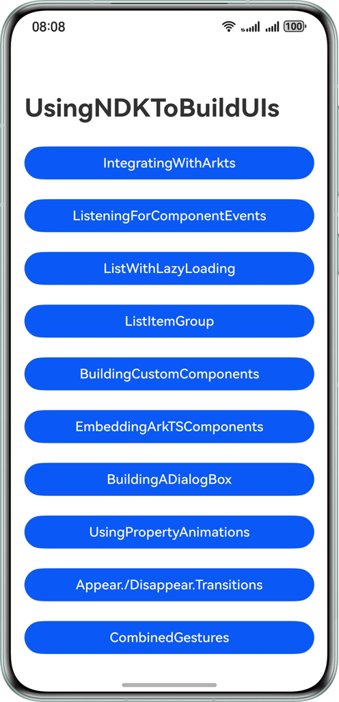

# Using NDK to Build UIs

## Overview

The ArkUI development framework provides a series of NDK APIs that enable building UI in applications using C and C++
code. These APIs include UI component creation, UI tree operations, property settings, and event listeners. You can
learn how to use NDK APIs through this project.

## Preview



## Project Directory

```
|──entry/src/main/cpp 
|  |──classdef 
|  |  |──include 
|  |  |  |──ArkUIBaseNode.h                            // Base class for component tree operations. 
|  |  |  |──ArkUICustomContainerNode.h                 // Encapsulation class for building custom container components. 
|  |  |  |──ArkUICustomNode.h                          // Encapsulation class for building custom UI components. 
|  |  |  |──ArkUIListItemAdapter.h                     // Encapsulation class for lazy loading. 
|  |  |  |──ArkUIListItemGroupNode.h                   // Lazy loading text. 
|  |  |  |──ArkUIListItemNode.h                        // Encapsulation for list items. 
|  |  |  |──ArkUIListNode.h                            // Encapsulation for list components. 
|  |  |  |──ArkUIMixedNode.h                           // Encapsulation class for mixed mode. 
|  |  |  |──ArkUIMixedRefresh.h                        // Encapsulation class for Refresh components. 
|  |  |  |──ArkUINode.h                                // Encapsulation for general components. 
|  |  |  |──ArkUITextNode.h                            // Encapsulation class for text components. 
|  |  |  └──NativeModuleInstance.h                     // Encapsulation of the ArkUI module on the native side. 
|  |  └──src 
|  |  |  |──ArkUIBaseNode.cpp                          // Base class for component tree operations. 
|  |  |  |──ArkUICustomContainerNode.cpp               // Encapsulation class for building custom container components. 
|  |  |  |──ArkUICustomNode.cpp                        // Encapsulation class for building custom UI components. 
|  |  |  |──ArkUIListItemAdapter.cpp                   // Encapsulation class for lazy loading. 
|  |  |  |──ArkUIListItemGroupNode.cpp                 // Lazy loading text. 
|  |  |  |──ArkUIListItemNode.cpp                      // Encapsulation for list item. 
|  |  |  |──ArkUIListNode.cpp                          // Encapsulation for list components. 
|  |  |  |──ArkUIMixedRefresh.cpp                      // Encapsulation class for Refresh components. 
|  |  |  |──ArkUINode.cpp                              // Encapsulation for general components. 
|  |  |  |──ArkUITextNode.cpp                          // Encapsulation class for  text components. 
|  |  |  └──NativeModuleInstance.cpp                   // Encapsulation of the ArkUI module on the native side. 
|  |──function 
|  |  |──include 
|  |  |  |──AppearDisappearTransitions.h               // Appear/disappear transition animation. 
|  |  |  |──BuildingADialogBox.h                       // Building a dialog box. 
|  |  |  |──BuildingCustomComponents.h                 // Building custom components. 
|  |  |  |──CustomGestureJudgment.h                    // Custom gesture judgment. 
|  |  |  |──EmbeddingArkTSComponents.h                 // Embedding ArkTS components. 
|  |  |  |──IntegratingWithArkts.h                     // Integrating with Arkts. 
|  |  |  |──ListeningForComponentEvents.h              // Registering an event listener. 
|  |  |  |──ListItemGroup.h                            // Creating text-group lists. 
|  |  |  |──ListWithLazyLoading.h                      // Lazy loading lists. 
|  |  |  |──NativeEntry.h                              // Managing Native component lifecycle. 
|  |  |  |──SequentialRecognition.h                    // Sequential gesture recognition. 
|  |  |  |──UITimer.h                                  // Creating a Native timer. 
|  |  |  └──UsingPropertyAnimations.h                  // Using property animations. 
|  |  └──src 
|  |  |  |──AppearDisappearTransitions.cpp             // Appear/disappear transition animation. 
|  |  |  |──BuildingADialogBox.cpp                     // Building a dialog box. 
|  |  |  |──BuildingCustomComponents.cpp               // Building custom components. 
|  |  |  |──CustomGestureJudgment.cpp                  // Custom gesture judgment. 
|  |  |  |──EmbeddingArkTSComponents.cpp               // Embedding ArkTS components. 
|  |  |  |──IntegratingWithArkts.cpp                   // Integrating with Arkts. 
|  |  |  |──ListeningForComponentEvents.cpp            // Registering an event listener. 
|  |  |  |──ListItemGroup.cpp                          // Creating text-group lists. 
|  |  |  |──ListWithLazyLoading.cpp                    // Lazy loading lists. 
|  |  |  |──SequentialRecognition.cpp                  // Sequential gesture recognition. 
|  |  |  |──UITimer.cpp                                // Creating a Native timer. 
|  |  |  └──UsingPropertyAnimations.cpp                // Using property animations. 
|  └──types 
|  |  └──libentry 
|  |  |  |──Index.d.ts                                 // Native-side API export declaration file. 
|  |  |  └──oh-package.json5 
|  |──CMakeLists.txt                                   // CMake configuration file. 
|  └──napi_init.cpp                                    // API mapping and module registration. 
|──entry/src/main/ets 
|  |──entryabilitity 
|  |  └──EntryAblity.ets 
|  |──entryBackupablity 
|  |  └──entryBackupablity.ets 
|  |──model 
|  |  └──DataModel.ets 
|  └──pages 
|  |  └──common 
|  |  |  |──scenery.PNG 
|  |  |  └──sky.PNG 
|  |  |──AppearDisappearTransitions.ets                // Appear/disappear transition animation. 
|  |  |──BuildingADialogBox.ets                        // Building a dialog box. 
|  |  |──BuildingCustomComponents.ets                  // Building custom components. 
|  |  |──CombinedGestures.ets                          // Combination gestures
|  |  |──CustomGestureJudgment.ets                     // Custom gesture judgment. 
|  |  |──EmbeddingArkTSComponents.ets                  // Embedding ArkTS components. 
|  |  |──Index.ets                                     // Home page. 
|  |  |──IntegratingWithArkts.ets                      // Integrating with Arkts. 
|  |  |──ListeningForComponentEvents.ets               // Registering an event listener. 
|  |  |──ListItemGroup.ets                             // Creating list item group. 
|  |  |──ListWithLazyLoading.ets                       // Lazy loading lists. 
|  |  |──MixedModule.ets                               // Refresh 
|  |  |──SequentialRecognition.ets                     // Sequential gesture recognition. 
└──└──└──UsingPropertyAnimations.ets                   // Using property animations.

```

## How to Use

1.  Tap the application icon. The NDK-based UI is displayed, with related function buttons.
2.	Tap the Integrating with Arkts button. The ShowNativeUI button appears. Tap it to display a text list and tap HideNativeUI to hide it.
3.	Tap the Listening for Component Events button. The ShowNativeUI button appears. Tap it to show a text list and tap it to change the background color and output logs. Tap HideNativeUI to hide the text.
4.	Tap the List with Lazy Loading button. The ShowNativeUI button appears. Tap it to show a text list and scroll to load it. Tap HideNativeUI to hide the text.
5.	Tap the Building Custom Components button. The ShowNativeUI button appears. Tap it to customize the container. Tap HideNativeUI to hide the text.
6.	Tap the Embedding ArkTS Components button. The ShowNativeUI button appears. Tap it to show a text list and pull down or up to refresh it. Tap HideNativeUI to hide the text.
7.	After you tap the Building a Dialog Box button, the Show Dialog Box button appears. Tap it to show a dialog box. Tap Close Dialog Box to close it.
8.	After you tap the Using Property Animations button, tap play to change the text box size.
9.	After you tap the Appear/Disappear Transitions button, the show button appears. Tap it to show the animation entrance page. Tap hide to show the animation exit one.
10.	Tap the Combined Gestures button. Two buttons appear: Combined Gestures - Sequential Recognition and Combined Gestures - Custom Gesture Judgment. Tap the former to log actions. Tap the latter and then touch and hold anywhere on the screen to log actions.


## How to Implement

1. When using NDK APIs to build the UI, you need to create a placeholder component in the ArkTS page to mount the NDK-created components. The placeholder component type is [ContentSlot](https://developer.huawei.com/consumer/en/doc/harmonyos-references/ts-components-contentslot). ContentSlot can be bound to a [NodeContent](https://developer.huawei.com/consumer/en/doc/harmonyos-references/js-apis-arkui-nodecontent) object, which can be passed to the native side through Node-API to mount and display native components.
2. The UI component capabilities provided by the NDK, such as component creation, tree operation, property settings, and event registration, are exposed through the function pointer structure (such as [ArkUI-NativeNodeAPI_1](https://developer.huawei.com/consumer/en/doc/harmonyos-references/_ark_u_i___native_node_a_p_i__1)). The function pointer structure can be obtained through the [module query interface](https://developer.huawei.com/consumer/en/doc/harmonyos-references/_ark_u_i___native_module).

## Required Permissions

Not involve.

## Constraints

1.	This sample is only supports running on standard systems and supports devices such as Huawei phones, tablets, and 2in1.
2.	The HarmonyOS version must be HarmonyOS 5.1.0 Release or later.
3.	The DevEco Studio version must be DevEco Studio 5.1.0 Release or later.
4.	The HarmonyOS SDK version must be HarmonyOS 5.1.0 Release SDK or later.

