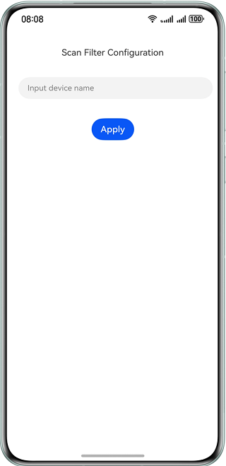
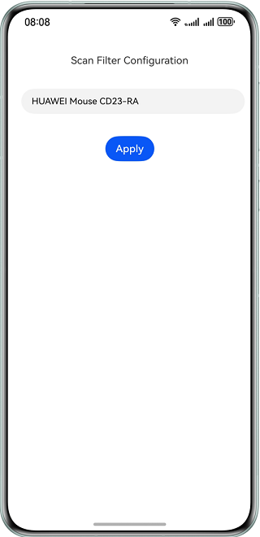
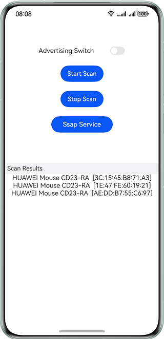
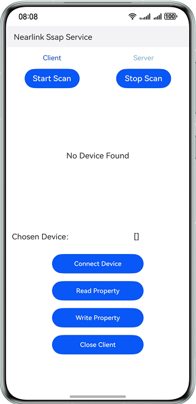
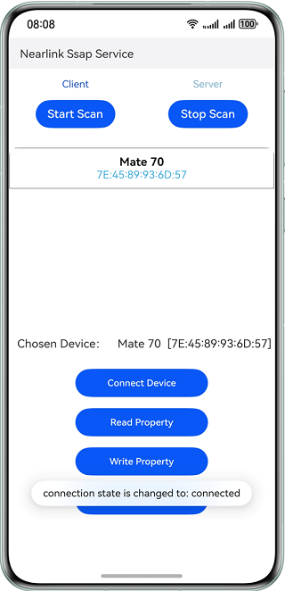
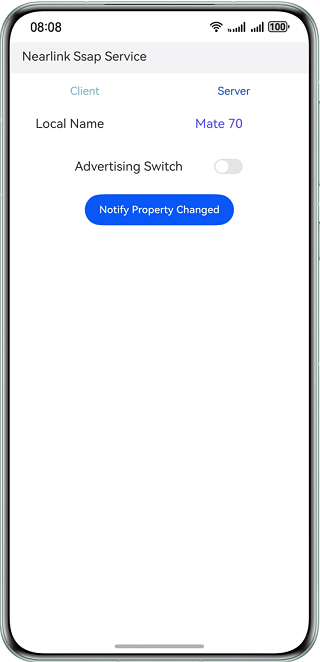
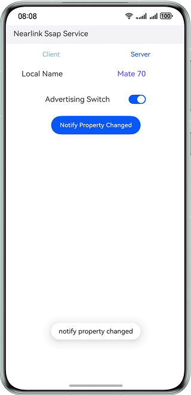

#  Nearlink Kit

## 介绍

本示例展示了使用Nearlink Kit提供的星闪广播、扫描、连接的能力。

本示例模拟了在应用里，操作星闪广播开关来实现对星闪广播启/停的控制，以及实现SSAP连接；点击“Start Scan”按钮进入扫描设置页面，输入希望扫描的设备名后可点击“Apply”按钮发起持续扫描，成功扫描到名称匹配的设备后会显示到“Scan Results”列表，显示信息包括设备名称和MAC地址；点击“Stop Scan”按钮可停止扫描；点击“Ssap Service”按钮进入SSAP页面，在SSAP服务端页面和SSAP客户端页面可以分别控制星闪广播和扫描启停，SSAP客户端在扫描到SSAP服务端的广播后，可以向选中的服务端设备发起连接，从而进行服务属性读写等操作。

需要手机设备支持星闪功能，需要使用Nearlink Kit接口 **@kit.NearLinkKit**。

## 效果预览

| 应用首页                                         | 广播开关开启                                       | 扫描配置页面                                       |
|----------------------------------------------|----------------------------------------------|----------------------------------------------|
|  |  |  |

|               指定扫描设备名称               |                 扫描结果显示                 |                SSAP客户端页面                |
| :------------------------------------------: | :------------------------------------------: | :------------------------------------------: |
|  |  |  |

|                扫描设备并连接                |                SSAP服务端页面                |                 属性变更通知                 |
| :------------------------------------------: | :------------------------------------------: | :------------------------------------------: |
|  |  |  |

##  本示例工程的使用

###  使用说明

以手机为例进行说明，平板、PC/2in1设备使用此应用的方法类似。

1. 构建应用（entry-default-signed.hap）并安装到设备。以华为手机为例，使用应用前需在设置界面开启星闪。开启方法为：设置>多设备协同>星闪，不同产品或系统版本的设置路径可能存在差异。星闪开关界面可查看和编辑本设备的名称。
2. 开启星闪后，可在本示例应用中调用广播和扫描接口。点击首页的“Start Scan”按钮，会跳转到扫描配置页面，需要输入待扫描发现的星闪设备名称。
3. 准备另一台支持星闪的设备作为被发现设备，可以为手机、鼠标、手写笔、键盘等。操作该设备发起星闪广播（如果设备为手机，需安装此应用并参考步骤6发起广播），以待被扫描发现，同时在步骤2中的扫描设置页面输入该设备的名称。
4. 点击“Apply”按钮，会发起持续扫描，页面跳回应用首页。正常情况下步骤3中指定名称的设备会被扫描到，其设备名称和MAC地址会显示到“Scan Results”列表中，扫描成功。
5. 点击“Stop Scan”按钮可停止扫描。
6. 应用首页的“Advertising Switch”开关用于控制星闪广播的发起或停止，默认为关闭状态。点击“Advertising Switch”开关，发起星闪广播，再次点击即停止星闪广播。发起广播后，可用另一台装有本示例应用的手机进行扫描操作（参考步骤2到步骤4）并抓取日志，能够获取广播数据报文AdvertisingReport等信息。
6. 点击首页的“Ssap Service”按钮，会跳转到SSAP页面。SSAP页面下可以在Client和Server之间切换。SSAP页面默显示SSAP客户端页面内容，点击“Sever”字样会跳转到SSAP服务端页面，同理点击“Client”字样会跳转到SSAP客户端页面。
6. 以两台手机为例，一台作为SSAP客户端，一台作为SSAP服务端。客户端Client作为扫描方，能够扫描发现服务端并主动发起连接。服务端Server作为广播方，发送广播以被客户端发现。SSAP客户端页面点击“Start Scan”按钮，会跳转到扫描配置页面，配置扫描过滤器和发起扫描的操作参考第2至第4步。对于服务端，在SSAP客户端页面点击“Advertising Switch”开关可控制星闪广播的启停，参考第6步。
6. SSAP客户端发起扫描并以SSAP服务端的设备名作为过滤条件，并让SSAP服务端发起广播，扫描到的服务端设备名称和地址会显示在SSAP客户端页面。在SSAP客户端页面点击选择扫描到的设备，“Chosen Device”栏会显示选中的设备信息。点击“Connect Device”按钮，客户端会向选中的设备发起SSAP连接。
6. 客户端与服务端连接成功后，在SSAP客户端页面点击“Read Property”按钮，SSAP客户端会向SSAP服务端发送读服务属性请求。
6. 客户端与服务端连接成功后，在SSAP客户端页面点击“Write Property”按钮，SSAP客户端会向SSAP服务端发送写服务属性请求。
6. 在SSAP服务端页面点击“Notify Property Changed”按钮，服务端会向客户端发送属性变更通知。
6. 在SSAP客户端页面点击“Close Client”按钮，会关闭此客户端实例。对于SSAP服务端，退出SSAP服务端页面会自动关闭服务端实例。

## 工程目录

```
├──entry/src/main/ets                           // 代码区
│  ├──entryability
│  │  └──EntryAbility.ets                       // 程序入口类
│  ├──entrybackupability
│  │  └──EntryBackupAbility.ets                 // 备份恢复能力
│  └──pages
│     ├──Index.ets                              // 页面导航
│     ├──MainPage.ets                           // 应用首页
│     └──ScanConfigPage.ets                     // 扫描配置页面
│     └──SsapPage.ets                           // SSAP页面
│     └──SsapClientPage.ets                     // SSAP客户端页面
│     └──SsapServerPage.ets                     // SSAP服务端页面
└──entry/src/main/resources                     // 应用资源目录
```

## 具体实现

控制星闪广播和扫描的应用首页，参考MainPage.ets：

* 通过startAdvertising()函数发起星闪广播，配置广播参数并调用advertising.startAdvertising接口发送广播数据。
* 通过stopAdvertising()函数停止星闪广播，调用advertising.stopAdvertising接口。
* 通过onDeviceFound()函数注册扫描回调函数，调用scan.on接口。
* 通过offDeviceFound()函数注销扫描回调函数，调用scan.off接口。
* 通过stopScan()函数停止扫描，调用scan.stopScan接口。

发起星闪扫描的扫描配置页面，参考ScanDataPage.ets：

* 获取扫描参数deviceName，通过startScan函数调用scan.startScan接口发起扫描。

实现星闪连接和服务属性交互的SSAP页面，可以在SSAP客户端页面和SSAP服务端页面之间切换，参考SsapPage.ets。

其中，实现SSAP客户端功能的SSAP客户端页面，参考SsapClientPage.ets：

* 通过connectDevice函数创建SSAP客户端实例并发起SSAP连接，调用ssap.createClient接口和Client.connect接口。
* 通过readProperty()函数向服务端发送读属性请求，调用Client.readProperty接口。
* 通过writeProperty()函数向服务端发送写属性请求，调用Client.writeProperty接口。
* 通过closeClient()函数关闭SSAP客户端实例，调用Client.close接口。

相应的，实现SSAP服务端功能的SSAP服务端页面，参考SsapServerPage.ets：

* 调用ssap.createServer接口来创建服务端实例。
* 调用Server.on('propertyRead')接口监听来自客户端的读属性请求。
* 调用Server.on('propertyWrite')接口监听来自客户端的写属性请求。
* 通过addServices()函数添加SSAP服务以及当中包含的属性，调用Server.addService接口。
* 调用Server.notifyPropertyChanged接口来通知客户端属性值变更。

## 相关权限

本示例应用需要调用星闪服务访问权限：ohos.permission.ACCESS_NEARLINK。

## 依赖

设备需要具备星闪功能。

## 约束与限制

1. 本示例仅支持标准系统上运行，支持设备：华为手机，平板，PC/2in1。
2. HarmonyOS系统：HarmonyOS 5.0.1 Release及以上。
3. DevEco Studio版本：DevEco Studio 5.0.1 Release及以上。
4. HarmonyOS SDK版本：HarmonyOS 5.0.1 Release SDK及以上。

